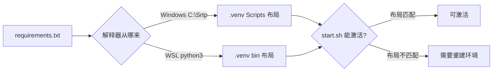
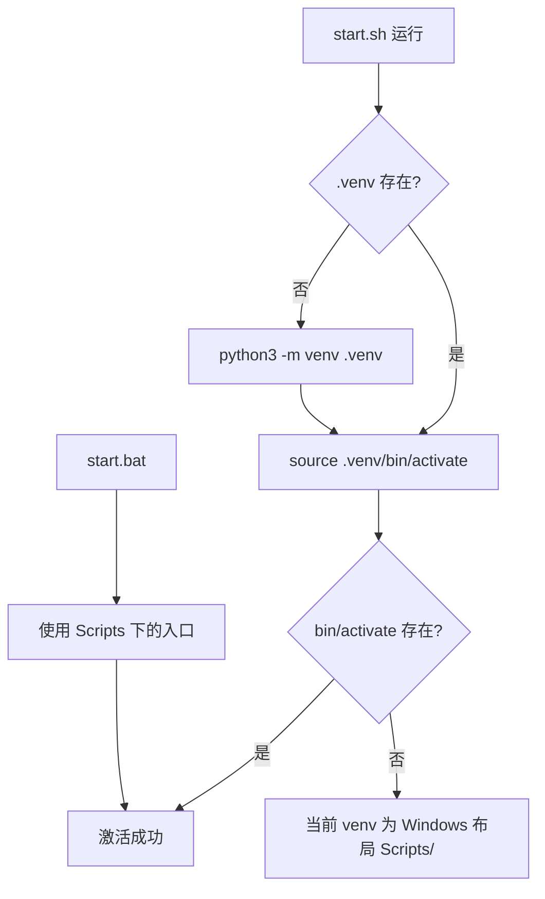

# 本仓库的 Python 环境现状

打开 KnowledgeDiver 目录会看到一个 `.venv` 目录和一个 `requirements.txt`，Python 侧的依赖管理就靠这两样。这与常见的「先装 Anaconda、再建环境」的路子不同：仓库里没有 `environment.yml`，机器上也没有 conda 的安装痕迹。

判断依据分两层：仓库内的环境目录与清单文件，以及本机解释器安装位置的检查结果。

## 1. 依赖清单长什么样

`requirements.txt` 共 33 行，分成两组：第 1 行是 `# Runtime` 注释，第 2 行到第 27 行是运行期依赖；第 29 行是 `# Dev / Test` 注释，后面是测试与覆盖率工具（`/mnt/d/KnowledgeDiver/requirements.txt:1`、`:29`）。

依赖的写法有两种。多数包用 `==` 钉死到具体版本，例如 `fastapi==0.135.3`、`uvicorn==0.44.0`、`sentence-transformers==3.4.1`（`/mnt/d/KnowledgeDiver/requirements.txt:2`、`:3`、`:25`）；少数包只写下限或区间，例如 `trafilatura>=2.0.0`、`crawl4ai>=0.8.0`、`pdfplumber>=0.11,<0.12`（`:17`、`:18`、`:19`）。

两种写法的分工在文件里能看出来：库的接口稳定、对版本敏感的钉死；自带二进制或需要跟随上游修复的留区间。

## 2. .venv 是怎么来的

`/mnt/d/KnowledgeDiver/.venv/pyvenv.cfg` 记录了创建方式：`home = C:\Srtp`、`version = 3.13.0`、`executable = C:\Srtp\python.exe`，创建命令是 `C:\Srtp\python.exe -m venv D:\KnowledgeDiver\.venv`。

也就是说，这个虚拟环境是在 Windows 侧创建的，解释器来自 `C:\Srtp`，环境目录落在 D 盘的仓库里（WSL 里对应 `/mnt/d/KnowledgeDiver/.venv`）。目录布局因此是 Windows 的：有 `Scripts`、`Lib`、`Include`，没有 `bin`。

| 项 | 值 | 来源 |
| --- | --- | --- |
| Python 版本 | 3.13.0 | pyvenv.cfg |
| 解释器来源 | `C:\Srtp\python.exe` | pyvenv.cfg |
| 创建命令 | `python.exe -m venv D:\KnowledgeDiver\.venv` | pyvenv.cfg |
| 目录布局 | `Scripts/Lib/Include` | 目录清点 |
| 是否继承系统包 | `false` | pyvenv.cfg |
| 启动脚本 | `start.sh` 与 `start.bat` | 仓库根目录 |

表里有一项容易被跳过：是否继承系统包。它为假，意味着用系统解释器装过的包在这个环境里导入不到；遇到"明明装过却报找不到"时先核对这一项。

## 3. conda 在本机的位置

现场检查的结果是：机器上没有 `miniconda3`、`anaconda3` 或 `/opt/conda`，用户目录下没有 `.condarc`；仓库里也没有 `environment.yml` 或 `conda-lock` 之类的文件。

需要 conda 的场景（例如用 conda 装 CUDA 运行时）按通用做法处理，02-venv的创建与两个平台的分工、03-依赖锁定与环境自检 与 04-conda对照与多环境并行 里分别标注了相关部分。

## 4. 两套布局的差异会带来什么

`.venv` 的记录只说明它由哪个解释器创建，实际使用时碰到的是目录布局。同一个虚拟环境在两种平台上文件名不同：

| 用途 | Windows 布局 | Linux 布局 |
| --- | --- | --- |
| 激活脚本 | `Scripts/activate` | `bin/activate` |
| 解释器 | `Scripts/python.exe` | `bin/python` |
| 包目录 | `Lib/site-packages` | `lib/python3.*/site-packages` |
| 安装命令 | `Scripts/pip.exe` | `bin/pip` |

现有环境是 Windows 布局（见第 2 节的目录清点），而 `start.sh` 按 Linux 布局激活，`start.bat` 按 Windows 布局激活。同一个环境在两个脚本下的可用性因此不同：Windows 侧能找到入口，Unix 侧会在激活这一步失败。可选的修复只有两条——按 Linux 布局重建环境，或改用与现有布局匹配的脚本。

## 5. 启动脚本的两套分支

仓库提供了两套启动脚本：`start.sh` 面向类 Unix 环境，`start.bat` 面向 Windows。前者会检查 `.venv` 是否存在，不存在就用 `python3 -m venv` 新建，然后执行 `source .venv/bin/activate`（`/mnt/d/KnowledgeDiver/start.sh:8` 至 `:16`）。

这里有一个可以现场验证的不一致：现有 `.venv` 是 Windows 布局，没有 `bin/activate`，而 `start.sh` 按 Linux 布局激活。也就是说，直接用 `start.sh` 在当前环境上会走到激活失败的分支，除非把环境重建为 Linux 布局。

Node 侧的依赖由锁文件保证可复现，Python 侧目前只有 `requirements.txt`。两边的复现手段不同，这也是为什么「换机器重现项目」这件事要分别检查。

## 6. 前端与 Python 的分界

同一个仓库里还有 Node 侧的东西：`package.json` 在，依赖用 Node 的锁文件管理，与 Python 环境互不干涉。分清这条界线可以避免一类误解——「环境没装好」在前端表现为依赖目录缺失，在 Python 侧表现为解释器或包缺失，两者的排查入口完全不同。

## 7. 易错点

- 直接运行 `start.sh` 而不检查激活路径。现有环境是 Windows 布局。
- 认为 `==` 与 `>=` 混用是疏漏。文件里两类包的定位不同。
- 把前端依赖缺失算进 Python 环境问题。两者入口不同。
- 认为 `.venv` 一定可搬。它记录了创建时的解释器绝对路径。
- 忽略 `include-system-site-packages = false`。它决定了环境是否继承系统包。
- 把 `.venv` 提交进版本库。它体积大且记录了绝对路径。

需要 conda 的场合一般出现在需要特定 CUDA 运行时的实验里，那种场景的依赖通常由实验目录自己带清单，与 KnowledgeDiver 这套环境相互独立。

## 8. 小结

核心概念：

| 概念 | 内容 |
| --- | --- |
| 依赖清单 | `requirements.txt`，33 行，两组 |
| 环境目录 | `/mnt/d/KnowledgeDiver/.venv` |
| 创建方式 | Windows 侧 `C:\Srtp\python.exe -m venv` |
| 解释器版本 | 3.13.0 |
| 目录布局 | `Scripts/Lib/Include` |
| 待核实 | `.venv` 能否被 WSL 的 `python3` 直接使用 |
| 待核实 | 依赖是否装全、清单与实际版本是否一致 |

设计权衡：

| 决策 | 选择 | 收益 | 代价 |
| --- | --- | --- | --- |
| 环境位置 | 仓库内 `.venv` | 与项目同进同出 | 目录较大，不宜进版本库 |
| 创建平台 | Windows | 与 Windows 侧脚本一致 | 与 WSL 的 `bin` 布局不匹配 |
| 依赖写法 | `==` 为主、区间为辅 | 兼顾稳定与跟进 | 需要区分哪些包该钉死 |
| 文档口径 | 区分已核实与未见 | 结论可追溯 | 需要逐项标注 |

## 9. 练习

### 基础题

1. `requirements.txt` 分成哪两组？各从第几行开始？
2. `.venv` 是用哪个解释器创建在哪个路径的？
3. 本机有没有 conda？依据是什么？

### 挑战题

4. 现有 `.venv` 是 Windows 布局。给出一个让 `start.sh` 可用的最小修复方案。
5. 列出三项「需要现场执行命令才能确认」的信息，并给出各自的验证命令。
6. 为什么 `include-system-site-packages` 为 `false` 会影响「本机装了某个包但环境里导入不到」这类现象？
7. 现有环境与 `start.sh` 不匹配时，重建与改脚本两条路各自的影响面是什么？

### 附：本页引用的路径

| 路径 | 作用 |
| --- | --- |
| `/mnt/d/KnowledgeDiver/requirements.txt` | 依赖清单 |
| `/mnt/d/KnowledgeDiver/.venv/pyvenv.cfg` | 环境创建记录 |
| `/mnt/d/KnowledgeDiver/start.sh` | Unix 侧启动与激活分支 |
| `/mnt/d/KnowledgeDiver/start.bat` | Windows 侧启动脚本 |
