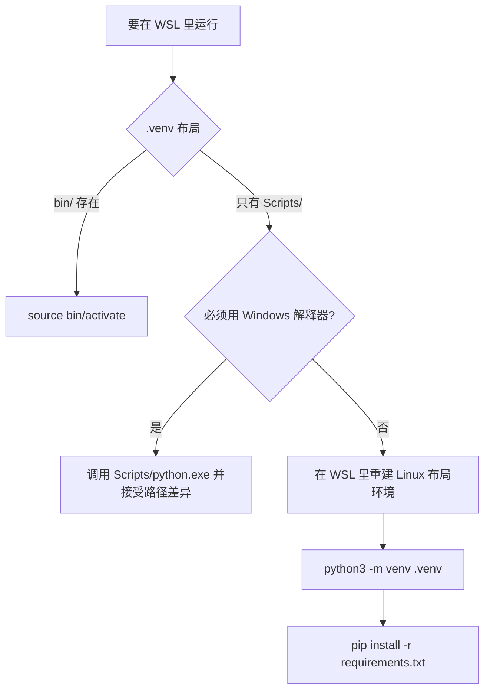
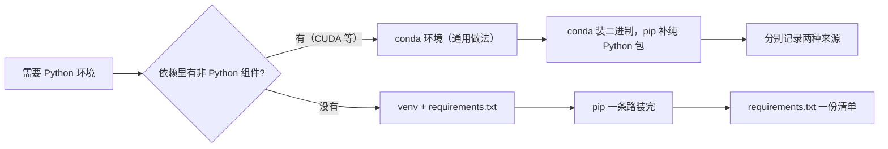

# venv 的创建与两个平台的分工

一个虚拟环境创建好之后，最容易被忽略的是它的「出身」：用哪个解释器创建的、在哪个操作系统上创建的。这两条信息记在 `pyvenv.cfg` 里，平时不看也没事，一旦环境要在另一个平台上使用，问题就会冒出来——激活脚本找不到、目录布局对不上。

KnowledgeDiver 的 `.venv` 正好是这种情况：它在 Windows 侧创建（`home = C:\Srtp`），目录里只有 `Scripts` 而没有 `bin`，而仓库的 `start.sh` 按 Linux 布局激活。这一节说明两套布局差在哪里、从 WSL 使用 Windows 环境有什么边界，以及需要重建时该怎么做。

## 1. venv 隔离的是什么

`venv` 的核心作用是给一个项目一份独立的 `site-packages`，让不同项目的依赖互不干扰。它不复制解释器，只在环境目录里放一份指向原解释器的记录，安装的包落在环境自己的目录下。

因此环境与解释器是绑定的：`pyvenv.cfg` 里的 `home` 一旦指向某条路径，环境就默认从那里找解释器。解释器被移动、升级或路径变化，环境可能失效，重建通常比修更快。

## 2. 两套目录布局的差异

同一个 venv 概念在两个平台上的落点不同：

| 项 | Windows 布局 | Linux 布局 |
| --- | --- | --- |
| 可执行文件目录 | `Scripts` | `bin` |
| 激活脚本 | `activate.bat`、`Activate.ps1` | `activate`、`activate.fish` |
| 包目录 | `Lib/site-packages` | `lib/pythonX.Y/site-packages` |
| 记录文件 | `pyvenv.cfg` | `pyvenv.cfg` |
| 配置里的 home | `C:\...\python.exe` | `/usr/bin/python3` |

只有 `pyvenv.cfg` 是两边都有的。这解释了为什么跨平台复用环境目录往往以失败告终：布局与路径两边都不一样。

## 3. 从 WSL 使用 Windows 环境的边界

WSL 能执行 Windows 的可执行文件，因此在 `/mnt/d` 下的 Windows 环境里，`Scripts/python.exe` 在技术上是可以被调用的。但这时运行的仍是 Windows 版解释器：它看到的路径是 Windows 路径，加载的是 Windows 版的二进制包，环境变量与工作目录的语义也随之切换。

于是出现一种混合状态：命令能跑，但报错信息里的路径与你在 WSL 里写的路径对不上。除非确实需要 Windows 侧的解释器（例如依赖只有 Windows 轮子），更省事的做法是在 WSL 里重建一份 Linux 布局的环境。

重建前要确认 WSL 里的 `python3` 版本，因为 `requirements.txt` 里钉死的版本对解释器有隐含要求；版本差距过大时，部分包会找不到匹配的轮子。

## 4. 重建一份 Linux 布局环境的步骤

重建的步骤本身很短：删掉或改名现有环境目录，执行 `python3 -m venv .venv`，再按 `requirements.txt` 安装依赖。关键点有三个：用 WSL 里的 `python3`（版本与 `requirements.txt` 的要求匹配）、安装前确认网络与代理、安装后做一次自检（见 03-依赖锁定与自检）。

原环境不建议直接删：它记录了当前可用的版本组合，可以先改名保留，等新环境验证通过再清理。

## 5. conda 在这套分工里的位置

以下内容属于通用做法，本机没有 conda 安装，无法在仓库内核实（详见 01-本仓库的Python环境现状）。

conda 与 venv 的定位不同：它同时管理解释器版本与二进制依赖，尤其适合需要 CUDA、cuDNN 这类非纯 Python 依赖的场景；venv 只隔离 Python 包，遇到二进制依赖要靠预编译轮子。选择时看项目是否需要 conda 提供的非 Python 组件，而不是看哪个更流行。

## 6. 混用时的注意点

conda 环境里用 `pip install` 安装的包与 conda 自己安装的包会落在同一套 `site-packages` 里，版本冲突时排查困难。通用做法是：能用 conda 装的优先用 conda，纯 Python 且 conda 源里没有的再用 pip；记录依赖时把两种来源分开写。

这条规则在本仓库没有对应实例，因为仓库走的是 venv 加 `requirements.txt` 一条路。

判断是否需要引入 conda 的一个实用标准是「有没有非 Python 的二进制依赖需要与解释器版本绑定」。只在这个条件成立时，换工具才有收益。

## 7. 与本仓库现状的对应

本仓库的事实是：环境为 Windows 布局、启动脚本按 Linux 布局激活、依赖清单在 `requirements.txt`。因此当前最实际的改动是重建环境，而不是引入 conda。

如果后续确实需要 conda，建议把它放在实验目录内单独管理，与 KnowledgeDiver 的环境分开，避免两套依赖体系互相污染。

重建完成后，最先验证的是环境本身的三件事：解释器版本、依赖是否齐全、环境是否被正确激活。

| 验证项 | 命令 | 期望 |
| --- | --- | --- |
| 解释器版本 | `python -V` | 与 `pyvenv.cfg` 里记录一致 |
| 环境是否激活 | `which python` | 路径落在 `.venv` 内 |
| 依赖是否齐全 | `pip check` | 无缺失依赖提示 |
| 关键包可导入 | `python -c import fastapi` | 无报错 |
| 服务能起 | 启动脚本 | 监听端口出现 |

这五项按顺序做，前一项失败时不必继续：版本不对后面的验证都没有意义。

## 9. 易错点

- 跨平台复制环境目录。两套布局与路径都不同。
- 在 WSL 里调用 `Scripts/python.exe` 后按 Linux 路径理解报错。解释器仍是 Windows 版。
- 直接删除旧环境再重建。先改名保留，验证通过再清理。
- 把 conda 当成 venv 的替代品。两者管的范围不同。
- 在同一环境里随意混用 conda 与 pip。来源不同会让版本排查变复杂。
- 重建后只跑业务功能不做自检。版本与依赖问题会在更晚的时候暴露。
- 忽略解释器版本。钉死的依赖对版本有隐含要求。

## 9. 小结

核心概念：

| 概念 | 内容 |
| --- | --- |
| venv 作用 | 隔离 Python 包，不复制解释器 |
| 绑定关系 | 环境通过 `pyvenv.cfg` 指向解释器 |
| Windows 布局 | `Scripts` 与 `Lib/site-packages` |
| Linux 布局 | `bin` 与 `lib/pythonX.Y/site-packages` |
| 跨平台使用 | 可行但语义混杂，建议重建 |
| conda | 本机未安装，按通用做法标注 |

设计权衡：

| 决策 | 选择 | 收益 | 代价 |
| --- | --- | --- | --- |
| 环境平台 | 与运行侧一致 | 路径与脚本都自然 | 换侧要重建 |
| 旧环境处理 | 改名保留 | 可回退 | 占磁盘 |
| 依赖工具 | 单一体系 | 排查简单 | 遇到非 Python 依赖要另想办法 |
| 验证顺序 | 版本优先 | 早失败早发现 | 需要额外记一条清单 |

## 10. 练习

### 基础题

1. venv 隔离的是什么？它是否复制了 Python 解释器？
2. Windows 布局与 Linux 布局的可执行目录分别叫什么？
3. 本机的 `.venv` 属于哪种布局？依据是什么？

### 挑战题

4. 给出在 WSL 里重建 Linux 布局环境并验证的完整步骤。
5. 如果某个依赖只有 Windows 轮子，评估「继续用 Windows 解释器」与「换依赖」两条路的代价。

### 附：本页引用的路径

| 路径 | 作用 |
| --- | --- |
| `/mnt/d/KnowledgeDiver/.venv/pyvenv.cfg` | 环境出身记录 |
| `/mnt/d/KnowledgeDiver/start.sh` | Linux 布局激活分支 |
| `/mnt/d/KnowledgeDiver/requirements.txt` | 重建环境时的依赖清单 |
