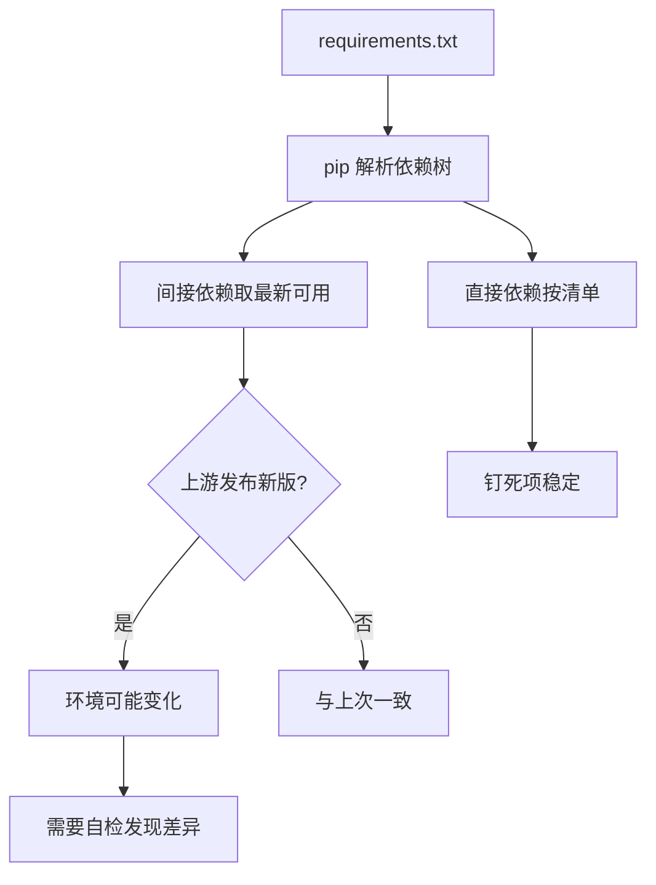
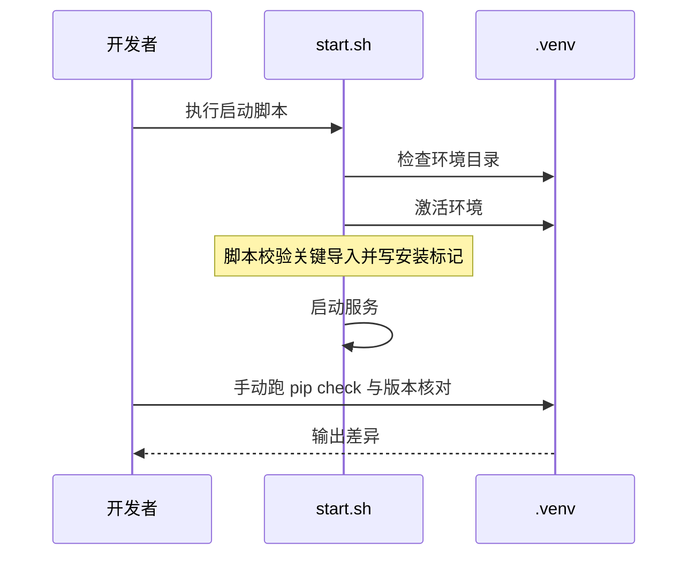

# 依赖锁定与环境自检

把依赖写成固定版本、让另一台机器装出同一份代码，这个做法叫依赖锁定。换一台机器把项目跑起来，最常见的失败往往与代码无关，而是环境差异：某个包装了另一个版本、某个间接依赖没被写进清单、解释器版本差了一档。这类问题的特点是报错位置与真实原因距离很远，因此装完立刻做一遍自检是划算的。

KnowledgeDiver 的 `requirements.txt` 用两种写法表达依赖：多数包钉死版本，少数包只写下限或区间。这两种写法各自解决什么问题、装完之后按什么顺序验证，是本页的内容。文件分组与 `.venv` 出身见 01-本仓库的Python环境现状，重建步骤见 02-venv的创建与两个平台的分工。

## 1. 钉死版本与留区间

钉死写法形如 `fastapi==0.135.3`（`/mnt/d/KnowledgeDiver/requirements.txt`）。它把安装结果固定在一个具体版本上，重复安装得到同一份代码，适合接口稳定、升级需要配合改代码的包。

留区间的写法有两类：只写下限，例如 `trafilatura>=2.0.0`、`crawl4ai>=0.8.0`、`networkx>=3.0`；以及同时写下限与上限，例如 `pdfplumber>=0.11,<0.12`、`sqlite-vec>=0.1,<0.2`。上限的作用是挡住可能破坏兼容的大版本。

```text
fastapi==0.135.3
trafilatura>=2.0.0            # 正文提取（混搭架构一级）
crawl4ai>=0.8.0               # JS渲染回退 (需要Playwright)
pdfplumber>=0.11,<0.12
sqlite-vec>=0.1,<0.2
```

## 2. 行内注释传递的信息

清单里几行带中文注释，例如 `trafilatura>=2.0.0` 后面写「正文提取（混搭架构一级）」、`crawl4ai>=0.8.0` 后面写「JS渲染回退 (需要Playwright)」。这些注释解释了包在系统里的角色，读清单时不必再翻代码。

括号里的「需要 Playwright」是一条实际的安装前提：该包依赖浏览器运行时，装完之后还要补浏览器组件，否则运行到渲染路径才报错。

清单没有锁定文件，因此「上次装出来的版本组合」并没有被记录下来；想回答这个问题只能现场执行 `pip freeze` 看实际结果。

## 3. 为什么两类写法会并存

如果全部钉死，升级一个包要手动改清单再全量验证；如果全部留区间，某次安装可能拉进不兼容的新版本。清单里的分工因此可以理解为按「升级风险」分类：影响面大的框架与模型库钉死（`fastapi`、`sentence-transformers`），外围工具留区间（正文提取、图算法、向量扩展）。

判断某个包该用哪种写法，可以问两个问题：它的接口是否被项目直接依赖？它是否自带二进制组件？前者为是、后者为否时，留区间通常更省事。

| 包 | 写法 | 大致理由 |
| --- | --- | --- |
| `fastapi` | `==` | 框架接口被直接依赖 |
| `uvicorn` | `==` | 与框架配合，版本敏感 |
| `trafilatura` | `>=` | 外围工具，跟随上游修复 |
| `crawl4ai` | `>=` | 渲染回退，依赖上游浏览器支持 |
| `pdfplumber` | `>=` 且上界 | 解析行为变化影响输出 |
| `sqlite-vec` | `>=` 且上界 | 扩展接口尚未稳定 |

## 4. 装完之后的自检顺序

自检按四步走，前一步失败就不必继续：

| 步骤 | 命令 | 判据 |
| --- | --- | --- |
| 解释器版本 | `python -V` | 与项目要求一致 |
| 依赖完整性 | `pip check` | 无缺失或冲突提示 |
| 关键导入 | 逐个导入运行期包 | 无 ImportError |
| 服务启动 | 启动脚本 | 监听端口出现、日志无异常 |

这四步的价值在于把「环境问题」与「代码问题」分开。导入失败的报错常常指向某个间接依赖，而根因可能是清单里漏写。其中第三步（关键导入）启动脚本已经覆盖了一部分，见第 6 节。`pip check` 做的是依赖一致性核对：读已安装包的元数据，检查每个包声明的依赖是否都被满足，不联网也能发现漏装与版本冲突。

## 5. 版本漂移从哪里来

即使清单钉死了直接依赖，环境仍可能与上次不同：被依赖包自己的依赖（间接依赖）如果没钉，会随上游发布而变；同一份清单在不同平台可能装到不同轮子（有无预编译版本）；Python 小版本不同也会改变可用轮子的集合。

因此「清单一致」与「环境一致」是两件事。要做到后者，通常需要一份记录全部解析结果的锁定文件（lockfile，安装时照它逐个还原，不再重新解析版本）；本仓库目前只有 `requirements.txt`，未见锁定文件，属于可改进项。



## 6. 自检与启动脚本的关系

仓库的两套启动脚本承担了「建环境 + 激活 + 起服务」的流程（`/mnt/d/KnowledgeDiver/start.sh`、`start.bat`），其中 `start.sh` 自带一段依赖校验。它把 `requirements.txt` 的 sha256 前 16 位写成 `.deps-<hash>.ok` 标记，标记存在就跳过安装；安装完成后逐个检查关键传递依赖，缺任何一个都不写标记并直接退出，避免 `--no-deps` 半装被误判成装好。

```bash
DEPS_HASH="$(sha256sum "$SCRIPT_DIR/requirements.txt" | cut -c1-16)"
DEPS_MARKER="$VENV_DIR/.deps-$DEPS_HASH.ok"
```

```python
missing = [m for m in ("uvicorn", "fastapi", "click", "starlette", "pydantic_core", "httpx")
           if importlib.util.find_spec(m) is None]
if missing:
    print("  ❌ 依赖校验失败，仍缺少：" + ", ".join(missing))
    sys.exit(1)          # 不写标记，下次启动仍会重装与复查
```

这段校验覆盖的是「关键依赖能不能导入」，它不跑 `pip check`，因此清单与已装版本是否一致、以及清单之外的隐式依赖仍需手动确认。同目录的 `server_start.sh` 带同样的校验；Windows 侧的 `start.bat` 只做安装，没有这段校验。

要补自检就补脚本未覆盖的那部分，也就是 `pip check` 与版本核对：位置放在激活之后、启动之前，失败就直接退出，避免带着不完整的环境启动服务后看到更晚、更难懂的报错。



## 7. 怎么验证环境与清单一致

清单一致不等于环境一致，验证必须落到命令：`python -V` 对解释器版本、`pip freeze` 看实际装了哪些包、`pip check` 看依赖声明是否互相满足。这些只能在装好依赖的那台机器上执行，从仓库文件推不出来。本仓库能从文件核实的只有清单的行数与分组、两种写法与注释、`.venv` 的创建方式，以及启动脚本的激活分支与依赖校验（含 `.deps-<hash>.ok` 安装标记）。

需要现场确认的是：`.venv` 里实际安装的版本是否与清单一致、`pip check` 的当前结果、是否存在未写进清单的隐式依赖。这类「文件里看不出来」的项应当标为待核实，而不是写成结论。

conda 的锁定方式（`environment.yml`、`conda-lock`）原理相同——把解析结果固定下来——但本机没有安装实例，只能按通用做法给出。

## 8. 易错点

- 只看直接依赖不看间接依赖。环境差异常由后者引入。
- 把 `>=` 当成「随便装哪个版本都行」。上限的缺失意味着风险由上游决定。
- 装完直接跑服务。缺少自检会让报错位置远离根因。
- 认为清单一致就等于环境一致。解析结果还需要锁定文件才能固定。
- 漏装浏览器组件。渲染相关依赖有额外前提。

## 9. 小结

核心概念：

| 概念 | 内容 |
| --- | --- |
| 钉死写法 | `==` 固定具体版本 |
| 区间写法 | `>=` 或 `>=` 加 `<` 上界 |
| 注释作用 | 说明包的角色与安装前提 |
| 自检四步 | 版本、完整性、导入、启动 |
| 版本漂移来源 | 间接依赖、平台轮子、小版本差异 |
| 未核实项 | 实际安装版本与 `pip check` 结果 |

设计权衡：

| 决策 | 选择 | 收益 | 代价 |
| --- | --- | --- | --- |
| 依赖写法 | 混合使用 | 兼顾稳定与跟进 | 需要逐个判断 |
| 自动锁定 | 当前未做 | 清单维护简单 | 环境不完全可复现 |
| 自检时机 | 装完后手做 | 不侵入脚本 | 依赖人的自觉 |

## 10. 练习

### 基础题

1. 清单里同时有 `==` 与 `>=`，各举两个例子。
2. 给 `crawl4ai` 那行注释提到的安装前提是什么？
3. 自检四步的顺序是什么？为什么版本排在第一？

### 挑战题

4. 设计一份记录全部解析结果的锁定方案，说明它如何与现有 `requirements.txt` 配合。
5. 在启动脚本里补一段自检，要选哪两步、失败时如何处理？

### 附：本页引用的路径

| 路径 | 作用 |
| --- | --- |
| `/mnt/d/KnowledgeDiver/requirements.txt` | 依赖清单与注释 |
| `/mnt/d/KnowledgeDiver/start.sh` | 启动流程、依赖校验与安装标记 |
| `/mnt/d/KnowledgeDiver/.venv/pyvenv.cfg` | 环境出身 |
