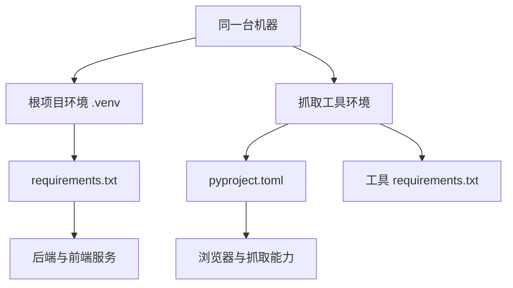
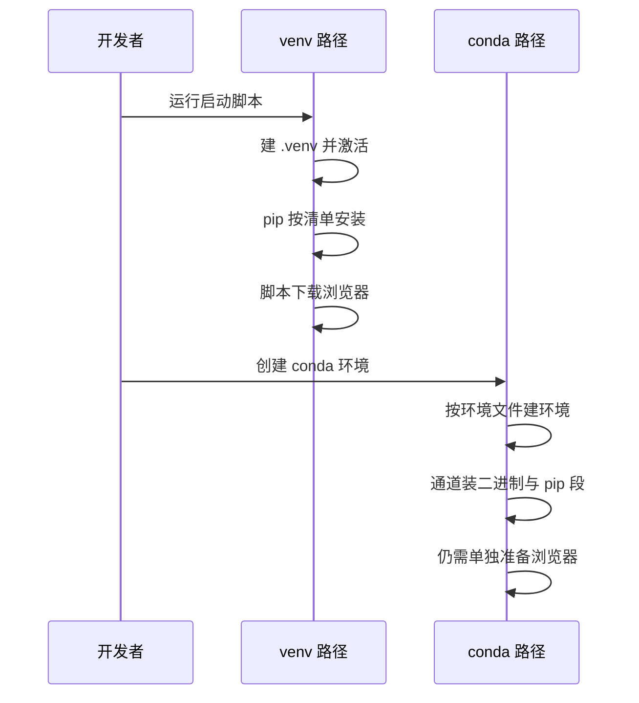

# conda 对照与多环境并行

装完 KnowledgeDiver 的依赖之后，如果再去用仓库里那个抓取工具，会撞上一个容易被忽略的事实：它不共用根项目的环境。工具目录里自己带了一份 `pyproject.toml` 与一份 `requirements.txt`，依赖版本与根项目并不完全一致（`.tools/better-crawler4agent/pyproject.toml`）。

于是同一台机器上实际上跑着两套 Python 依赖，外加一份由 `.env` 提供的运行参数。环境管理的难点从"装什么"变成"哪套环境被激活、读的是哪个配置文件"。conda 的用法在本仓库无从核实——仓库里没有环境文件，机器上也没有 conda 可执行文件——因此相关部分按通用做法标注。

## 一台机器上的两套依赖

根项目的依赖清单在仓库根目录，抓取工具的依赖在工具自己的目录里，两者各自描述自己的运行条件：

| 位置 | 依赖描述 | 与根项目的关系 |
| --- | --- | --- |
| `requirements.txt` | 三十三行，运行时与开发测试两段 | 根项目与后端的运行环境 |
| `.tools/better-crawler4agent/pyproject.toml` | 声明包名、入口脚本与依赖列表 | 独立项目，可单独安装 |
| `.tools/better-crawler4agent/requirements.txt` | 工具自己的清单副本 | 与 pyproject 内容对应 |

工具那份 `pyproject.toml` 里的浏览器依赖被钉死到精确版本，并附了注释说明原因：浏览器 revision 与依赖版本强绑定，放宽版本会导致复用已有浏览器时因版本不匹配而启动失败（`.tools/better-crawler4agent/pyproject.toml`）。根项目的 `requirements.txt` 对同类包写下限（`requirements.txt`），粒度明显更松。

```toml
dependencies = [
    # 与浏览器 revision 强绑定：1.61 用 rev 1228，1.62 用 rev 1234。
    "playwright==1.61.0",
    ...
]

[project.scripts]
better-crawler-mcp = "better_crawler.mcp_server:main"
```

`[project.scripts]` 是打包声明里的入口点（entry point）：安装时据此生成一个同名命令行程序，指向 `better_crawler.mcp_server` 里的 `main`，工具因此可以独立安装与分发。

这个差异是有意的：工具是独立分发的东西，需要自带完整的运行条件；根项目是应用，靠启动脚本与镜像保证安装成功。



## conda 的对应做法

下面的命令与文件结构是通用做法，本仓库没有使用；写出来是为了对照"如果换成 conda 要补哪些东西"。

用 conda 管理时，环境文件通常长这样：

```yaml
name: knowledgediver
channels:
  - conda-forge
dependencies:
  - python=3.13
  - pip
  - pip:
      - -r requirements.txt
```

核心区别有两点：conda 环境文件需要声明 Python 本体的版本与来源通道，而 venv 的版本由创建环境时的解释器决定；conda 可以在同一个文件里混装非 Python 二进制，而 venv 只能装 Python 包，其余交给系统包管理器。

仓库现状里的环境创建与激活写在 `start.sh` 里：

```bash
VENV_DIR="${VENV_DIR:-$SCRIPT_DIR/.venv}"
PIP_INDEX="${PIP_INDEX:-https://pypi.tuna.tsinghua.edu.cn/simple}"

if [ ! -d "$VENV_DIR" ]; then
  python3 -m venv "$VENV_DIR"
fi

source "$VENV_DIR/bin/activate"
```

`VENV_DIR` 与 `PIP_INDEX` 都带默认值：前者允许把环境指到别处复用，后者把 pip 指向清华镜像，也就是表里「镜像加速的 pip」的来源。

| 环节 | venv 现状 | conda 通用做法 |
| --- | --- | --- |
| 环境创建 | 脚本判断目录后执行 `python3 -m venv`（`start.sh`） | `conda env create -f environment.yml` |
| 激活 | `source .venv/bin/activate`（`start.sh`） | `conda activate knowledgediver` |
| 装 Python 包 | 镜像加速的 pip（`start.sh`） | 文件内 `pip:` 段 |
| 非 Python 依赖 | 系统包管理器与脚本下载 | 通道直接提供 |
| 环境记录 | `.venv/pyvenv.cfg` 记录解释器出身 | 环境文件加 `conda env export` |

浏览器运行时是个典型例子：本仓库由启动脚本下载到项目目录（`start.sh`），conda 并不负责它；换成 conda 也不会省掉这段逻辑，只是环境文件里多一行浏览器依赖的版本约束。



## 环境变量归谁管

依赖之外还有一类配置：接口地址、密钥、并发数与数据库路径。它们不适合写进代码，仓库用一份模板加一份本地文件管理。模板开头写明用法——复制为 `.env` 并填入真实值，程序自动加载（`.env.example`）；本地文件被忽略清单排除，同类的 `.env.local` 也在忽略之列（见 `.gitignore`）。

```ini
AI_API_URL=https://ollama.com/v1
AI_API_KEY=your_ollama_api_key_here
JWT_SECRET=your_jwt_secret_here
PAY_PRIVATE_KEY=your_merchant_private_key_base64_here
```

模板里只有占位符，真实值只进本地的 `.env`；这种一行一个键值的文本文件是本地配置的常见载体，`python-dotenv` 负责读它。

加载动作发生在后端配置模块里：导入加载函数后立即执行（`backend/config.py`），依赖清单里对应 `python-dotenv==1.1.0`（`requirements.txt`）。模板按用途分段，依次是 AI 服务、搜索服务、认证、支付、数据库与抓取参数（`.env.example`），其中数据库与抓取两项默认是注释状态，需要时才打开。

```python
from dotenv import load_dotenv
load_dotenv()

AI_API_URL: str = os.getenv("AI_API_URL", "https://ollama.com/v1")
AI_API_KEY: str = os.getenv("AI_API_KEY", "")
```

`load_dotenv()` 把 `.env` 里的键值读进进程环境，已经存在的同名变量不会被覆盖；`os.getenv` 的第二个参数是缺省值，没配某项也能启动，只是走默认值。

密钥类的值在模板里只放占位符，例如认证用的长随机串与支付私钥（`.env.example`）。生产环境另有一层：服务定义里注入了模型下载镜像与模块搜索路径（`deploy/knowledgediver.service`），这样服务进程不依赖登录 shell 里的变量。

```ini
[Service]
WorkingDirectory=/opt/knowledgediver
Environment="PYTHONPATH=/opt/knowledgediver"
Environment="HF_ENDPOINT=https://hf-mirror.com"
ExecStart=/opt/knowledgediver/.venv/bin/uvicorn backend.main:app --host 127.0.0.1 --port 8000
```

这份服务单元文件是 systemd 的配置格式：`Environment=` 在启动时把变量直接注入进程，不经过登录 shell；`ExecStart=` 是启动命令，这里的 `uvicorn` 是运行 FastAPI 应用的 ASGI 服务器，`backend.main:app` 指向应用对象。

## 并存时的优先级

三套东西同时存在时，谁的配置生效取决于两件事：当前激活的环境，以及工作目录。启动脚本在前端目录里执行 npm 命令，后端则以项目根目录为工作目录启动（`start.sh` 中对应的两段）。

conda 与 venv 混用时的通用建议是：一次只激活一个，切换前先确认解释器路径；排查时用解释器自报的路径与包来源而不是 `which python` 的简短输出。环境变量同理，确认加载顺序——进程环境优先于 `.env` 文件里的同名项。

本仓库的实际做法更简单：环境由脚本创建并激活，工具环境独立，配置只在 `.env` 里。需要排查时按"解释器路径、包来源、配置文件路径"三项依次确认即可。

## 重建检查单

换机器或删除环境后重建时，按依赖、浏览器、配置、自检四项确认：

| 步骤 | 确认内容 | 依据 |
| --- | --- | --- |
| 依赖 | 虚拟环境存在且能导入后端入口 | `start.sh` 建环境并激活的那段流程 |
| 浏览器 | 项目目录下存在浏览器安装标记 | `start.sh` 下载浏览器运行时的步骤 |
| 配置 | `.env` 已从模板复制并填好 | `.env.example` 开头的用法说明 |
| 服务 | 后端与前端端口各自可达 | `start.sh` 启动前后端服务的那一段 |

四项里最容易漏的是第二项：依赖装好不等于浏览器可用，而抓取能力依赖浏览器。

## 易错点

| 位置 | 问题 | 建议 |
| --- | --- | --- |
| `.tools/better-crawler4agent/pyproject.toml` | 浏览器依赖钉死版本并绑定 revision，放宽会启动失败 | 升级前检查对应的浏览器版本 |
| 根项目与工具 | 两套依赖版本不完全一致，混用会互相覆盖 | 各自使用独立环境 |
| `.gitignore` | `.env` 不入库，新机器必须从模板复制 | 重建时先补配置文件 |
| `.env.example` | 模板含密钥占位符，误提交真实值会泄露 | 提交前检查暂存内容 |
| `deploy/knowledgediver.service` | 生产依赖服务定义里的环境变量，本地测试不会暴露差异 | 本地也补上同类变量 |
| conda 相关 | 仓库内没有可核实的配置，别照搬外部教程 | 以脚本与清单为准 |

## 小结

### 核心概念

* 同一台机器上存在根项目依赖与工具自带依赖两套环境。
* 工具用 `pyproject.toml` 描述依赖并把浏览器包钉死版本，根项目用清单加下限。
* conda 的对应做法需要环境文件表达 Python 版本与非 Python 依赖，本仓库未使用。
* 环境变量由模板加本地文件管理，后端配置模块在导入时加载。
* 生产环境通过服务定义注入变量，不依赖登录 shell。
* 重建时按依赖、浏览器、配置、服务四项确认。

### 设计权衡

| 选择 | 收益 | 代价 |
| --- | --- | --- |
| 工具自带依赖描述 | 可独立安装与分发 | 机器上出现两套依赖 |
| 根项目依赖写下限 | 安装成功率高 | 不同时间装出的版本可能不同 |
| 工具依赖钉死版本 | 行为可复现 | 升级必须整体推进 |
| 配置走 `.env` | 密钥不入库 | 新环境需要手工补配置 |
| 服务定义注入变量 | 进程启动即可用 | 本地与生产存在配置差异 |

## 练习

### 基础题

1. 仓库里为什么会出现两套依赖描述，它们各自的约束粒度是什么。
2. 环境变量从模板到程序生效经历了哪些环节。
3. conda 的环境文件相比依赖清单多表达了什么。

### 挑战题

4. 为这份项目写一份 conda 环境文件并设计验证脚本，列出需要标注"本仓库未见"的部分，并说明如何处理浏览器运行时。
5. 设计一个环境自检脚本，覆盖解释器版本、关键依赖、浏览器标记与配置文件四项，并说明失败时的输出应当包含哪些定位信息。

## 附：本页引用的路径

| 路径 | 用途 |
| --- | --- |
| `requirements.txt` | 根项目依赖清单 |
| `.tools/better-crawler4agent/pyproject.toml` | 抓取工具的依赖声明 |
| `.tools/better-crawler4agent/requirements.txt` | 工具的清单副本 |
| `.env.example` | 环境变量模板 |
| `backend/config.py` | 配置加载入口 |
| `.gitignore` | 本地配置与缓存忽略规则 |
| `deploy/knowledgediver.service` | 生产环境变量注入 |
