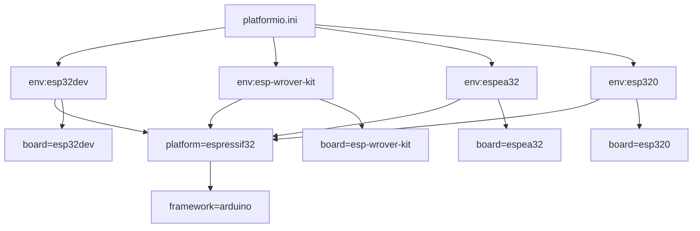
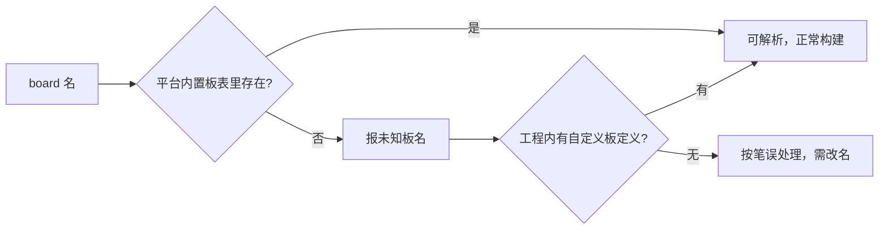

# 四个工程与 platformio.ini 逐字段

PlatformIO 把「板子、框架、依赖」写进工程根目录的 `platformio.ini`，一条命令就能编译下载。要看懂一个工程能不能构建，先看这个文件的 `[env:*]` 段：段名是环境名，段内的 `board` 决定目标芯片，`framework` 决定用哪套库。

配置文件的长短直接反映工程走到哪一步：只剩模板注释说明还没选板子，三行环境段说明只定了一个目标，并列多组环境说明要在多块板上验证。本机四个工程都在 `/mnt/d/Documents/PlatformIO/Projects` 下，配置从 9 行到 32 行不等，恰好覆盖这三种形态，下面用它们举例。

## 1. 工程目录的共同布局

四个工程都由 PlatformIO 的项目模板生成，目录结构一致：`src` 放源码、`include` 放头文件、`lib` 放私有库，根目录下是 `platformio.ini`、`.gitignore` 与 `.vscode` 目录。

`include` 与 `lib` 里通常各有一个 `README` 说明用途，这是模板自带文件，不是项目内容。判断一个工程是否已经开工，看 `src` 里有没有源码比看目录结构更可靠。

| 目录/文件 | 作用 | 是否模板自带 |
| --- | --- | --- |
| `platformio.ini` | 工程配置 | 是 |
| `src` | 源码 | 目录自带，内容自写 |
| `include` | 头文件 | 目录与 README 自带 |
| `lib` | 私有库 | 目录与 README 自带 |
| `.vscode` | 编辑器配置 | 是 |
| `.gitignore` | 忽略规则 | 是 |

## 2. 一个环境最少要写三行

`Test` 与 `ESP32S3CAMfirst` 两个工程给出了最小形态，先看后者：

```ini
[env:esp32s3camlcd]
platform = espressif32
board = esp32s3camlcd
framework = arduino
```

`platform` 选平台（这里是乐鑫的 ESP32 平台），`board` 选具体开发板（`esp32s3camlcd`），`framework` 选 Arduino 框架。三行之外没有别的配置，说明这个工程只需要默认可选项。

这三行构成一个环境（env）：一段配置对应一个编译目标，`pio run` 不带参数会构建全部环境，`pio run -e esp32s3camlcd` 只构建这一个。`platform` 背后是厂商维护的平台包，提供工具链与板级定义；`framework` 决定用哪套库，`arduino` 即 Arduino 核心库。

`Test` 工程的结构完全相同，只是把板子换成 `esp32s3usbotg`：`[env:esp32s3usbotg]`、`board = esp32s3usbotg`。两个工程都用 Arduino 框架。

## 3. wifiscan 的四组环境

同一份代码要在多块板子上验证时，做法是在一个 `platformio.ini` 里并列多组 `[env:*]`：每组换 `board`，`platform` 与 `framework` 保持一致，代码只维护一份。`260116-140012-arduino-wifiscan` 就写了四组环境（`esp32dev`、`esp-wrover-kit`、`espea32`、`esp320`），每组都带 `monitor_speed = 115200`，共 32 行。

```ini
[env:esp32dev]
platform = espressif32
framework = arduino
board = esp32dev
monitor_speed = 115200

[env:esp-wrover-kit]
platform = espressif32
framework = arduino
board = esp-wrover-kit
monitor_speed = 115200

; 其余两组（espea32、esp320）结构相同，只换 board
```

`monitor_speed` 是串口监视器的波特率。写进配置后，`pio device monitor` 一启动就按这个速率打开，不必每次手输。四组环境都写同一数值，说明这个工程期望四个目标板共用同一套串口参数。



## 4. 多环境共用配置的写法

四组环境里 `platform` 与 `framework` 重复了四遍。PlatformIO 允许把它们上提到 `[env]` 通用段，各环境只留差异项，这样配置更短、改一处即全体生效。

当前文件没有这么做。两种写法都能工作，区别只在维护：重复写法在环境数量少时更直观，上提写法在环境多、公共项多时更省事。本仓库未见对该文件的后续修改记录，因此保持现状即可。

## 5. 没有环境段：还没选板子

判断工程有没有开工，看两处：`platformio.ini` 里有没有 `[env:*]` 段，`src` 里有没有源码；只看目录结构会误判，因为模板会预先建好 `src`、`include`、`lib`。`111/platformio.ini` 只有 9 行模板注释，没有环境段，也没有 `platform`、`board`、`framework`，`pio run` 在这种状态下没有可构建的目标。

```ini
; PlatformIO Project Configuration File
;
;   Build options: build flags, source filter
;   Upload options: custom upload port, speed and extra flags
; ...（9 行全部是注释）
```

这通常意味着工程只创建了骨架、还没选板子。它同时缺少可判定的目标芯片，所以本节无法确认它是为哪块板准备的。

## 6. 两处需要现场核实的板名

`espea32` 与 `esp320` 这两个板名与常见的 ESP32 开发板命名不同（常见写法类似 `esp32dev`、`esp32doit-devkit-v1`）。它们可能是自定义板名，也可能是录入时的笔误。

本仓库没有 `boards` 目录或自定义板定义文件，因此无法判定这两项是否指向有效目标。要确认只有一条路：现场执行 `pio run -e espea32` 看平台能否解析该板名。在确认之前，这两组环境是否存在都按「待核实」处理。



## 7. 字段速查

| 字段 | 含义 | 本机出现情况 |
| --- | --- | --- |
| `platform` | 目标平台 | 四个环境均为 `espressif32` |
| `board` | 具体开发板 | 有 6 个不同取值 |
| `framework` | 开发框架 | 均为 `arduino` |
| `monitor_speed` | 串口监视器波特率 | 四组环境均为 `115200` |
| `[env]` 通用段 | 上提公共配置 | 未见使用 |
| 环境数量 | 每工程 0 到 4 个 | `111` 为 0 个 |

## 8. 易错点

- 把模板注释当成配置。`111` 的 9 行全是注释。
- 认为 `board` 写什么都行。平台解析不到会直接报错。
- 忽略 `monitor_speed`。串口输出乱码常常是波特率不匹配。
- 把 `include`、`lib` 里的 README 当成项目文档。它们是模板文件。
- 在多环境工程里逐个改公共项。应当先判断是否该上提。

## 9. 小结

核心概念：

| 概念 | 内容 |
| --- | --- |
| 配置文件 | 工程根目录的 `platformio.ini` |
| 环境段 | `[env:<name>]`，段名即环境名 |
| 最小三行 | `platform`、`board`、`framework` |
| 多环境 | 同一个 ini 里并列多组 `[env:*]` |
| 串口速率 | `monitor_speed` |
| 空工程 | 只有注释，无环境段 |

设计权衡：

| 决策 | 选择 | 收益 | 代价 |
| --- | --- | --- | --- |
| 环境数量 | 按目标板数量 | 一套代码多板验证 | 配置重复 |
| 公共项 | 当前逐段重复 | 单段可读 | 改动需多处同步 |
| 板名来源 | 平台内置表 | 无需额外文件 | 笔误难在配置里发现 |

## 10. 练习

### 基础题

1. 一个环境段最少需要哪三个字段？
2. 四个工程各有多少个环境？
3. `monitor_speed` 控制什么？本机取值为多少？

### 挑战题

4. 把 wifiscan 的四组环境改写成「公共段 + 差异项」的写法，并说明收益。
5. `espea32` 与 `esp320` 是否为有效板名？给出你的核实步骤。

### 附：本页引用的路径

| 路径 | 作用 |
| --- | --- |
| `/mnt/d/Documents/PlatformIO/Projects` | 四个工程所在目录 |
| `/mnt/d/Documents/PlatformIO/Projects/ESP32S3CAMfirst/platformio.ini` | 单环境样例 |
| `/mnt/d/Documents/PlatformIO/Projects/260116-140012-arduino-wifiscan/platformio.ini` | 四环境样例 |
| `/mnt/d/Documents/PlatformIO/Projects/111/platformio.ini` | 空模板样例 |
