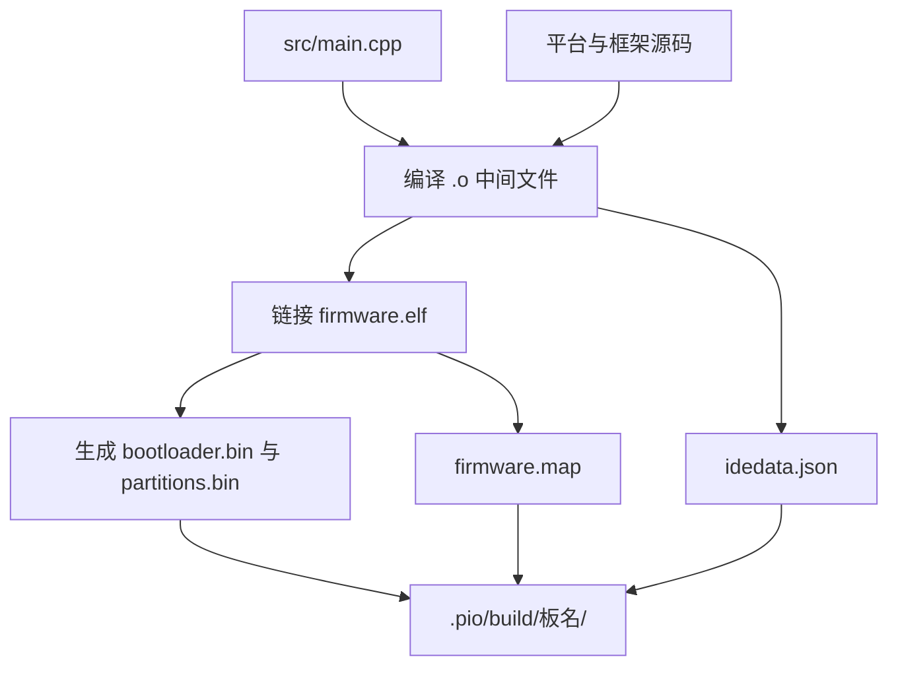
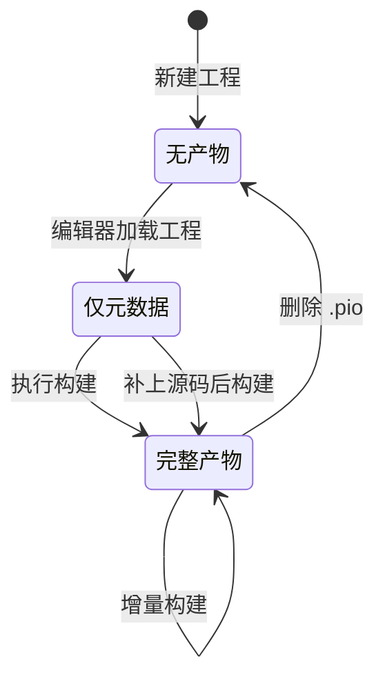

# 构建产物与目录约定

`pio run` 执行完之后，工程根目录会多出一个 `.pio` 目录。它装着编译产物与中间文件，体积不小，通常不进版本库；这台机器上四个工程的 `.gitignore` 第一条就是 `.pio`（`/mnt/d/Documents/PlatformIO/Projects/111/.gitignore:1`）。

因为被忽略，`.pio` 里的内容容易与当前配置脱节：改了 `board` 或换了环境之后，旧产物仍然留在目录里。这一节说明产物目录的结构、四个工程各自的构建状态，以及怎样用产物的存在与否反推工程走到哪一步。

产物目录的存在本身就是一条信息：它说明这个工程至少被构建过一次，而目录内容能进一步说明构建走了多远。

## 1. .pio 目录的层级

产物按环境（板名）分文件夹，路径形如 `.pio/build/<board>/`。同一个工程配置了多个环境时，每个环境一份，互不覆盖。

`.pio/build` 下还有一个 `project.checksum` 文件，记录上次构建时配置的校验值，用来判断是否需要重新构建。它属于工具自己维护的状态文件，不需要手工处理。

| 路径 | 内容 |
| --- | --- |
| `.pio/build/<board>/` | 该环境的编译输出 |
| `.pio/build/project.checksum` | 配置校验值 |
| `.pio/libdeps/<env>/` | 依赖库的下载副本（本机未见） |

## 2. 一个已构建环境里有什么

`111` 工程的 `.pio/build/4d_systems_esp32s3_gen4_r8n16/` 是一次完整构建留下的产物，可以看到：

| 文件/目录 | 作用 |
| --- | --- |
| `firmware.elf` | 链接后的可执行文件 |
| `firmware.map` | 符号与地址映射 |
| `bootloader.bin` | 启动引导程序 |
| `partitions.bin` | 分区表 |
| `src/` | 项目源码的编译中间文件 |
| `FrameworkArduino/` | 框架源码的编译中间文件 |
| `idedata.json` | 供编辑器读取的工程元数据 |

二进制与中间文件同时存在，说明这一次构建走完了编译与链接。

## 3. 四个工程的构建状态

产物目录能把四个工程分成三类：

| 工程 | src 内容 | .pio/build 内容 | 状态 |
| --- | --- | --- | --- |
| `111` | `main.cpp`（模板） | 完整构建产物 | 构建过 |
| `Test` | `main.cpp`（模板） | 仅 `idedata.json` | 配置过，未完成构建 |
| `ESP32S3CAMfirst` | 空 | 无 `.pio` | 未构建 |
| `...wifiscan` | `WiFiScan.ino` | 无 `.pio` | 未构建 |

这三类对应「已经编译过」「只让编辑器认识工程」「刚建好骨架」三种中间状态。目录里没有构建记录时，不能判断代码能否编译通过。

## 4. 编译缓存与重建

`FrameworkArduino` 下的 `.cpp.o` 与 `.cpp.d` 是框架源码的编译缓存与依赖记录。清理时用工具的 clean 目标，不要手工删单个文件，否则依赖记录会与中间文件不一致，下一次构建可能出现奇怪的链接错误。

整个 `.pio` 目录可以安全删除，代价是下一次构建要重新编译全部框架源码，耗时明显变长。需要腾空间或排除缓存干扰时，删目录是最直接的办法。

产物目录与源代码都在工程内，两者却是不同性质的证据：前者可以随时删除重建，后者才决定工程做什么。判断工程状态时以源码与配置为准，产物只作旁证。

## 5. 产物与配置可能不一致

`111` 工程是一个现成的例子：`platformio.ini` 只有模板注释、没有任何 `[env:*]` 段，但 `.pio/build` 下的目录名是 `4d_systems_esp32s3_gen4_r8n16`，对应一个具体的 ESP32-S3 板。两者不可能同时成立——要么构建时 ini 里还有该环境，要么产物是从别处复制来的。

本仓库没有构建日志，无法判定是哪一种。这条不一致带来的实际影响是：不能凭 `.pio` 里的板名推断当前工程的目标板。

## 6. 与版本库的关系

`.gitignore` 除了 `.pio`，还忽略了 `.vscode/c_cpp_properties.json`、`.vscode/launch.json` 与 `.vscode/ipch`（`/mnt/d/Documents/PlatformIO/Projects/111/.gitignore:2` 至 `:5`）。被忽略的都是机器或编辑器相关文件，换一台机器会重新生成。

因此仓库里留下来的只有 `platformio.ini`、`src` 里的源码与 `.vscode` 中的少数通用配置。产物不进版本库这一条，也意味着「构建是否成功」无法从仓库内容反推。

产物目录的另一个作用是提供线索：目录里出现过的板名说明曾经用某个环境构建过。但线索不等于结论，配置改动后旧目录仍在，判断当前状态仍然要以 `platformio.ini` 为准。

## 7. 易错点

- 从 `.pio` 里的板名推断当前配置。产物可能早于配置变更。
- 手工删除 `.pio` 里的单个文件。缓存与依赖记录会不一致。
- 把 `project.checksum` 当配置读。它是工具的状态文件。
- 认为没有 `.pio` 就是构建失败。也可能从未构建。
- 把 `.pio` 提交进版本库。它体积大且可重新生成。
- 把中间文件当成最终固件。要烧录的是 `.bin` 与 `.elf`。

## 8. 小结

核心概念：

| 概念 | 内容 |
| --- | --- |
| 产物目录 | 工程根目录下的 `.pio` |
| 分层方式 | 按环境（板名）分文件夹 |
| 完整构建标志 | 二进制与中间文件同时存在 |
| 元数据文件 | `idedata.json` |
| 校验文件 | `project.checksum` |
| 版本库策略 | `.pio` 被忽略 |

设计权衡：

| 决策 | 选择 | 收益 | 代价 |
| --- | --- | --- | --- |
| 产物存放 | 工程内 `.pio` | 工程自包含 | 目录较大 |
| 是否入库 | 忽略 | 仓库干净 | 构建状态不可追溯 |
| 清理方式 | 删整个目录 | 彻底 | 下次全量编译 |

## 9. 练习

### 基础题

1. `.pio/build` 下的子目录名由什么决定？
2. 一次完整构建会生成哪些二进制文件？
3. 四个工程里哪一个有完整的构建产物？

### 挑战题

4. `111` 的产物板名与 ini 不一致。列出两种可能原因与各自的验证方法。
5. 设计一条判断「工程当前配置能否构建」的检查流程，要求不依赖旧产物。

### 附：本页引用的路径

| 路径 | 作用 |
| --- | --- |
| `/mnt/d/Documents/PlatformIO/Projects/111/.pio/build/4d_systems_esp32s3_gen4_r8n16` | 完整构建产物 |
| `/mnt/d/Documents/PlatformIO/Projects/Test/.pio/build/esp32s3usbotg` | 仅元数据的构建目录 |
| `/mnt/d/Documents/PlatformIO/Projects/111/.gitignore` | 忽略规则 |
