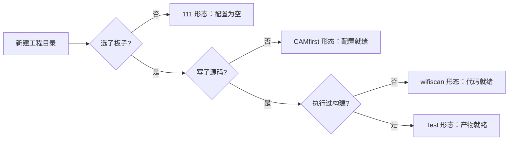
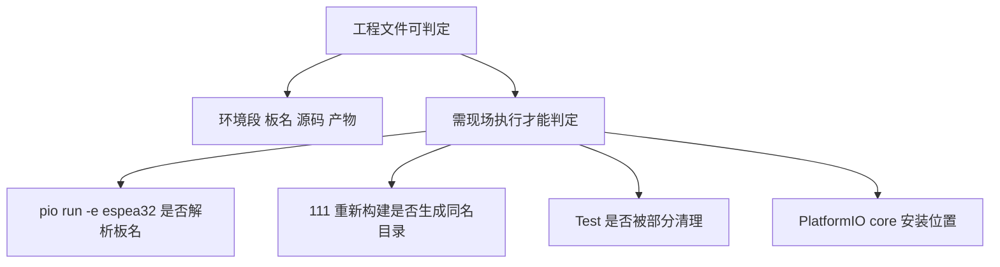

# 工程状态与待核实项

要判断一个固件工程走到哪一步，通用做法是交叉三类证据：配置（有没有选板子、写没写环境段）、源码（是真代码还是模板示例）、产物（有没有构建过）。三者里产物的可信度最低——它可以被删除、复制或来自旧配置，所以判断当前状态应以配置与源码为准，产物只当旁证。下面的四个工程正好落在几种典型状态上，用来说明这套判据。

盘点的另一半是划清边界：从文件推不出来的结论（板名是否有效、产物从哪来、某功能有没有用过）不要写成结论，而要给出可执行的核实命令并标为待核实。这条纪律对任何工程盘点都适用，后面先列表、再逐项给核实办法。

## 1. 四个目录的现状

| 工程 | 环境段 | src | .pio | 判断 |
| --- | --- | --- | --- | --- |
| `111` | 无 | 模板 `main.cpp` | 完整产物 | 构建过，源码未改 |
| `Test` | 1 个（`esp32s3usbotg`） | 模板 `main.cpp` | 仅 `idedata.json` | 配置过 |
| `ESP32S3CAMfirst` | 1 个（`esp32s3camlcd`） | 空 | 无 | 未开工 |
| `...wifiscan` | 4 个 | `WiFiScan.ino` | 无 | 有业务代码，未构建 |

两类证据的强弱不同：源码与配置是工程内容，产物只是曾经的执行记录。表里第四列因此按内容判断，产物放在备注里。



## 2. 怎么认出真实业务代码

模板生成的 `main.cpp` 只有一个空的 `setup()`/`loop()` 与示例函数，看源码内容就能区分；有业务代码的工程会引入具体库并实现行为。`260116-140012-arduino-wifiscan` 的 `src` 下是 `WiFiScan.ino`（`/mnt/d/Documents/PlatformIO/Projects/260116-140012-arduino-wifiscan/src/WiFiScan.ino`），引入 `WiFi.h` 并调用扫描接口，与工程名一致。它配了四个环境对应四块目标板，属于「一套代码多板验证」的常见做法：环境段多写几份，代码只维护一份。

```cpp
#include "WiFi.h"

void setup()
{
    Serial.begin(115200);
    WiFi.mode(WIFI_STA);
    ...
}

void loop()
{
    int n = WiFi.scanNetworks();
    ...
}
```

PlatformIO 默认示例用 `main.cpp` 加 `setup()`/`loop()`，而 `.ino` 是 Arduino IDE 的习惯后缀。项目模板允许两种写法，构建时 `.ino` 会被预处理成 C++ 源文件，因此两种后缀都能编译。`setup()` 在板子上电或复位后执行一次，`loop()` 紧接着反复执行，这是 Arduino 框架约定的两个入口；上面的 `WiFiScan.ino` 正是在 `setup()` 里初始化串口与 Wi-Fi 模式，在 `loop()` 里反复调用扫描。

## 3. 停在骨架状态的工程

配好环境段不等于能构建：源码目录为空时没有入口文件，构建会在编译阶段失败。`ESP32S3CAMfirst` 就是这种状态，`src` 里没有 `main.cpp` 也没有 `.ino`，但 `platformio.ini` 已写好 `[env:esp32s3camlcd]` 与三行配置。此时的配置只是一份「准备用这块板」的声明，判断工程是否开工要看源码而不是配置。

这种状态下执行构建通常会因缺少源码而报错，具体报错信息需要现场执行才能确认。可以确定的是：工程本身没有开工，配置只是一份「准备用这块板」的声明。

## 4. 模板源码与真实改动

`111` 与 `Test` 的 `src/main.cpp` 内容相同，都是模板生成的示例：包含 `setup()` 与 `loop()`，另有一个返回两数之和的 `myFunction` 函数（`/mnt/d/Documents/PlatformIO/Projects/111/src/main.cpp`）。

```cpp
#include <Arduino.h>

int myFunction(int, int);

void setup() {
  int result = myFunction(2, 3);
}

void loop() {
}

int myFunction(int x, int y) {
  return x + y;
}
```

模板代码能编译通过，因此「构建成功」与「项目有用」是两件事。`111` 的完整产物正好说明这一点：它编译的是一段没有实际行为的框架代码。

## 5. 待核实项：无法从文件判定的板名

`espea32` 与 `esp320` 出现在 `...wifiscan/platformio.ini` 的第三、第四组环境里。它们与常见的 ESP32 板名写法接近却不同：常见的有 `esp32dev`，而 `espea32` 多了一个 `e` 且少了 `32` 的位置，`esp320` 末尾是数字零。

这两项是否为打字错误，需要执行 `pio run -e espea32` 与 `pio run -e esp320` 看平台能否解析。本仓库没有自定义板定义目录，因此在文件层面无法确认。

## 6. 待核实二：111 的产物板名

`111/.pio/build` 下的目录名是 `4d_systems_esp32s3_gen4_r8n16`，而该工程的 `platformio.ini` 里没有环境段。若产物是本地构建产生的，说明构建时配置与现在不同；若产物是复制或移动来的，则与配置无关。

区分办法是看产物内部的时间与内容一致性，或者直接在 `111` 目录执行一次构建，观察是否生成同名目录。仓库内没有构建日志，无法从文件层面判定。

## 7. 待核实三：Test 只有元数据

`Test/.pio/build/esp32s3usbotg` 里只有 `idedata.json`，没有二进制与中间文件。这通常对应「编辑器加载工程后生成元数据」，尚未走到编译链接。也有可能是产物被部分清理过。两条解释都需要现场验证。

## 8. 本仓库未见的部分

盘点还要标出「未见」的边界。文件里找不到某样东西，只能说明它没被写进仓库，不能推断功能从未使用过——例如参数可能写在别处、日志可能没有入库、工具可能装在仓库外。本机与仓库里没有对应文件的项如下：

- PlatformIO core 的安装目录（常见位置是用户目录下的 `.platformio`），`/mnt/d/Documents/PlatformIO` 下只有 `Projects`。
- 上传端口与烧录参数的记录：四个 ini 里都没有 `upload_port` 或 `upload_speed`。
- 依赖库声明：四个 ini 里都没有 `lib_deps`，`.pio/libdeps` 也不存在。
- 构建与上传日志：没有任何 `.log` 或日志目录。

结论只能写到「未见」这一层，不能推断从未使用过这些功能。



## 9. 核实命令清单

| 待核实项 | 命令 | 观察点 |
| --- | --- | --- |
| 板名有效 | `pio run -e espea32` | 是否报未知板 |
| 板名有效 | `pio run -e esp320` | 是否报未知板 |
| 111 产物来源 | 在 `111` 目录执行构建 | 是否生成同名板目录 |
| Test 状态 | 在 `Test` 目录执行构建 | 是否补齐产物 |
| core 位置 | `pio system info` | 输出里的 core 目录 |

## 10. 易错点

- 把模板源码当成项目代码。`111` 与 `Test` 的 `main.cpp` 是示例。
- 认为有 `.pio` 就说明配置有效。产物可能来自旧配置。
- 把 `.ino` 当成不可编译的后缀。PlatformIO 支持两种写法。
- 从「没有 `lib_deps`」推断「没有用第三方库」。也可能是通过其他方式引入。
- 把待核实项写成结论。缺少现场输出的部分只能标未见。

## 11. 小结

核心概念：

| 概念 | 内容 |
| --- | --- |
| 证据类型 | 配置、源码、产物三类 |
| 业务代码判据 | 引入具体库并实现行为，非模板 |
| 可判定的状态 | 配置、源码、产物三类证据 |
| 模板示例 | 空 `setup()`/`loop()` 与示例函数 |
| 待核实板名 | `espea32`、`esp320` |
| 未见内容 | core 目录、上传参数、依赖声明、日志 |

设计权衡：

| 决策 | 选择 | 收益 | 代价 |
| --- | --- | --- | --- |
| 记录口径 | 区分已核实与未见 | 结论可复核 | 需要逐项标注 |
| 工程组织 | 每个试验一个目录 | 互不干扰 | 状态分散 |
| 多板验证 | 一个 ini 多环境 | 代码复用 | 环境重复配置 |

## 12. 练习

### 基础题

1. 四个工程里哪一个含有业务源码？文件叫什么？
2. `ESP32S3CAMfirst` 的 `src` 目录里有什么？
3. 列出三项本仓库未见的内容。

### 挑战题

4. 给出判定 `espea32` 是否有效板名的完整步骤，并说明可能的两种结果。
5. 如果要把这四个工程整理成一份可复现的记录，你会补哪些文件？

### 附：本页引用的路径

| 路径 | 作用 |
| --- | --- |
| `/mnt/d/Documents/PlatformIO/Projects/260116-140012-arduino-wifiscan/src/WiFiScan.ino` | 唯一业务源码 |
| `/mnt/d/Documents/PlatformIO/Projects/111/src/main.cpp` | 模板源码 |
| `/mnt/d/Documents/PlatformIO/Projects/Test/.pio/build/esp32s3usbotg` | 仅元数据的产物 |
| `/mnt/d/Documents/PlatformIO/Projects/260116-140012-arduino-wifiscan/platformio.ini` | 四环境配置 |
