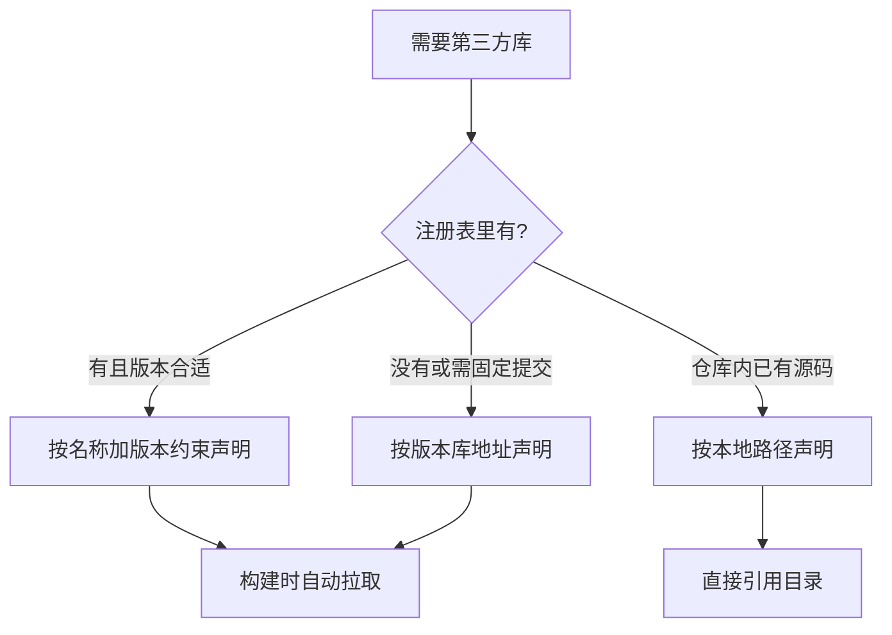
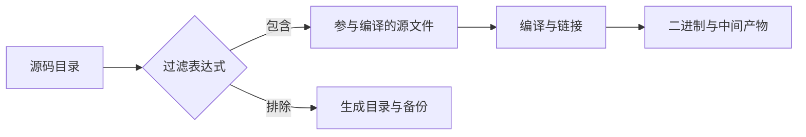

# 库依赖与烧录配置

PlatformIO 的最小配置只要三行（`platform`、`board`、`framework`），能编出一个空壳工程；一旦要引入第三方库、改编译参数或换下载器，就必须补对应字段。本机的四个工程恰好停在最小配置上，用来说明缺了哪些字段会卡在哪一步。

库依赖、编译参数、源文件过滤、扩展脚本与上传协议五类字段在本机四个 `platformio.ini` 中都没有出现，所以本页按官方手册的通用做法给出写法，并拿机器人仓库里已有的 CMake、Makefile、Keil 构建方式对照，说明每个字段替代了原来的哪一步。

## 依赖声明的三种来源

库依赖写在环境段里的依赖列表字段中（PlatformIO 里这个字段叫 `lib_deps`，写进哪个环境段就只在该环境生效），来源分三类：

| 来源 | 写法形态 | 适用场景 |
| --- | --- | --- |
| 注册表 | 名称加版本约束 | 常见开源库 |
| 版本库地址 | 仓库地址加分支或标签 | 官方注册表没有的库 |
| 本地路径 | 目录链接或符号链接 | 私有库与仓库内源码 |

注册表方式最省事，但要把版本约束写清楚，否则不同时间安装会得到不同代码。版本库方式适合上游更新快、注册表滞后或者需要固定到某个提交的库。本地路径方式适合仓库里已有的源码，例如素材仓库里的实时系统源码目录 `FreeRTOS-LTS/`，可以直接作为本地库引入而不必复制一份。

对机器人工程来说，中间这条路最常用：驱动库往往由厂商或队伍自己维护，注册表里要么没有，要么版本陈旧。



## 库是怎么被找到的

声明了依赖不等于每个源文件都能用上：构建系统还需要知道哪个源文件引用了哪个库。这个判断由依赖查找机制完成，按手册的通用做法有三种模式，默认是折中模式，先按源文件直接引用的头文件找库，再对项目自身的源文件做一轮扩展查找。

| 模式 | 行为 | 代价 |
| --- | --- | --- |
| 直接模式 | 只看源文件包含的头文件 | 最快，可能漏库 |
| 深度模式 | 递归扫描所有源文件 | 最全，构建变慢 |
| 折中模式 | 直接查找加项目源码扩展 | 默认，多数项目够用 |

如果出现"头文件找不到"或"编到一半缺符号"，先确认库是否被声明，再确认查找模式是否覆盖到了引用它的文件。反过来，如果构建明显变慢，可以考虑是否误用了深度模式。

## 编译参数与源文件范围

编译参数用来补编译器开关、宏定义与头文件搜索路径，典型内容是打开某个功能宏、关掉某个警告或指定优化等级。在 PlatformIO 里这些内容写进 `build_flags`，构建时追加到编译器命令行。这部分与机器人仓库里的两种既有做法对应关系很清楚：

| 需求 | CMake 工程的做法 | PlatformIO 的字段 |
| --- | --- | --- |
| 指定参与编译的文件 | 在可执行目标里逐条列出（`2026sentriomeni_gimbal/CMakeLists.txt` 里的显式清单） | 源文件过滤表达式 |
| 传递宏与开关 | 编译定义与编译选项 | 编译参数列表 |
| 指定链接脚本 | 链接选项与脚本路径 | 板级构建属性 |

源文件范围是迁移时最容易吃亏的一步。CMake 版本把参与编译的文件显式列出来（见 `2026sentriomeni_gimbal/CMakeLists.txt`），Makefile 版本由生成器按目录收集（见 `sentry_omni_2025/Makefile` 的头部注释）。PlatformIO 默认递归收集源码目录，直接照搬会把生成目录、备份目录与不参与编译的代码一起编进去，因此需要用过滤表达式显式排除。

CMake 那段长这样（省略中间条目）：

```cmake
add_executable(${CMAKE_PROJECT_NAME}
        PID/Inc/speed_pid.h
        PID/Src/speed_pid.cpp
        BSP/Src/bsp_can.cpp
        BMI088/Src/BMI088.cpp
        ...
)
```

Makefile 由生成器写好头部注释，源文件按目录收集：

```make
# File automatically-generated by tool: [projectgenerator] version: [4.2.0-B44] date: [Fri Apr 26 22:21:58 CST 2024]
```

PlatformIO 侧的对应字段是源文件过滤表达式，用包含与排除规则决定哪些文件参与编译，写法与这份显式清单不等价。

Keil 工程则是另一类情形：源文件与分组写在工程文件里（`GIMBAL_1/MDK-ARM/baiduo.uvprojx`），迁移时要逐组核对，尤其是启动文件与链接脚本的位置。



## 上传与下载器

上传配置决定固件怎么进板子。上传（upload）是 PlatformIO 的一个构建目标，由 `pio run -t upload` 触发；下载协议决定用哪种调试器或下载器（stlink、cmsis-dap 等），端口指设备节点或地址，速率指下载时钟。串口监视另有一组速率与过滤器配置。

| 字段 | 作用 | 本机现状 |
| --- | --- | --- |
| 下载协议 | 选择 stlink、cmsis-dap 等下载器 | 四个工程均未声明 |
| 上传端口 | 指定设备节点或地址 | 未声明，用自动探测 |
| 上传速率 | 下载时钟 | 未声明 |
| 监视速率 | 串口波特率 | 只有 wifiscan 写了 115200（`/mnt/d/Documents/PlatformIO/Projects/260116-140012-arduino-wifiscan/platformio.ini` 的监视器字段） |

ESP 系列默认走串口下载，所以那四个工程不声明协议也能工作；换成 STM32 板子时通常必须指定下载器，否则命令会在探测阶段失败。这就是"同一条命令在两种板子上行为不同"的原因。

监视速率虽然只有一个工程写了，但它是实际使用频率最高的字段：不写会落到默认值，打印出来的是乱码。

## 扩展脚本的位置

有些步骤不属于编译也不属于上传，例如生成额外的固件格式、打印体积统计、把产物拷到指定目录。这类动作由扩展脚本完成（PlatformIO 里用 `extra_scripts` 声明），可以在构建前、构建后或上传后挂载。

对机器人工程来说，常见用途是生成烧录工具需要的另一种格式，或者把固件复制到队伍的固件仓库目录。对照现有 CMake 工程，这些动作现在写在构建脚本或手工步骤里（`deploy` 一类的部署脚本另见网站后端仓库，不在素材仓库内），迁到 PlatformIO 后集中到一处，代价是脚本要跟着项目走。

## 补齐配置的检查顺序

把这五类字段补齐时，按依赖、查找、编译、上传、脚本的次序推进，每一步都能单独验证：

| 步骤 | 验证方式 |
| --- | --- |
| 依赖声明 | 列出已安装依赖并核对版本 |
| 查找模式 | 编译通过且没有缺符号 |
| 编译参数 | 宏或开关生效，产物行为可观察 |
| 上传配置 | 下载命令能识别到设备 |
| 扩展脚本 | 目标文件被正确生成 |

顺序不能反：上传配置写对了但编译不过，仍然到不了下载那一步。

## 易错点

| 位置 | 问题 | 建议 |
| --- | --- | --- |
| 四个 `platformio.ini` | 没有依赖声明，照搬后新增库无处可写 | 新增字段放对应环境段 |
| 依赖版本约束 | 只写名称不写版本，构建结果会漂移 | 需要可复现就写约束或固定提交 |
| 源文件过滤 | 默认递归收集会把生成目录编进去 | 迁移时先列出编译清单再写过滤 |
| `2026sentriomeni_gimbal/CMakeLists.txt` | 显式清单与过滤表达式不等价，容易漏文件 | 用编译日志对比参与文件 |
| `/mnt/d/Documents/PlatformIO/Projects/260116-140012-arduino-wifiscan/platformio.ini` | 只有串口速率，换板后缺少下载协议字段 | 换板时先补协议与端口 |
| Keil 工程 | 启动文件与链接脚本不在默认位置 | 单独核对路径 |

## 小结

### 核心概念

* 四个现成工程只写了平台、框架、板名与个别串口速率，没有依赖与上传配置。
* 库依赖有三种来源：注册表、版本库地址与本地路径。
* 库查找模式决定头文件与符号能否被解析，默认模式多数够用。
* 源文件过滤表达式用来控制参与编译的范围，迁移时必须显式排除生成目录。
* 上传配置包含下载协议、端口与速率；串口监视速率不写会出乱码。
* 扩展脚本承担编译与上传之外的产物处理动作。

### 设计权衡

| 选择 | 收益 | 代价 |
| --- | --- | --- |
| 依赖写注册表 | 拉取方便 | 上游变更可能影响构建 |
| 依赖固定到提交 | 结果可复现 | 升级要手工推进 |
| 本地路径引入仓库源码 | 与仓库版本同步 | 目录结构被构建系统依赖 |
| 收紧源文件范围 | 构建可控 | 新增目录要同步维护 |
| 上传协议显式声明 | 换板行为一致 | 配置量增加 |

## 练习

### 基础题

1. 四个工程为什么没有依赖与上传字段也能构建。
2. 库依赖的三种来源分别适合什么场景。
3. 源文件过滤表达式解决什么问题。

### 挑战题

4. 为一个需要 stlink 下载器的工程写完整配置，列出字段与验证步骤，并说明如何确认下载协议被正确识别。
5. 设计一段扩展脚本，在构建后生成另一种固件格式并做体积统计，说明挂载时机与失败处理。

## 附：本页引用的路径

| 路径 | 用途 |
| --- | --- |
| `/mnt/d/Documents/PlatformIO/Projects/260116-140012-arduino-wifiscan/platformio.ini` | 多环境与串口速率配置 |
| `/mnt/d/Documents/PlatformIO/Projects/111/platformio.ini` | 只有模板注释的配置文件 |
| `2026sentriomeni_gimbal/CMakeLists.txt` | 显式源文件清单 |
| `sentry_omni_2025/Makefile` | 生成器收集源码的构建方式 |
| `GIMBAL_1/MDK-ARM/baiduo.uvprojx` | Keil 工程的源文件分组 |
| `FreeRTOS-LTS/` | 可作为本地库引入的源码 |
