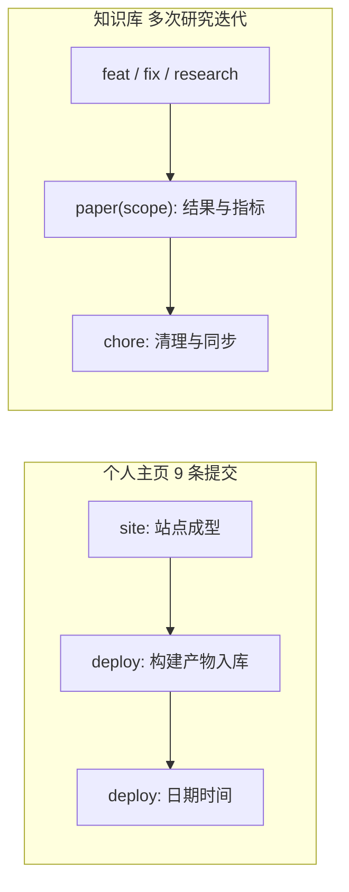
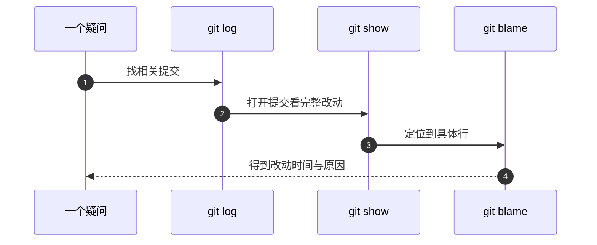

# 提交历史怎么读

改坏一个文件之后想知道它上一次是什么样，或者几个月后想弄明白某段配置为什么写成这样，答案都在 `git log` 里。前提是历史本身能被读：提交粒度足够小、信息里写清了意图。本项目手上有两个仓库，提交习惯并不相同，读法也就不同。

这篇先看两个仓库各自留下什么形状的历史，再讲提交信息的结构，最后给出一组命令，对应"我想知道什么"这类问题。

## 两个仓库，两种历史形状

个人主页仓库（`TC63PersonalWebsite`）一共九条提交，其中八条以 `deploy:` 开头，一条以 `site:` 开头。`deploy:` 的正文固定是日期与时间（由 `deploy.sh` 生成），内容包含源码与构建产物；`site:` 那一条是站点本身的首次成型。这种历史的特点是非常好读：想找"上一次线上是什么样子"，按 `deploy:` 往回数一条即可。

知识库仓库（`KnowledgeDiver`）的历史形状相反：提交粒度按工作单元划分，前缀覆盖 `research`、`fix`、`revise`、`chore`、`paper`、`feat`、`typeset`、`review` 等，正文里常带验证结果。例如一条论文相关的提交会写明测试数量与复现退出码，一条修复提交会写清修的是哪个脚本、指标从多少变到多少。

| 仓库 | 远程 | 提交风格 | 适合的读法 |
| --- | --- | --- | --- |
| 个人主页 | `github.com:TC635807/TC63PersonalWebsite` | `deploy:` 加时间，发布型 | 按发布时间线读 |
| 知识库 | `gitee.com:tc63/knowledge-diver` | 类型前缀加工作单元描述 | 按主题与关键词读 |

## 提交信息的结构与粒度

两边都遵循一个共同结构：一行简短的类型与描述，正文写细节。类型告诉读者这次改动属于哪一类，描述告诉读者改了什么，正文则在需要时补上验证方式与影响范围。

粒度上有个明显的差别。个人主页的提交是"发布"粒度：一次提交包含当天所有源码与产物改动。知识库的提交是"工作单元"粒度：一条提交对应一次实验、一次修复或一次重构，正文带指标。粒度粗的优点是历史短、翻起来快；细的优点是能定位到具体改动。项目选择哪种粒度，取决于回滚时希望回到多细的状态。

## 一组命令对应一组问题

| 想回答的问题 | 命令 |
| --- | --- |
| 最近发生了什么 | `git log --oneline -20` |
| 某个文件改过几次 | `git log --oneline --follow 路径` |
| 这次改动具体改了什么 | `git show 提交号` |
| 哪个提交动了这一行 | `git blame -L 起,止 路径` |
| 这次提交只涉及哪些文件 | `git show --stat 提交号` |
| 按作者或时间过滤 | `git log --since="7 days ago" --oneline` |
| 找含某关键词的提交 | `git log --grep="修复" --oneline` |

`--follow` 在文件被改名后仍然能追到更早的历史，这一点对文档仓库尤其有用：单元目录调整时文件路径会变，不加重命名跟踪就会断在改名那一刻。

## 用历史回答三个典型问题

第一个问题是"这段代码什么时候进来的"。做法是先 `git blame`定位行，拿到提交号，再 `git show`读完整改动与正文。`blame` 给出的是最后一次改动该行的提交，不是最初引入该逻辑的提交，两者可能相隔很远。

第二个问题是"这个文件为什么改名"。`git log --follow --name-status 路径` 会把重命名前后的路径都列出来。项目整理规划里提到的 `git mv` 迁移（知识库把论文、专利、文档搬进 `成果材料/` 这类操作）只有用 `--follow` 才能追住。

第三个问题是"上次发布是不是正常"。个人主页的做法是看最近一条 `deploy:` 提交的时间与内容，服务器上的 `git log --oneline -1` 应当与本地一致；不一致说明服务器还没拉取。

## 提交正文里应该留下什么

从两个仓库的实践可以归纳出三类信息：改了什么、为什么改、怎么验证。个人主页的 `deploy:` 提交用时间戳解决"是哪一次发布"，验证方式则是构建与自检脚本；知识库的提交把测试数量、复现退出码、指标变化写进正文，回答"这次改动有没有被验证过"。

对文档仓库而言，正文里最有用的是"结论来源"：哪一段结论是基于源码核对、哪一段是按手册推断。历史里写清了来源，后来回头看时才不会把推断当成事实。

## 提交与发布记录的对应关系

个人主页每一次 `deploy:` 提交都是一次发布的快照，因此历史可以直接当发布记录用：`git log --oneline` 里的顺序就是线上版本的倒序。知识库没有固定发布节奏，历史对应的是工作阶段，读的时候更适合先按前缀筛一遍，再看某一条的正文。

| 需求 | 个人主页 | 知识库 |
| --- | --- | --- |
| 找上一次发布 | 最近一条 `deploy:` | 无固定发布概念 |
| 找某主题的改动 | 关键词少，按时间翻 | `--grep` 按前缀与关键词筛 |
| 判断验证情况 | 看构建与自检 | 看正文里的测试与指标 |
| 恢复到旧版本 | 切到某条 `deploy:` | 切到对应工作单元提交 |

历史里还有一种信息容易被忽略：提交之间的间隔。同一主题的多条提交如果集中在一天内，通常说明当时在连续推进；间隔很长的提交则可能包含环境变化，例如依赖升级或目录调整。读历史时把时间也当成一条线索，能减少"为什么这里突然换了写法"这类困惑。

提交正文还有一个隐性的作用：它是写给自己看的说明。几个月后回来查一条配置为什么是这个值，正文里一句"按某手册取值"就能省下一次重新推断。

## 常见判断偏差

| # | 判断偏差 | 表现 | 依据 |
| --- | --- | --- | --- |
| 1 | 认为 `blame` 给出最初改动 | 追到的是最后一次改动 | blame 取的是行上的最后一次提交 |
| 2 | 文件改名后历史断了 | `git log 路径` 只剩改名之后 | 需要 `--follow` |
| 3 | 只看提交标题 | 不知道改动影响范围 | 正文与 `--stat` 才有范围 |
| 4 | 用提交粒度判断工作量 | 一次发布型提交看起来做了很多 | 粒度取决于仓库习惯 |
| 5 | 本地查看服务器状态 | 两边历史不一致 | 服务器要先 `git pull` |
| 6 | 把文档里的推断当结论 | 后来越用越确信 | 正文里应当标注来源 |

## 小结

### 核心概念

- 个人主页仓库以 `deploy:` 加时间的发布型提交为主，历史短而清晰。
- 知识库仓库以工作单元为粒度，前缀包括 `research`、`fix`、`paper` 等，正文常带验证数据。
- 提交信息的基本结构是一行类型描述加正文细节。
- `--follow` 用于跨改名追历史，`blame` 定位最后一次改动行。
- 提交正文里写清"怎么验证"与"结论来源"，回看时才有依据。

### 设计权衡

| 权衡点 | 本工程的选择 | 收益与代价 |
| --- | --- | --- |
| 提交粒度 | 主页偏发布、知识库偏工作单元 | 主页易回滚到发布点；代价是单条提交体积大 |
| 描述语言 | 中文为主、类型前缀英文 | 阅读快；代价是与工具默认输出混排 |
| 正文内容 | 记录验证数字与来源 | 事后可追溯；代价是写提交要多花时间 |
| 历史长度 | 主页很短、知识库很长 | 主页一眼看完；代价是知识库需要关键词检索 |

## 练习

### 基础题

1. 写出两条命令，分别查看最近提交列表与某文件的历史。
2. 为什么 `git blame` 的结果不等于该逻辑的引入提交？
3. 文件改名之后怎样继续追踪它改名前的历史？
4. 服务器上看不出更新，用哪条命令确认它拉到了哪一条提交？

### 挑战题

5. 为文档仓库设计一份提交信息模板，要求能区分"源码核对"与"手册推断"。
6. 给定一次线上样式丢失，设计一条只用 git 命令定位到引入那次改动的路径。
7. 如果要把发布型提交拆成"源码"与"产物"两类，历史读法会发生什么变化？说明好处与成本。
8. 设计一个规则，判断某条提交是否把构建产物与源码一起提交了。

## 附：本页引用的路径

| 路径 | 用途 |
| --- | --- |
| `TC63PersonalWebsite/deploy.sh` | 生成 `deploy: 日期 时间` 提交信息 |
| `TC63PersonalWebsite/.gitignore` | 产物入仓的约定 |
| `KnowledgeDiver/项目整理规划.md` | 知识库的结构调整与历史整理计划 |
| `KnowledgeDiver/成果材料/` | `git mv` 迁移后的目标目录 |
