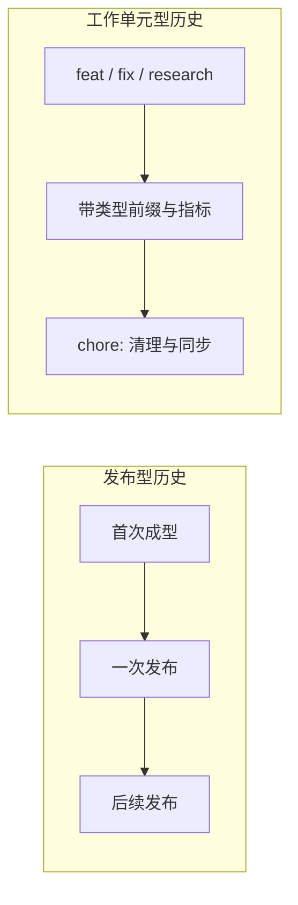
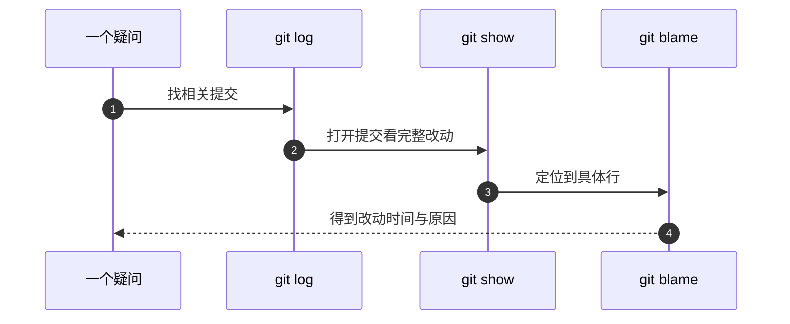

# 提交历史怎么读

改坏一个文件之后想知道它上一次是什么样，或者几个月后想弄明白某段配置为什么写成这样，答案都在 `git log` 里。前提是历史本身能被读：提交粒度足够小、信息里写清了意图。这两件事都是写的时候决定的——提交怎么切、信息里写什么，直接决定几个月后还能不能从历史里还原出「为什么」。

下面先看历史有哪几种常见形状与对应的读法，再讲提交信息的结构与粒度，最后给出一组命令，对应「我想知道什么」这类问题。

## 历史形状决定读法

发布型仓库把「一次上线」压成一条提交，标题里放版本号或时间戳，内容同时包含源码与构建产物。这类历史短、一眼能看完，适合按发布时间线读：想找「上一次线上是什么样子」，从最近一条发布提交往回数即可。代价是单条提交体积大，回滚只能回到发布点，回不到「完成一半」的中间态。

工作单元型仓库反过来：一条提交对应一次实验、一次修复或一次重构，标题带类型前缀（`fix:`、`feat:`、`docs:` 之类），正文写清改了什么、为什么改、怎么验证。这类历史便于按主题检索与精确定位，代价是提交数量多，翻起来要靠关键词。两种形状没有优劣之分，只有「以发布为单位回滚」和「以改动为单位回滚」的区别。

`git log --oneline` 把每条提交压成「短提交号 + 信息第一行」，是看历史形状最快的一条命令。提交号是 Git 按提交内容算出的十六进制指纹，命令里只写前 7 位就够。

下面是一份**示意**输出（不是本仓库原文），用来对照两种形状：

```console
$ git log --oneline -3
a1b2c3d deploy: v1.4.0        # 发布型：标题即发布标识
e4f5a6b deploy: v1.3.2
...

$ git log --oneline -3
9f8e7d6 fix(parser): 修正空文件导致的解析报错
5c4b3a2 feat(api): 新增按标签筛选
1a2b3c4 docs: 补上部署步骤
```

`git log` 默认新的排在前面，`-N` 表示只看最近 N 条；反过来取最早的两条可以用 `tail`。工作单元型的标题本身就在回答「改了哪一类东西」，发布型的标题只回答「这是哪一次发布」，两者后续的读法因此不同。

| 历史形状 | 典型标题 | 适合的读法 | 主要代价 |
| --- | --- | --- | --- |
| 发布型 | 版本号或时间戳 | 按发布时间线读，最近一条即线上状态 | 单条提交体积大，回不到中间态 |
| 工作单元型 | 类型前缀加描述 | 按前缀与关键词筛，再读正文 | 提交多、需要检索 |



## 提交信息的结构与粒度

可读的提交信息通常遵循一个共同结构：一行简短的类型与描述，正文写细节。类型告诉读者这次改动属于哪一类，描述告诉读者改了什么，正文则在需要时补上验证方式与影响范围。这个结构来自一个现实约束——历史是给未来的读者（常常是几个月后的自己）看的，所以标题要能在列表里被扫读，正文要被检索时能命中。

粒度是一处必须先定下的取舍。发布粒度（一次上线一条提交）历史短、翻起来快，适合以线上状态为回滚单位；工作单元粒度（一条提交对应一次改动）能定位到具体改动，适合需要精确回滚的场景。粗粒度让「回到上一个可用版本」变得简单，但单条提交里混着多件事，出问题时难以只回退其中一件；细粒度反过来。选择哪一种，取决于你希望回滚时回到多细的状态，所以「提交粒度」通常要写进团队的协作约定。

## 一组命令对应一组问题

| 想回答的问题 | 命令 |
| --- | --- |
| 最近发生了什么 | `git log --oneline -20` |
| 某个文件改过几次 | `git log --oneline --follow 路径` |
| 这次改动具体改了什么 | `git show 提交号` |
| 哪个提交动了这一行 | `git blame -L 起,止 路径` |
| 这次提交只涉及哪些文件 | `git show --stat 提交号` |
| 按作者或时间过滤 | `git log --since="7 days ago" --oneline` |
| 找含某关键词的提交 | `git log --grep="修复" --oneline` |

`--follow` 在文件被改名后仍然能追到更早的历史，这一点对文档仓库尤其有用：单元目录调整时文件路径会变，不加重命名跟踪就会断在改名那一刻。

## 用历史回答三个典型问题

第一个问题是"这段代码什么时候进来的"。做法是先 `git blame`定位行，拿到提交号，再 `git show`读完整改动与正文。`blame` 给出的是最后一次改动该行的提交，不是最初引入该逻辑的提交，两者可能相隔很远。

第二个问题是"这个文件为什么改名"。`git log --follow --name-status 路径` 会把重命名前后的路径都列出来。项目整理规划里提到的 `git mv` 迁移（知识库把论文、专利、文档搬进 `成果材料/` 这类操作）只有用 `--follow` 才能追住。

第三个问题是「部署的那台机器上是不是最新版本」。做法是在两边跑同一条命令比输出：远程上 `git log --oneline -1` 的结果与本地的 HEAD 一致，说明已经拉取到位；不一致就说明还停在旧提交。这条判断不依赖任何发布工具，只要机器上有仓库副本就能用。



## 提交正文里应该留下什么

一条能被复用的提交信息通常留三类信息：改了什么、为什么改、怎么验证。标题负责「改了什么」，正文回答后两个。只写标题的提交在当下够用，几个月后往往只剩「有这么一次改动」，无从判断能不能动它。

下面是一份**示意**模板（不是本仓库原文），把这几类信息固定成格式：

```text
fix(parser): 修正空文件导致的解析报错

原因：上传空文件时解析函数直接抛异常，接口返回 500。
改动：解析前先判空，空内容返回明确的 400 与提示。
验证：补一条单测覆盖空文件；本地跑自检脚本全绿。
```

「怎么验证」这一行尤其值得写：它区分了「改完试了一下」和「改完留下了可重复的检查」。写清验证方式之后，下一个改动的人才知道自己该重跑什么。

对文档仓库而言，正文里最有用的是"结论来源"：哪一段结论是基于源码核对、哪一段是按手册推断。历史里写清了来源，后来回头看时才不会把推断当成事实。

## 提交与发布记录的对应关系

发布型历史可以直接当发布记录用：`git log --oneline` 的顺序就是线上版本的倒序，最近一条对应当前线上状态。工作单元型历史没有固定发布节奏，它对应的是工作阶段，读的时候更适合先按前缀筛一遍，再看某一条的正文。

| 需求 | 发布型历史 | 工作单元型历史 |
| --- | --- | --- |
| 找上一次发布 | 最近一条发布提交 | 无固定发布概念，按工作阶段找 |
| 找某主题的改动 | 关键词少，按时间翻 | `--grep` 按前缀与关键词筛 |
| 判断验证情况 | 看发布前的构建与自检 | 看正文里的测试与指标 |
| 恢复到旧版本 | 切到某条发布提交 | 切到对应工作单元提交 |

历史里还有一种信息容易被忽略：提交之间的间隔。同一主题的多条提交如果集中在一天内，通常说明当时在连续推进；间隔很长的提交则可能包含环境变化，例如依赖升级或目录调整。读历史时把时间也当成一条线索，能减少"为什么这里突然换了写法"这类困惑。

提交正文还有一个隐性的作用：它是写给自己看的说明。几个月后回来查一条配置为什么是这个值，正文里一句"按某手册取值"就能省下一次重新推断。

## 常见判断偏差

| # | 判断偏差 | 表现 | 依据 |
| --- | --- | --- | --- |
| 1 | 认为 `blame` 给出最初改动 | 追到的是最后一次改动 | blame 取的是行上的最后一次提交 |
| 2 | 文件改名后历史断了 | `git log 路径` 只剩改名之后 | 需要 `--follow` |
| 3 | 只看提交标题 | 不知道改动影响范围 | 正文与 `--stat` 才有范围 |
| 4 | 用提交粒度判断工作量 | 一次发布型提交看起来做了很多 | 粒度取决于仓库习惯 |
| 5 | 本地查看服务器状态 | 两边历史不一致 | 服务器要先 `git pull` |
| 6 | 把文档里的推断当结论 | 后来越用越确信 | 正文里应当标注来源 |

## 小结

### 核心概念

- 历史有发布型与工作单元型两种常见形状，形状决定读法：前者按时间线，后者按类型前缀与关键词。
- 提交粒度决定回滚精度与历史长度，通常要写进协作约定。
- 提交信息的基本结构是一行类型描述加正文细节。
- `--follow` 用于跨改名追历史，`blame` 定位最后一次改动行。
- 提交正文里写清"怎么验证"与"结论来源"，回看时才有依据。

### 设计权衡

| 权衡点 | 常见选择 | 收益与代价 |
| --- | --- | --- |
| 提交粒度 | 发布型偏粗、工作单元型偏细 | 粗粒度历史短、易回滚到发布点，代价是单条体积大；细粒度能精确定位，代价是要靠检索 |
| 描述语言 | 类型前缀用英文、描述用母语 | 阅读快；代价是与工具默认输出混排 |
| 正文内容 | 记录验证方式与结论来源 | 事后可追溯；代价是写提交要多花时间 |
| 历史长度 | 与粒度直接相关 | 短历史一眼看完；长历史需要关键词检索 |

## 练习

### 基础题

1. 写出两条命令，分别查看最近提交列表与某文件的历史。
2. 为什么 `git blame` 的结果不等于该逻辑的引入提交？
3. 文件改名之后怎样继续追踪它改名前的历史？
4. 服务器上看不出更新，用哪条命令确认它拉到了哪一条提交？

### 挑战题

5. 为文档仓库设计一份提交信息模板，要求能区分"源码核对"与"手册推断"。
6. 给定一次线上样式丢失，设计一条只用 git 命令定位到引入那次改动的路径。
7. 如果要把发布型提交拆成"源码"与"产物"两类，历史读法会发生什么变化？说明好处与成本。
8. 设计一个规则，判断某条提交是否把构建产物与源码一起提交了。

## 附：本页引用的路径

| 路径 | 用途 |
| --- | --- |
| `TC63PersonalWebsite/deploy.sh` | 生成 `deploy: 日期 时间` 提交信息 |
| `TC63PersonalWebsite/.gitignore` | 产物入仓的约定 |
| `KnowledgeDiver/项目整理规划.md` | 知识库的结构调整与历史整理计划 |
| `KnowledgeDiver/成果材料/` | `git mv` 迁移后的目标目录 |
