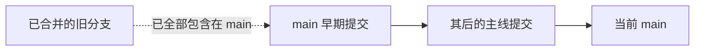
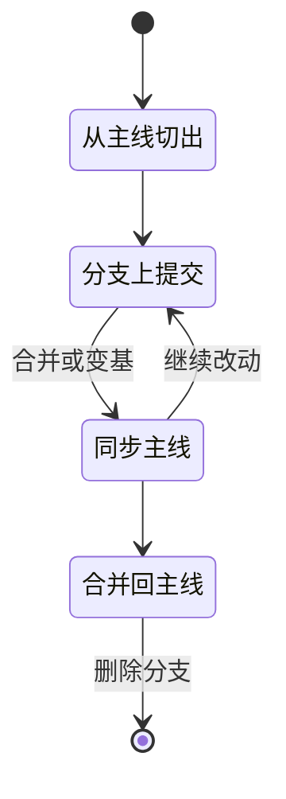

# 分支与主线的关系

打开任一仓库执行 `git branch -a`，结果通常比预想简单：真正在推进的往往只有一条主线，其余的要么已经合并、要么停在很久以前的某次提交上（本项目的另一个仓库就留着这样一条旧分支）。判断一条分支还有没有存在价值，看它与主线的领先落后就够了。

单人项目里，分支的作用是隔离风险，而不是承载评审流程——没有评审要等，也没有第二个人需要被挡住。下面先看分支状态该怎么读，再讲什么时候需要开一条分支、特征分支从创建到清理的完整生命周期，以及什么条件下分支是必须的。

## 先看清分支的实际状态

「落后若干、领先 0」是一条分支的常见终态：它的内容已经全部进入主线，删除它不会丢任何改动。出现这种状态的原因很固定——分支完成了历史使命，合并之后没人清理。反过来，如果一条分支领先数一直大于 0 而落后数还在增长，说明它既有独有改动又没跟上主线，需要尽快决定合并还是放弃。

| 常见状态 | 判据 | 处置 |
| --- | --- | --- |
| 只有主线与远程跟踪分支 | `git branch -a` 只列出 `main` 与 `origin/main` | 正常，无需处理 |
| 分支已全部并入主线 | 领先 0、落后若干 | 直接删除，不会丢改动 |
| 分支既有独有改动又落后 | 领先大于 0，落后还在增长 | 尽快决定合并还是放弃 |
| 分支长期未推送 | 没有远程对应，改动只在本地 | 要么推送备份，要么删除 |



## 单人项目里分支换来什么

单人开发时，直接提交主线的成本很低：没有评审等待，没有合并冲突，发布路径最短。分支换来的主要是三种保护：一是让未完成的实验不污染主线，二是让一条改动可以整体丢弃，三是让 CI 或发布流程只在合并时触发。

反过来，分支也有成本：需要记住它的存在、需要定期同步主线、需要在完成时合并与清理。在「一个人在推进、发布即拉取」这类节奏里，短命分支的收益通常大于成本；长期挂着的分支则会退化成「不敢合也不敢删」的遗留。

## 特征分支的生命周期

一条特征分支通常经历四步：从主线切出、在分支上提交、把主线的变化合进来或变基、合并回主线并删除。

第一步切分支时基于最新的主线，避免一开始就落后。第二步的提交保持小而清晰，方便回退。第三步有两种做法：合并主线到分支，或者把分支变基到主线。两者的差别在于历史形状：合并会保留两条线并产生一个合并提交；变基会把分支改写成主线上的一条直线，历史更好读，代价是提交号变化、已经推送过的分支再改基础会导致其他人无法直接拉取。

第四步合并时是否保留分支拓扑，取决于仓库偏好。`merge --no-ff` 会显式留下一个合并提交，便于识别"这是一个功能"；快进合并则让历史完全没有分支痕迹。



## 什么时候必须开分支

有几种情况分支不再可选，而是必要。第一，改动具有破坏性，比如重写构建流程或调整目录结构，需要随时能整体放弃。第二，出现外部协作者，两条线同时改同一批文件，需要合并而不是互相覆盖。第三，需要让 CI 在合并前跑一次检查，此时分支是评审单元。第四，需要保留一条长期并行线，例如文档重写与功能开发同时进行。

判断标准可以简化成一句：如果这次改动失败之后需要花时间还原，就先切分支。

还有一类场景介于两者之间：改动本身可还原，但过程需要多次提交试错。这时分支的作用是让试错过程不进入主线历史，验证成功后可以把多条提交压成一条再合并，保持主线整洁。

## 合并冲突的处理顺序

冲突出现在同一个文件的同一区域被两条线改动时。处理顺序建议是先判断该文件属于哪一类：配置与产物类冲突通常重新生成而不是手工合并；源码类冲突按语义合并；文档类冲突需要逐段对照，避免把两边的结论都留下。

合并完成后不要急着推送。先跑一次构建或测试，再确认 `git status` 干净，最后把分支删除并在主线确认改动存在。不清理的代价是延迟显现的：半年后再看，这条分支到底还是一条独有改动、还是已经毫无内容，需要重新判断一遍。

## 主线上的提交如何保持可发布

直接提交主线的前提是每次提交之后主线仍然可用。保证这一点有两种做法：把构建与自检放进提交前的脚本，让推上去的内容天然可发布；或者把测试结果写进提交正文，用一条记录说明这一步验证过。两种做法指向同一个原则：验证发生在提交之前，而不是之后。

如果某次改动无法在提交前验证完，就应当切分支，等验证完成再合回来。这条规则把"分支"从流程装饰变成了验证缓冲。

## 分支命名与追踪

分支名在单人项目里同样有用，因为它是一行说明。`opencode/cosmic-sailor` 这类名字来自工具自动生成，看不出主题；相比之下 `fix/uart-dma` 或 `docs/git-flow` 一眼能看出范围。命名约定的收益在分支变多时体现，在只有一条主线时几乎为零，因此不必为命名立规矩，但新建分支时按主题起名是低成本的好习惯。

远程追踪方面，`git branch -vv` 能看出每条本地分支对应哪个远程分支、领先落后多少。推送过一次的分支会自动建立追踪关系；本地新切的分支在没有推送前不存在远程对应，删除时也不影响远程。

下面是**示意**输出（不是本仓库原文）：

```console
$ git branch -vv
* main a1b2c3d [origin/main] docs: 补上部署步骤
  feature/login e4f5a6b [origin/feature/login: ahead 2, behind 1] feat: 登录页
```

行首的 `*` 标出当前所在分支；方括号里的 `[origin/main]` 表示这条本地分支已与远程同名分支建立追踪关系（tracking branch），之后 `git push`、`git pull` 不写远程名也知道该找谁。方括号后若出现 `ahead 2`、`behind 5`，就是相对该追踪分支领先与落后的提交数。

## 分支决策怎么落到日常

把判断标准压成日常习惯之后，流程会变得很简单：打开编辑器之前先问一句这次改动失败是否需要还原。需要，就 `git switch -c 主题` 切一条分支；不需要，就直接在 `main` 上改。

`git switch -c` 是「新建一条分支并立刻切过去」（`-c` 即 create），等价于旧的 `git checkout -b`。切过去之后的提交都落在新分支上，`main` 停在原地不动，这也正是分支能「整体放弃」的原因。分支上的工作一旦验证通过，立刻合并并删除，避免它变成第二条六月分支。

这套习惯的收益在几个月后显现：主线上每一段历史都对应一次可用的状态，回退时没有"这条改动完成到一半"的中间态需要判断。

## 单人仓库里替代分支的几种做法

不开分支也能获得一部分保护。第一种是标签：发布点打一个 `git tag`，回看与回滚都有一条明确的锚点，成本几乎为零。第二种是提交前的验证习惯，把构建与测试跑通再提交，相当于用纪律代替隔离。第三种是本地备份与远程双写，把仓库同时推到两个远程，避免单点丢失。

分支保护规则是另一种机制：在 GitHub 或 Gitee 上把主线设为受保护，禁止直接推送、要求通过合并请求进入。它主要服务于多人协作，单人仓库开启之后只会给自己增加一步操作，收益要等协作者出现才兑现。

分支与主线的距离也是需要定期看的指标。`git rev-list --left-right --count main...分支` 一眼给出领先与落后，如果一条分支连续几周落后数量在增长而领先一直是零，它就已经失去存在意义。

```console
$ git rev-list --left-right --count main...origin/main
0	0
```

输出是两个数字，左边是 `main` 独有、右边是 `origin/main` 独有的提交数，`0 0` 表示两边完全一致；三个点表示比较的是两边的对称差，而不是谁是谁的祖先。换成一条已经被主线包含的旧分支，右边为 0 就说明它没有任何主线没有的改动，删除不会丢东西。

主线上每一段历史都应当是可用状态，这条要求本身就解释了为什么破坏性改动要先切分支：它保证失败只发生在分支里。

## 常见判断偏差

| # | 判断偏差 | 表现 | 依据 |
| --- | --- | --- | --- |
| 1 | 看到分支名以为它在并行开发 | 实际上早已落后 | `git rev-list --left-right --count` 给领先与落后 |
| 2 | 认为删除分支会丢改动 | 犹豫不决 | 领先 0 的分支删除安全 |
| 3 | 对已推送分支变基 | 其他克隆无法直接拉取 | 变基会改写提交号 |
| 4 | 合并前不跑构建 | 冲突解决引入语法错误 | 构建与测试是合并的验证 |
| 5 | 长期挂着未完成分支 | 半年后不敢合也不敢删 | 分支需要定期决定去留 |
| 6 | 把分支当成发布开关 | 线上更新与分支无关 | 发布由推送与拉取决定 |

## 小结

### 核心概念

- 大多数单人仓库实际只有一条主线在推进；已全部并入主线的旧分支留下的只是名字，删除安全。
- 分支在单人项目里的价值是隔离风险，而不是评审。
- 特征分支的生命周期是从主线切出、提交、同步、合并与删除。
- 合并与变基的区别在历史形状，变基会改写提交号。
- 破坏性改动、外部协作者、需要前置检查、长期并行线这四类场景下分支是必要的。
- 完成后的分支要及时删除，避免变成需要重新判断的遗留。

### 设计权衡

| 权衡点 | 常见选择 | 收益与代价 |
| --- | --- | --- |
| 主线推进 | 单人直接提交 main | 路径最短；代价是实验失败要手动还原 |
| 分支数量 | 尽量少，用完即删 | 不留判断负担；代价是需要自律 |
| 同步方式 | 视情况选合并或变基 | 合并保真、变基好看；代价是变基影响他人拉取 |
| 合并形态 | 视仓库偏好 | 保留拓扑便于识别功能；代价是历史出现分叉 |

## 练习

### 基础题

1. 用一条命令判断一条分支相对主线的领先与落后数量。
2. 说明「领先 0、落后若干」的分支删除是否安全，理由是什么。
3. 合并与变基分别对历史形状做什么改变？
4. 列出四种必须开分支的场景。

### 挑战题

5. 给一条「领先 0、落后很多」的旧分支写一份处置决定：删除、保留归档，或者重新合并，说明判据。
6. 设计一个"分支过期提醒"的检查，写出判据与执行时机。
7. 一次合并后发现主线构建失败，写出从定位到回退的完整步骤。
8. 如果引入第二位协作者，现有流程需要增加哪些约定？按优先级排序并说明理由。

## 附：本页引用的路径

| 路径 | 用途 |
| --- | --- |
| `TC63PersonalWebsite/.github/workflows/deploy.yml` | 只在 main 上触发的发布流程 |
| `TC63PersonalWebsite/deploy.sh` | 直接推送 main 的发布方式 |
| `KnowledgeDiver/项目整理规划.md` | 结构调整与分支后续处理 |
