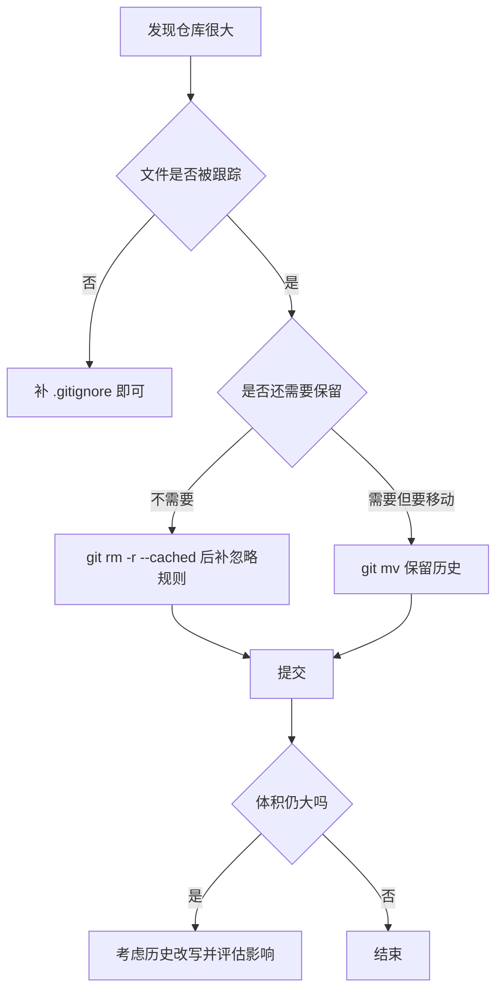
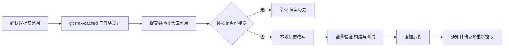

# 仓库卫生与历史整理

仓库用久了会出现一些与代码无关的东西：编译缓存、工具生成的会话状态、同一个文件的几份副本、甚至别人项目的完整仓库。它们在 `git status` 里不显眼，却会把仓库撑到几百 MB，让克隆和备份变慢。知识库的整理规划里把这类问题列了一遍，数字很具体：根级缓存目录被跟踪了 429 个文件，两个工具目录各占 321M，其中一个还包含两百多个被跟踪文件，`项目未来/` 下嵌着两个独立的 git 仓库。

这篇按"先看清楚、再决定处置、最后才是改写历史"的顺序，讲清 `git rm --cached`、`.gitignore`、`git mv` 与历史改写各自解决什么，以及哪些操作一旦执行就很难回头。

## 误提交是怎么发生的

`.gitignore` 只对未被跟踪的文件生效。一个目录如果在写出忽略规则之前就已经被 `git add` 过，之后即使补上规则，它仍然在版本控制里。知识库规划里记录的两处正是这种情况：根级缓存目录的忽略规则只覆盖了子目录，根级的 429 个文件被误提交；两个工具目录虽然标注了忽略，但仍有 219 个文件被跟踪。

判断方法是把"工作区里存在"与"被仓库跟踪"分开看：`git status --ignored` 看忽略状态，`git ls-files 目录` 看跟踪状态。后者才是提交体积的来源。

## 三个操作各解决什么

| 操作 | 作用 | 适用场景 |
| --- | --- | --- |
| `git rm -r --cached 目录` | 停止跟踪但保留工作区文件 | 缓存、生成物、误提交的目录 |
| 补 `.gitignore` | 阻止再次被添加 | 与上一步配套 |
| `git mv 旧 新` | 移动文件并保留历史 | 目录重组、成果归档 |
| `git rm -r 目录` | 删除文件并停止跟踪 | 确认不再需要的重复副本 |
| 历史改写工具 | 从所有历史中移除大文件 | 体积仍无法接受时 |

前四个操作只影响最新提交，历史里仍然留着那些文件。要把体积降下来，必须改写历史，这一步的影响面比前四步大得多。

停止跟踪不等于删除。`git rm -r --cached` 之后文件仍在工作区，本地开发不受影响；如果某台机器上有人正在使用这些路径，也不会因为这次提交而消失。变化的只是仓库内容与克隆体积的走向。

## 目录重组为什么用 git mv

知识库的整理方案把论文、专利、文档、比赛材料统一搬进 `成果材料/` 下，并明确使用 `git mv`（`项目整理规划.md` 的迁移表）。原因是保留历史：普通 `mv` 加 `git add` 在 git 眼里是一次删除加一次新增，`git log --follow` 也追不到之前的内容；`git mv` 记录成重命名，历史链保持完整。

重组还会遇到内嵌仓库的问题：`项目未来/` 下有两个独立 git 仓库，直接移动会让它们变成普通目录（丢失各自历史）或者被外层仓库拒绝跟踪。常见处理是抽成子模块，或者先把内层仓库的历史导出再合并，具体方式取决于这两个项目是否还需要独立维护。

## 历史重写的风险与顺序

改写历史会改变提交号，进而影响所有已经克隆过仓库的环境。对知识库而言，至少有三处受影响：本机的工作副本、远程仓库、以及任何已经拉取过的机器。已经推送的分支再被改写，其他人无法直接拉取，只能重新克隆或做手术式修复。

如果确实要改写，顺序是：先把要保留的数据导出留档，再在本地完成改写，确认仓库能正常构建与测试，然后强推远程，最后通知所有克隆过的人重新拉取。强推是这条链里唯一不可逆的动作，执行前应当确认远程没有别人正在推送。

## 重复副本为什么要单独处理

规划里还记录了一类问题：同一个文件在多个目录下内容完全相同，md5 一致。重复副本的害处不在体积，而在维护：改一处忘另一处，下一次读文档时不知道哪一份是最新的。处理后应当只保留一份，其余归档或删除，并在提交信息里写清保留哪一份、为什么。

## 忽略规则的写法与验证

忽略规则的写法有个常见顺序问题：先补规则、再确认状态、最后才提交。规则里应当区分"忽略目录内容"与"保留目录本身"，前者用 `目录/` 结尾，后者需要额外的占位文件。规则写完之后用 `git status --ignored` 确认目标已经被忽略，再用 `git ls-files` 确认它不在跟踪列表里。两步都通过，才说明清理完成。

验证还要覆盖反例：故意在缓存目录里新建一个文件，看它是否仍然不出现。规则没有生效时往往是因为上一层目录被整体忽略了，此时需要显式取消忽略某个子路径。

## 克隆与备份的成本

仓库体积的直接代价出现在三处：新机器克隆、远程仓库备份、以及每次 `git status` 与 `git log` 的扫描。知识库规划里记录的两个 321M 目录如果长期存在，等于每次克隆都要搬运几百 MB 的历史无关内容。

判断标准可以简化为一句：这部分内容在克隆之后会不会被用到。不会被用到的缓存与会话状态属于可以清理的部分；需要长期保留的原始数据则适合放到仓库之外单独备份，或者使用大文件存储方案，把版本库与数据分离。

清理误提交时还要注意与发布产物区分开。个人主页把 `dist/` 有意保留在仓库里，因为服务器需要它来发布；知识库的缓存目录则是纯粹的副作用。同样是"生成物"，一个是有意入仓的交付物，一个是应当移除的中间状态，判断依据是它有没有下游使用者。

判断某个目录该不该入仓，可以问它是否会被克隆之后的机器直接使用。会被直接使用的产物、配置与文档应当入仓；只在构建或运行时生成、又能随时重建的内容应当排除。按这条标准过一遍目录树，多数误提交都能自己浮出来。

仓库卫生是每次新增工具时顺手确认的一件事，而不是一次性的清理任务：新目录产生的中间文件有没有被忽略规则覆盖。把它当成提交前的习惯，就不会再积累出需要改写历史才能解决的局面。

清理完成之后还要回看一次忽略规则本身。规则写得过宽会误伤需要入仓的文件，写得过窄又会漏掉新生成的中间状态；每次处理完一处误提交，顺便确认相邻路径的规则是否也该调整，比事后一次性重写更省力。

## 常见判断偏差

| # | 判断偏差 | 表现 | 依据 |
| --- | --- | --- | --- |
| 1 | 加了忽略规则就以为文件不再进仓库 | 目录仍在跟踪列表里 | 已跟踪文件不受 `.gitignore` 影响 |
| 2 | 用普通 mv 搬迁目录 | 历史断在搬迁处 | `git mv` 才保留重命名记录 |
| 3 | 以为删除文件就会减小仓库 | 克隆体积不变 | 体积来自历史，需要改写才能释放 |
| 4 | 直接强推改写后的历史 | 其他克隆报错 | 提交号变化影响所有副本 |
| 5 | 忽略内嵌 git 仓库 | 目录被当作普通文件或拒绝提交 | 需要子模块或历史导出 |
| 6 | 保留两份内容相同的文件 | 后续修改只落到一份 | 重复副本带来维护歧义 |

## 小结

### 核心概念

- 已跟踪的文件不会因为新增忽略规则而离开版本控制，需要 `git rm --cached`。
- 判断体积来源要看跟踪列表而不是工作区大小。
- `git mv` 保留重命名历史，是目录重组时的正确做法。
- 删除文件只影响最新提交，减小克隆体积需要改写历史。
- 历史改写会改变提交号，强推前要确认影响到的克隆与协作者。
- 重复副本的主要成本是维护歧义，处理时只保留一份。

### 设计权衡

| 权衡点 | 本工程的选择 | 收益与代价 |
| --- | --- | --- |
| 清理方式 | 先 `rm --cached` 加忽略，再评估改写 | 风险可控；代价是体积不会立刻下降 |
| 目录重组 | 统一用 `git mv` | 历史完整；代价是操作前要确认目标路径 |
| 内嵌仓库 | 评估后再决定子模块或导出 | 各自历史得以保留；代价是需要额外维护 |
| 历史改写 | 谨慎执行、全量验证后强推 | 体积彻底下降；代价是不可逆与协作成本 |

## 练习

### 基础题

1. 写出停止跟踪一个目录但保留本地文件的命令，以及配套的忽略规则。
2. 为什么 `git rm` 之后克隆体积没有变化？
3. `git mv` 与"`mv` 加 `git add`@"在历史记录上有什么区别？
4. 判断一个文件是否被跟踪用哪条命令？

### 挑战题

5. 给一份仓库状态检查清单：列出体积、跟踪文件数、忽略状态与大文件四类检查及对应命令。
6. 设计一次目录重组方案，要求所有被移动文件都能用 `--follow` 追到历史，写出验证步骤。
7. 如果必须强推改写后的历史，写一份执行前检查表与执行后通知内容。
8. 内嵌 git 仓库的两种处理方式（子模块、历史导出合并）各适合什么场景？

## 附：本页引用的路径

| 路径 | 用途 |
| --- | --- |
| `/mnt/d/KnowledgeDiver/项目整理规划.md` | 误提交目录、重复副本与迁移表 |
| `/mnt/d/KnowledgeDiver/.gitignore` | 忽略规则的覆盖范围 |
| `/mnt/d/KnowledgeDiver/成果材料/` | 目录重组后的目标位置 |
| `/mnt/d/TC63PersonalWebsite/.gitignore` | 产物与缓存的忽略约定对比 |
