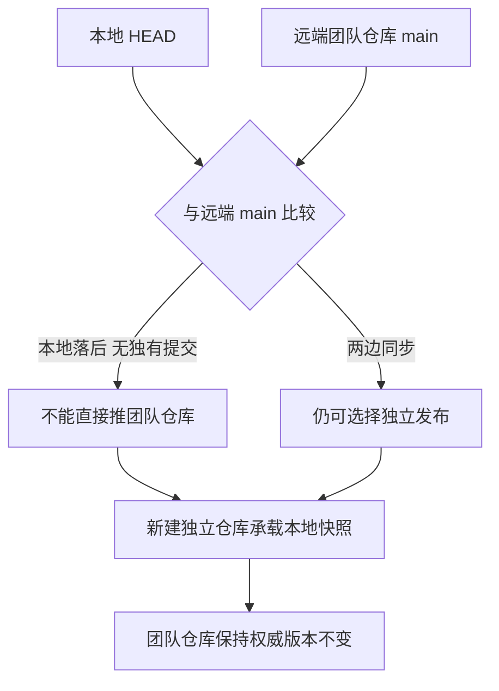
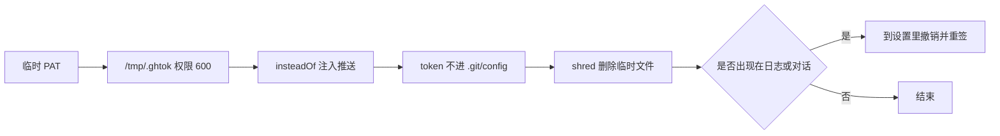

# 公开一个本地项目

把一份本地代码放到自己名下的公开仓库，看起来只是「新建仓库再 push」，实际有四件事必须在动手之前完成：确认远端历史、扫描凭据、排除构建产物、决定用哪种凭据推送。任何一件漏掉，代价可能是覆盖别人的提交、把密钥写进公开仓库，或者推上去一个几百 MB 的目录。

下面用一个真实场景贯穿：一份放在团队仓库之外的机器人固件要单独开源（原始记录见 `personal-homepage-research/11-github-publish-record.md`）。值得保留下来的是判断依据，命令只是执行细节。

## 第一步：核对本地与远端的历史

动手之前先比对本地 HEAD 与目标仓库的主线，避免把落后版本推上去覆盖别人的改动。判断方法是拿两边的同一位置对照：本地 `git log --oneline -1` 与远端主线的最新提交。如果本地落后而没有任何独有提交，说明它只是一份旧快照，往原仓库推不会带来新内容，只会制造冲突。

还有一处容易忽略的细节：账号改名。remote 地址里写的是旧用户名时，平台会用 301 重定向把请求导到新名字上，旧的 `git push` 往往仍能工作，但重定向会让自动化工具与鉴权配置的行为变得难以预测，最好把 remote 更新到当前用户名。



## 第二步：决定发布到哪里

核对之后有两条路：把本地版本推到原仓库，或者新建一个独立仓库承载本地快照。如果本地版本与团队版本已经分叉（本地缺少团队最近的改动），直接推会冲掉对方的提交，此时新建独立仓库更安全：新仓库是本地快照，原仓库仍是权威版本，两边互不影响。

这个决定的适用条件是明确区分"我的版本"与"我们的版本"。只要两个版本的用途不同，各自独立就比强行合并安全；如果目标是让本地改动回流团队仓库，动作应当是拉取、合并、再推送，而不是新建仓库。

## 第三步：公开之前的密钥扫描

仓库要设为公开，扫描是必做项。扫描范围是全部将被提交的文本文件——第三方依赖与构建产物目录一般跳过，它们体积大且不是自己写的。扫描分两路：按关键词匹配正文，按文件名匹配典型凭据文件。

「密钥扫描」就是用一组模式把全部文本文件过一遍，找凭据的痕迹。它不能证明「没有泄漏」，只是把人工核对的范围缩小到少数命中点。记录里列出的模式分两类：

```text
# 内容关键词
password  secret  api_key  token  PRIVATE KEY  ssid  AKIA  ghp_  xox
# 文件类型
.env  .pem  .key  credentials
```

命中的条目要逐个看上下文再决定：协议字段名、示例值、文档里的占位符都会命中，但它们不是凭据。原始记录里唯一一次命中就是固件里的协议字段注释。反过来说，没命中也不等于安全——扫描不能证明「没有泄漏」，它只是把人工核对的范围从整个仓库缩小到少数几处。

| 检查项 | 匹配内容 | 处理方式 |
| --- | --- | --- |
| 通用凭据词 | password、secret、api_key、token | 命中即逐个核对上下文 |
| 云平台密钥 | AKIA、ghp_、xox | 命中即视为泄漏处理 |
| 私钥文件 | .pem、.key、PRIVATE KEY | 不入仓或直接删除 |
| 配置文件 | .env、credentials | 用示例文件替代 |
| 协议字段名 | 形似密钥的注释与字段 | 核对后保留 |

## 第四步：排除构建产物

发布内容要明确划分包含与排除：包含源码、工程配置与工具链，排除编译产物、IDE 状态与版本库自身目录，并新增 `.gitignore` 把排除项固化下来，避免下一个人又把它们加回去。

排除判断的依据是「克隆之后会不会被直接使用」。编译产物可以由源码重建，且体积远大于源码本身，因此属于排除项；编辑器配置虽然可选，保留它可以降低别人复现开发环境的成本，属于可接受的取舍。

## 构建产物为什么通常是排除项

排除 `build/` 的直接理由是体积：编译产物动辄几十 MB，而源码与工程文件只有几 MB；两者又都能由构建工具从源码重新生成，判断口径是「能否由仓库里的东西重建」。可重建的内容入仓，等于让每个克隆者都多下载一份冗余副本。

`.gitignore` 只能阻止未跟踪文件，对已经跟踪的 `build/` 无效。如果历史上提交过，需要先 `git rm -r --cached build/` 再提交，这一步只从索引里移除，不删本地文件。核对是否清干净，可以在 `git status --ignored` 里看目录是否归入忽略类别，或在一个临时克隆里检查体积。

| 目录 | 典型体积 | 处理 | 理由 |
| --- | --- | --- | --- |
| 编译产物 | 几十 MB | 排除 | 可由源码重建 |
| 构建缓存 | 与产物同量级 | 排除 | 重建即可，无下游 |
| IDE 配置 | 数 MB | 一般排除 | 本机状态，含个人路径 |
| `.git/` | 随历史增长 | 本来就不入库 | 版本库自身 |
| 源码与工程文件 | 数 MB | 保留 | 克隆后需要直接使用 |

## 第五步：凭据怎么用、怎么撤

一次性推送的通用做法是临时 PAT 加一次注入：token 只写入一个权限 600 的临时文件（`0600` 表示只有属主可读写）；推送时通过 `git -c url."https://x-access-token:$T@github.com/".insteadOf=...` 注入，因此 token 没有写进任何 `.git/config`；结束后用 `shred` 删除文件。

PAT 是 personal access token（个人访问令牌），用一串可以随时撤销的字符串代替账号密码，适合只做一次的操作。命令本身也值得逐段看：`git -c 键=值` 表示「只为这一次调用临时设置一项配置」，不落盘到 `.git/config`；`url.<前缀>.insteadOf=<原前缀>` 则是在推送前把地址前缀改写成带 token 的形式。

```bash
# 记录里原样摘录的一条（`insteadOf` 的替换目标在记录中以省略号略去）：
git -c url."https://x-access-token:$T@github.com/".insteadOf=... push
# 结束后销毁只放着 token 的临时文件
shred /tmp/.ghtok
```

`shred` 用随机数据覆盖文件后再删除，比 `rm` 更难被恢复，适合处理这种只装过一次凭据的临时文件。

有一条通用规则值得单独记：凭据一旦离开安全存储进入日志、对话或截图，就应当视为已失效，到平台设置里撤销并重新签发。撤销比「希望没人看到」可靠得多——泄漏的判定不需要等确认。



## 发布之后要检查什么

仓库设为公开只是开始，发布之后至少确认三件事。第一，仓库描述与 topics 能让目标读者搜到：topics 是检索入口，用「通用技术标签 + 项目专属标签」的组合。第二，README 在网页上渲染正常，表格、徽章、图片与相对链接都要看一眼。第三，仓库里没有意料之外的大文件或凭据。

README 的结构应当回答读者打开页面后的连续几个问题：这是什么、用了什么技术、怎么编译或安装、代码怎么组织、有哪些已知限制。

## 常见判断偏差

| # | 判断偏差 | 表现 | 依据 |
| --- | --- | --- | --- |
| 1 | 直接推本地版本到团队仓库 | 队友的提交被覆盖 | 发布前必须比对远端历史 |
| 2 | 认为 remote 里的用户名不会变 | 自动化工具行为异常 | 账号改名会返回 301 |
| 3 | 密钥扫描只看文件名 | 内容里的凭据漏掉 | 需要按模式扫描正文 |
| 4 | 命中一处就全部推翻 | 把协议字段名当成密钥 | 命中要逐个核对上下文 |
| 5 | 把 build 目录一起提交 | 仓库体积暴涨 | 编译产物可由源码重建 |
| 6 | token 直接写进 remote URL | 凭据留在 .git/config | 用一次性的 insteadOf 注入 |

## 小结

### 核心概念

- 公开之前先比对本地与远端历史，判断是否存在被覆盖的风险。
- 本地版本与团队版本用途不同时，独立仓库比强行合并安全。
- 密钥扫描要覆盖内容模式与文件类型，命中后逐个核对上下文。
- 编译产物与 IDE 缓存属于排除项，判断依据是能否由源码重建。
- 凭据用临时文件加一次性注入，避免写入版本库配置。
- 凭据一旦进入日志或对话，应当撤销并重新签发。

### 设计权衡

| 权衡点 | 常见选择 | 收益与代价 |
| --- | --- | --- |
| 发布目标 | 新建独立仓库 | 不动团队权威版本；代价是两份代码分叉 |
| 仓库可见性 | 公开 | README 与作品集展示成立；代价是必须做密钥扫描 |
| 内容范围 | 源码加工程文件，排除构建产物 | 体积小、可复现；代价是别人需自行编译 |
| 凭据方式 | 临时 PAT 加一次性注入 | 不落盘到配置；代价是每次需要重新准备 |

## 练习

### 基础题

1. 为什么推送本地版本之前要先比对远端历史？
2. 密钥扫描除了文件名还要检查什么？
3. 排除 `build/` 目录的判断依据是什么？
4. 说明 `insteadOf` 注入凭据相比把 token 写进 remote URL 的好处。

### 挑战题

5. 给一次公开操作写一份检查清单，按时间顺序排列，并标出每一步的失败表现。
6. 如果本地版本确实需要回流团队仓库，写出从比对到推送的完整步骤。
7. 设计一个扫描脚本的规则集：要覆盖哪些模式、怎样减少"协议字段名"这类误报？
8. 仓库公开之后发现某个文件含凭据，写出处置顺序，包括历史清理的判断。

## 附：本页引用的路径

| 路径 | 用途 |
| --- | --- |
| `personal-homepage-research/11-github-publish-record.md` | 发布记录：历史核对、扫描、排除项与凭据处理 |
| `personal-homepage-research/05-repo-metadata.md` | 仓库元数据核验方法与 API 限速说明 |
| `README.md` | 站点仓库的部署与 Pages 说明 |
