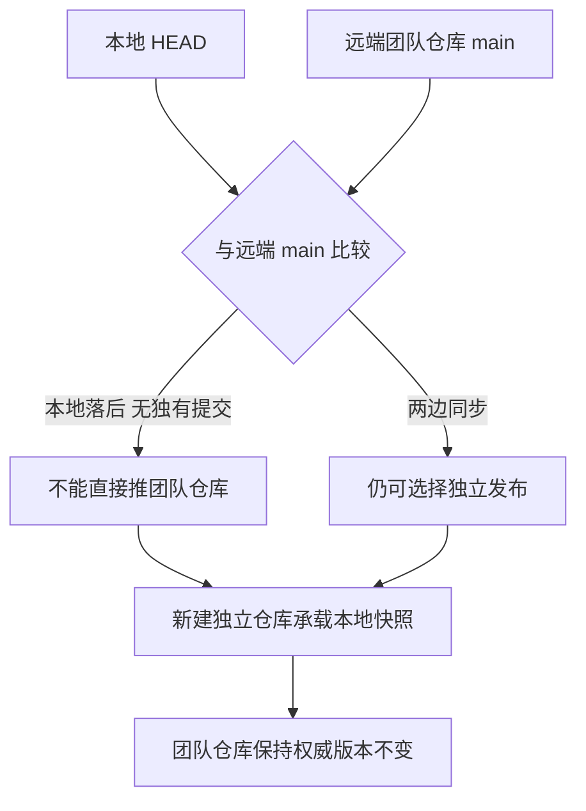
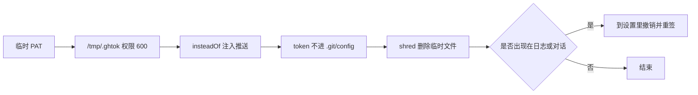

# 公开一个本地项目

本地躺着一份 RM 机器人代码，团队仓库在别人名下，想把它放到自己的 GitHub 账号下，顺便写一份能看的 README。这个动作看起来只是"新建仓库再 push"，实际有四件事需要在动手之前完成：确认远端历史、扫描凭据、排除构建产物、决定用哪种凭据推送。任何一件漏掉，代价可能是覆盖队友提交、把密钥写进公开仓库，或者推上去一个几百 MB 的目录。

调研文档里记录了一次完整的执行过程（`personal-homepage-research/11-github-publish-record.md`），执行日期是 2026-10-06，对象是两个 RM 项目。可复用的是当时的判断依据与取舍，命令本身只是执行细节。

## 第一步：核对本地与远端的历史

动手之前先比对本地 HEAD 与团队仓库的主线，避免把落后版本推上去覆盖队友的改动。核对结果有两处关键差异：云台项目的本地提交停在 2026-04-02（`428f528`），而团队仓库的主线已经走到 2026-07-06（`7e2e941`），本地落后三个提交且没有独有提交；底盘项目两边完全同步（`121ea30`）（`11-github-publish-record.md:18-26`）。

另一个细节是账号改名：本地 remote 写的是 `QianLi2026`，实测该账号已经改名为 `QianLi2027`，判断依据是 GitHub 返回 301 重定向（`11-github-publish-record.md:27`）。remote 地址里的旧名字可能仍能工作，但重定向会让一些自动化工具行为变得难以预测。

## 第二步：决定发布到哪里

核对之后有两条路：把本地版本推到团队仓库，或者新建独立仓库。当时的选择是后者，理由是用户要求"提交我本地版本即可"，而本地版本落后三个月、不含七月的团队重构，推上去会冲掉那批改动。新建独立仓库之后，两个仓库各说各话：新仓库是本地快照，团队仓库仍是权威版本（`11-github-publish-record.md:29-30`）。

这个决定的适用条件是明确区分"我的版本"与"我们的版本"。只要两个版本的用途不同，各自独立就比强行合并安全；如果目标是让本地改动回流团队仓库，动作应当是拉取、合并、再推送，而不是新建仓库。

## 第三步：公开之前的密钥扫描

仓库要设为公开，扫描是必做项。当时扫描的范围是两个项目工作区，排除了 `build/`、`build_test/` 与 ST 驱动库，匹配 `password`、`secret`、`api_key`、`token`、`PRIVATE KEY`、`ssid`、`AKIA`、`ghp_`、`xox` 等模式，并检查 `.env`、`.pem`、`.key`、`credentials` 一类文件（`11-github-publish-record.md:32-38`）。

扫描结果只有一处命中：裁判系统头文件里的注释"0x0A06 对方干扰波密钥"，那是协议字段名说明，不是凭据。这条记录本身说明一个判断标准：命中不等于泄漏，需要看命中的上下文；但命中之后必须逐个看过，不能因为"大概不是"就跳过。

| 检查项 | 匹配内容 | 处理方式 |
| --- | --- | --- |
| 通用凭据词 | password、secret、api_key、token | 命中即逐个核对上下文 |
| 云平台密钥 | AKIA、ghp_、xox | 命中即视为泄漏处理 |
| 私钥文件 | .pem、.key、PRIVATE KEY | 不入仓或直接删除 |
| 配置文件 | .env、credentials | 用示例文件替代 |
| 协议字段名 | 形似密钥的注释与字段 | 核对后保留 |

## 第四步：排除构建产物

发布内容里明确排除了 `build/`（云台项目 84 MB、底盘项目 76 MB 编译产物）、`build_test/`、`.idea/` 与 `.git/`，并新增 `.gitignore` 覆盖构建产物与 IDE 缓存（`11-github-publish-record.md:40-46`）。包含的是源码、CubeMX 工程文件、CMake 工具链、编辑器配置与仓库自带文档。

排除判断的依据是"克隆之后会不会被直接使用"。编译产物可以由源码重建，且体积远大于源码本身，因此属于排除项；编辑器配置虽然可选，但当时选择保留，因为它能降低别人复现开发环境的成本。

## 构建产物的体积口径

排除 `build/` 的直接理由是体积：云台项目 84 MB、底盘项目 76 MB，而源码与工程文件加起来只有几 MB。两个目录都可以由 CubeMX 与 CMake 重新生成，判断口径是「能否由仓库里的东西重建」。

`.gitignore` 只能阻止未跟踪文件，对已经跟踪的 `build/` 无效。如果历史上提交过，需要先 `git rm -r --cached build/` 再提交，这一步只从索引里移除，不删本地文件。核对是否清干净，可以在 `git status --ignored` 里看目录是否归入忽略类别，或在一个临时克隆里检查体积。

| 目录 | 体积 | 处理 | 理由 |
| --- | --- | --- | --- |
| `build/` | 云台 84 MB、底盘 76 MB | 排除 | 可由源码重建 |
| `build_test/` | 与 build 同量级 | 排除 | 同上 |
| `.idea/` | 数 MB | 排除 | 本机 IDE 状态 |
| `.git/` | 随历史增长 | 本来就不入库 | 版本库自身 |
| 源码与工程文件 | 数 MB | 保留 | 克隆后需要直接使用 |

## 第五步：凭据怎么用、怎么撤

当时使用的是一个临时 PAT。处理方式有三处细节：token 只写入 `/tmp/.ghtok` 并把权限设为 600；推送时通过 `git -c url."https://x-access-token:$T@github.com/".insteadOf=...` 注入，因此 token 没有写进任何 `.git/config`；结束后文件用 `shred` 删除（`11-github-publish-record.md:48-52`）。

记录里还留了一条提醒：token 曾经出现在对话记录里，属于已暴露状态，应当到 GitHub 的设置里撤销并重新签发（`11-github-publish-record.md:53`）。这条提醒的通用含义是：凭据一旦离开安全存储进入日志或对话，就应当视为失效，撤销比"希望没人看到"更可靠。

## 发布结果

两个仓库都设为公开，并补了 topics：`robomaster`、`stm32f407`、`freertos`、`embedded`、`firmware`、`can-bus`、`cpp` 以及各自特有项；README 用浏览器抓取工具复核过渲染，标题、徽章与表格都正常（`11-github-publish-record.md:9-16`）。

| 仓库 | 首次提交 | 文件数 |
| --- | --- | --- |
| 2026OmniSentryGimbal | `352fc3c` | 1341 |
| 2026OmniSentryChassis | `7ed0fcf` | 1333 |

## 常见判断偏差

| # | 判断偏差 | 表现 | 依据 |
| --- | --- | --- | --- |
| 1 | 直接推本地版本到团队仓库 | 队友的提交被覆盖 | 发布前必须比对远端历史 |
| 2 | 认为 remote 里的用户名不会变 | 自动化工具行为异常 | 账号改名会返回 301 |
| 3 | 密钥扫描只看文件名 | 内容里的凭据漏掉 | 需要按模式扫描正文 |
| 4 | 命中一处就全部推翻 | 把协议字段名当成密钥 | 命中要逐个核对上下文 |
| 5 | 把 build 目录一起提交 | 仓库体积暴涨 | 编译产物可由源码重建 |
| 6 | token 直接写进 remote URL | 凭据留在 .git/config | 用一次性的 insteadOf 注入 |

## 小结

### 核心概念

- 公开之前先比对本地与远端历史，判断是否存在被覆盖的风险。
- 本地版本与团队版本用途不同时，独立仓库比强行合并安全。
- 密钥扫描要覆盖内容模式与文件类型，命中后逐个核对上下文。
- 编译产物与 IDE 缓存属于排除项，判断依据是能否由源码重建。
- 凭据用临时文件加一次性注入，避免写入版本库配置。
- 凭据一旦进入日志或对话，应当撤销并重新签发。

### 设计权衡

| 权衡点 | 本工程的选择 | 收益与代价 |
| --- | --- | --- |
| 发布目标 | 新建独立仓库 | 不动团队权威版本；代价是两份代码分叉 |
| 仓库可见性 | 公开 | README 与作品集展示成立；代价是必须做密钥扫描 |
| 内容范围 | 源码加工程文件，排除构建产物 | 体积小、可复现；代价是别人需自行编译 |
| 凭据方式 | 临时 PAT 加一次性注入 | 不落盘到配置；代价是每次需要重新准备 |

## 练习

### 基础题

1. 为什么推送本地版本之前要先比对远端历史？
2. 密钥扫描除了文件名还要检查什么？
3. 排除 `build/` 目录的判断依据是什么？
4. 说明 `insteadOf` 注入凭据相比把 token 写进 remote URL 的好处。

### 挑战题

5. 给一次公开操作写一份检查清单，按时间顺序排列，并标出每一步的失败表现。
6. 如果本地版本确实需要回流团队仓库，写出从比对到推送的完整步骤。
7. 设计一个扫描脚本的规则集：要覆盖哪些模式、怎样减少"协议字段名"这类误报？
8. 仓库公开之后发现某个文件含凭据，写出处置顺序，包括历史清理的判断。

## 附：本页引用的路径

| 路径 | 用途 |
| --- | --- |
| `personal-homepage-research/11-github-publish-record.md` | 发布记录：历史核对、扫描、排除项与凭据处理 |
| `personal-homepage-research/05-repo-metadata.md` | 仓库元数据核验方法与 API 限速说明 |
| `README.md` | 站点仓库的部署与 Pages 说明 |
