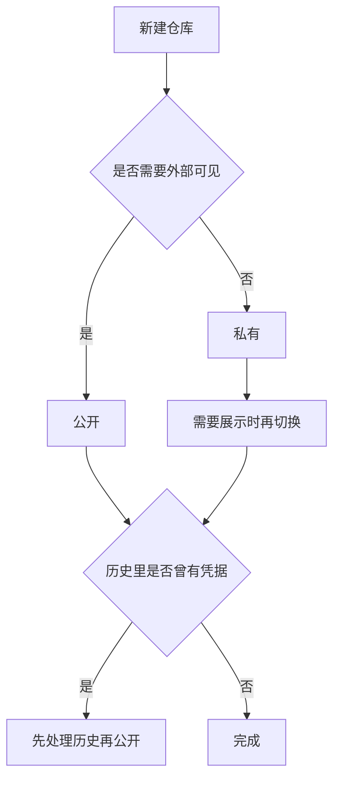
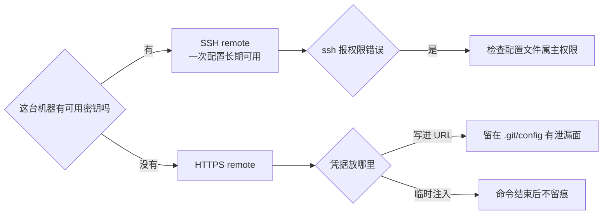

# 仓库设置与推送方式

仓库建好之后，日常打交道的其实只有三件事：可见性、元信息、推送通道。可见性决定谁能看到代码，元信息决定别人搜到之后第一眼看到什么，推送通道决定每次提交能不能顺利送上去。三件事都可以在网页上点几下完成，也都可以用命令行完成；区别在于网页操作留下了操作者，命令行操作留下了脚本。

三件事里最容易出问题的是推送通道：选错通道或把凭据放错位置，往往在事后才暴露。

## 可见性切换在哪一步做

新建仓库时可以选公开或私有。选公开的一个现实理由是 README 只有公开才有意义，作品集链接也需要一个不需要登录就能打开的地址（`11-github-publish-record.md:12`）。选完之后的切换点也很明确：仓库的 Settings 页面底部有一个危险操作区，可以改变可见性；用 API 则是 `PATCH /repos/{owner}/{repo}` 带上 `private` 字段（`11-github-publish-record.md:13-14`）。

需要注意切换的连带影响：私有改公开会让历史里所有内容一并可见，包括曾经提交过后来删掉的文件。如果历史中曾有凭据，仅靠最新提交里删掉并不够，需要处理历史。公开改私有则会让外部链接失效，作品集上的跳转会变成需要登录的页面。

## 元信息决定第一印象

元信息包含仓库描述、topics 与 README。topics 是别人按关键词搜索时能否命中的直接因素，当时两个 RM 仓库补的是 `robomaster`、`stm32f407`、`freertos`、`embedded`、`firmware`、`can-bus`、`cpp` 以及各自特有项（`11-github-publish-record.md:15`）。

README 的结构需要单独拆开看。两个 RM 仓库的 README 覆盖了项目定位、硬件构成、CAN 拓扑、模块表、串口协议字段表、编译烧录步骤、目录结构、限制与致谢，并做成中英双语（`11-github-publish-record.md:46`）。这个结构回答的是读者打开页面后的几个连续问题：这是什么、用了什么硬件、怎么编译、代码怎么组织、有哪些已知限制。

| 元信息 | 作用 | 当时的做法 |
| --- | --- | --- |
| 描述 | 搜索结果与仓库页副标题 | 中文概括项目定位 |
| topics | 关键词检索命中 | 通用标签加专属标签 |
| README | 第一印象与上手路径 | 中英双语，含拓扑与协议表 |
| License | 使用范围 | 按仓库实际情况填写，未核实的仓库标注待补充 |

## SSH 与 HTTPS 两种推送方式

GitHub 支持 SSH 与 HTTPS 两种推送通道。SSH 用密钥，长期配置一次即可，适合固定机器；HTTPS 用用户名加令牌，适合临时操作或者机器上没有密钥的情况。网站仓库的 remote 就是 SSH 形式（`git@github.com:TC635807/TC63PersonalWebsite.git`），说明这台机器上已经配好了密钥。

SSH 通道的常见故障与环境配置有关。部署记录里记过一次：系统 SSH 配置文件的属主或权限不正确时，`ssh` 会直接报 `Bad owner or permissions` 并拒绝工作，`git push` 同样受影响；当时的绕法是让 git 用 `ssh -F /dev/null`，通过 `core.sshCommand` 指定（`personal-homepage-research/15-deploy-tc63.md:144-149`）。根治方式是把那个配置文件的属主与权限改回标准值。

HTTPS 通道的问题在凭据如何存放。把 token 拼进 remote URL 会把它写进 `.git/config`，仓库一旦被复制，凭据一起走。临时操作更安全的做法是让 token 只存在于环境变量与一次性的 git 参数里。

## 三种凭据形态的比较

推送通道之外，凭据本身也有形态之分。SSH 密钥、个人令牌与部署密钥解决的是同一件事，适用场景不同。

| 形态 | 作用范围 | 存放位置 | 适用场景 |
| --- | --- | --- | --- |
| SSH 密钥 | 整个账号，或单仓库（部署密钥） | `~/.ssh/` | 固定开发机长期使用 |
| 个人令牌 | 账号下按 scope 授权的仓库 | 临时文件或环境变量 | 临时推送、脚本操作 |
| 部署密钥 | 单个仓库，可设只读或读写 | 仓库设置里登记公钥 | CI 或单仓库自动化 |

临时个人令牌的风险集中在校验范围与有效期：权限给得过多、期限给得过长，都会扩大泄漏后的影响面。更稳的做法是把有效期压到完成一次操作所需的最短时间，用完立即撤销；固定机器改用 SSH 密钥，省去每次准备凭据的步骤。

## 推送前检查清单

推送前先看三样东西：`git status` 确认没有意料之外的文件，`git remote -v` 确认推的是正确的目标，`git log -1` 确认提交信息与实际内容相符。如果仓库里可能有新增的生成物，再补一次 `git status --ignored`，看忽略规则是否覆盖到了新目录。

推送之后立刻确认远端状态。`git log --oneline -1 origin/main` 应当与本地一致，`git status` 应当显示分支与远端同步。推送成功但远端内容不对，通常是把内容推到了另一个 remote，或者本地分支与远端分支不是同一条线。

| 检查项 | 命令 | 期望结果 |
| --- | --- | --- |
| 工作区状态 | `git status` | 只有本次预期的改动 |
| 远端目标 | `git remote -v` | 地址与账号正确 |
| 提交内容 | `git show --stat HEAD` | 文件范围符合预期 |
| 忽略覆盖 | `git status --ignored` | 生成物处于忽略状态 |
| 远端同步 | `git log --oneline -1 origin/main` | 与本地提交一致 |

## 分支与保护规则

默认分支决定 clone 之后落在哪条线上，也决定合并请求的目标。个人仓库通常保持 `main` 为默认分支即可。保护规则则限制直接推送、要求合并请求与检查通过，主要服务于多人协作；单人仓库启用它只会给自己增加操作步骤，因此本项目两个仓库都没有启用（仓库设置页不在版本库里，这一项按通用做法说明）。

如果后续引入协作者，建议的顺序是先把默认分支确认清楚，再开启保护规则，最后把必须通过的检查配好。顺序颠倒会让协作者在规则不完整的状态下先推几次，之后再收紧时容易产生"以前可以现在不行"的困惑。

## 常见判断偏差

| # | 判断偏差 | 表现 | 依据 |
| --- | --- | --- | --- |
| 1 | 认为私有仓库内容绝对安全 | 公开切换后历史全部可见 | 可见性作用于整个历史 |
| 2 | 只写 README 不加 topics | 搜索时找不到仓库 | topics 是检索入口 |
| 3 | 把 token 写进 remote URL | 凭据随仓库配置扩散 | 配置会随目录复制 |
| 4 | SSH 报权限错误就换 HTTPS | 绕过了可根治的配置问题 | 配置文件属主权限可修复 |
| 5 | 推送后不核对远端 | 内容推到了别的 remote | 需要比对 origin/main |
| 6 | 单人仓库开保护规则 | 每次提交多一步操作 | 保护规则主要服务协作 |

## 小结

### 核心概念

- 可见性在新建时选择，之后可在设置页危险操作区或通过 API 切换。
- 切换可见性作用于整个历史，历史里的凭据需要在公开前处理。
- 元信息由描述、topics 与 README 组成，README 结构回答读者连续提出的问题。
- SSH 适合固定机器，HTTPS 适合临时操作；token 不应写进 remote URL。
- 推送前检查状态、目标、提交内容与忽略覆盖，推送后核对远端提交。
- 保护规则主要服务多人协作，单人仓库通常不必启用。

### 设计权衡

| 权衡点 | 本工程的选择 | 收益与代价 |
| --- | --- | --- |
| 可见性 | 公开 | 可展示、可匿名拉取；代价是需要先做凭据处理 |
| 元信息 | topics 加双语 README | 检索与上手都顺；代价是维护两份说明 |
| 推送通道 | SSH | 长期免密；代价是环境配置出问题时排查麻烦 |
| 保护规则 | 不启用 | 提交路径最短；代价是没有外部约束 |

## 练习

### 基础题

1. 写出改变仓库可见性的两种途径，并说明为什么切换前要检查历史。
2. topics 与 README 各自解决什么问题？
3. 为什么不应该把 token 直接写进 remote URL？
4. 推送后怎样确认远端内容与本地一致？

### 挑战题

5. 设计一份"公开前检查清单"，覆盖历史、凭据、元信息与可见性四类。
6. SSH 报权限错误时，写出从绕法到根治的两条路径与各自代价。
7. 引入第一位协作者后，仓库设置需要增加哪些项？按优先级排序。
8. 如果仓库需要同时发布到 GitHub 与另一个平台，remote 与分支应当如何组织？

## 附：本页引用的路径

| 路径 | 用途 |
| --- | --- |
| `personal-homepage-research/11-github-publish-record.md` | 可见性、topics 与凭据处理记录 |
| `personal-homepage-research/15-deploy-tc63.md` | SSH 配置故障与绕法 |
| `README.md` | 仓库部署说明与 Pages 配置入口 |
| `.github/workflows/deploy.yml` | 推送 main 后触发的发布流程 |
