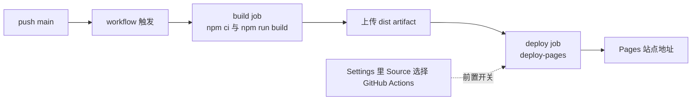
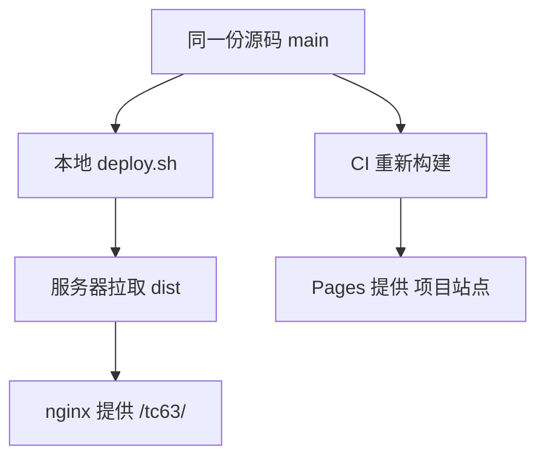

# Pages 发布与站点联动

推送 `main` 之后，页面并不会自动出现在 GitHub Pages 上。仓库里放好了 workflow，但还有一个只在网页设置里存在的开关：Pages 的 Source 必须选成 GitHub Actions（`README.md:185-188`）。这个开关不在版本库里，克隆仓库看不到它，因此换账号或新建仓库时最容易漏掉，现象是 workflow 跑成功了、站点地址却还是 404。

链路上每一段的失败表现都不一样：从 workflow 是否运行，到页面资源是否加载，可以逐段定位。

## 从推送 main 到页面可访问

链路可以分成四段：推送触发 workflow、build job 构建并上传产物、deploy job 交给 Pages、Pages 在站点地址上提供服务。前两段由仓库里的配置文件决定，后两段由仓库设置与平台决定。

workflow 只在 push 到 `main` 或手动触发时运行（`.github/workflows/deploy.yml:3-6`），构建时传入 `SITE_BASE=/TC63PersonalWebsite`（`.github/workflows/deploy.yml:29-31`），这与服务器部署默认的 `/tc63` 前缀正好相反。README 里把两条路的切换点写得很清楚：默认发服务器，传入该变量则发 Pages（`README.md:166-167`）。

## workflow 的权限与并发约束

Actions 默认拿到的令牌权限有限，部署到 Pages 需要显式声明三项（`.github/workflows/deploy.yml:8-11`）：`contents: read` 读取仓库、`pages: write` 写入 Pages、`id-token: write` 换取部署身份令牌。缺任何一项，deploy job 会在授权阶段失败，而 build job 可能已经成功，现象就是「构建绿、部署红」。

并发控制写在同一文件（`deploy.yml:14-16`）：分组固定为 `pages`，且 `cancel-in-progress: false`，同一时间只允许一个 Pages 部署，新触发不会取消进行中的那次。这条设置保证生产部署能跑完，代价是连续推送时后一次需要排队等待。

| 配置 | 值 | 作用 |
| --- | --- | --- |
| `contents` | `read` | 检出仓库代码 |
| `pages` | `write` | 允许写入 Pages |
| `id-token` | `write` | 取得部署身份令牌 |
| `concurrency.group` | `pages` | 串行化 Pages 部署 |
| `cancel-in-progress` | `false` | 不打断进行中的部署 |

## 两条发布路径的关系

站点有两套发布方式：GitHub Pages 与自己的服务器，两者共用一份源码，各自独立触发。服务器那条路依赖 `dist/` 已经提交进 `main`（`README.md:162-164`，`personal-homepage-research/15-deploy-tc63.md:115-117`），本地执行 `deploy.sh` 推送，再由服务器拉取；Pages 那条路由 CI 在云端重新构建，不使用仓库里的 `dist/`。

| 项 | 服务器 | GitHub Pages |
| --- | --- | --- |
| 触发 | 本地 `deploy.sh` 推送后手动拉取 | 推送 `main` 自动 |
| 构建位置 | 本地 | CI 运行器 |
| 使用 `dist/` | 使用仓库里的产物 | 重新构建，不使用仓库产物 |
| 前缀 | `/tc63` | `/TC63PersonalWebsite` |
| 访问地址 | 自有域名子路径 | `github.io` 项目站点 |

两条路互不影响，因此可能出现只有一边更新。判断方法分别是看服务器上的提交与 Actions 页面的最近一次运行。

## 为什么设置开关容易漏

Pages 的 Source 有三个常见选项：从分支发布、从 GitHub Actions 发布、以及关闭。本仓库的 workflow 走的是第二种，因为它自己完成构建并上传产物，不需要平台再构建一次。如果 Source 还停留在"从分支发布"，平台会去找指定分支的根目录或 `docs/` 目录下的静态文件，而本仓库的产物在 `dist/`，两边对不上，页面就会是 404 或停留在旧版本。

判断顺序是：workflow 是否成功、Source 是否为 Actions、部署环境是否产生了页面地址。三项依次排除，基本能定位到是哪一段断了。

另一个容易忽略的选项是「从分支发布」：平台会自己去找指定分支里的静态文件并构建，与本仓库 workflow 的构建重复。即使它能跑通，产物来源也与本仓库的配置预期不一致，排查时会把问题引到错误的方向。

## 新开源的仓库怎样出现在作品集页面上

站点首页的项目区由一个配置与一个页面组成：链接写在身份配置里（`src/config/site.ts:32-33`），项目页顶部显示"共几个、其中几个已开源"（`src/pages/projects/index.astro:23`）。RM 两个仓库公开之后，站点同步做了两处更新：把这两个项目从"进行中 · 仓库暂未公开"改为"已开源"并接上链接；把原来写死的"有 N 个仓库目前是私有的"提示改成条件渲染，全部公开时提示不再出现（`11-github-publish-record.md:55-58`）。

这段联动说明了一件事：开源动作不只是代码层面的操作，作品集页面的数据与文案需要跟着改。改动的判断标准是页面上是否存在与仓库可见性相关的写死文案，有就要改成由数据决定。

| 联动位置 | 改动内容 | 依据 |
| --- | --- | --- |
| `src/config/site.ts` | 补 GitHub 账号链接 | 仓库地址出现在社交入口 |
| `src/pages/projects/index.astro` | 已开源计数与条件提示 | 计数由数据推导，不写死 |
| 项目条目 | 状态与链接从"未公开"改为"已开源" | 与仓库实际可见性一致 |

配置里的社交入口目前保留了两条 GitHub 链接（`src/config/site.ts:31-33`），分别指向主账号与改名后的账号，两处并存是为了让旧链接仍然可达。

## 发布后怎么验证

验证分三层。第一层看构建：Actions 最近一次运行是否成功、耗时多少。第二层看站点：项目站点地址能否打开、页面里的资源是否加载（前缀错误会表现为样式丢失）。第三层看渲染结果：README 与页面里的表格、图片在浏览器里是否正常，当时两个 RM 仓库的 README 就是用浏览器抓取工具复核渲染的（`11-github-publish-record.md:16`）。

对文档类仓库还有一层内容校验：页面里的链接是否指向存在的路径、构建后的搜索结果是否包含新内容。这些检查在本地 `preview` 里做一遍，比在线上反复刷新更快。

## 常见判断偏差

| # | 判断偏差 | 表现 | 依据 |
| --- | --- | --- | --- |
| 1 | 认为有 workflow 就会自动发布 | Pages 地址 404 | Source 需要在设置里选 Actions |
| 2 | 改完源码没推 main | workflow 不触发 | 触发条件是 push main |
| 3 | 用服务器前缀看 Pages 站点 | 样式与图片 404 | 两套前缀不同 |
| 4 | 认为 Pages 使用仓库里的 dist | 与本地构建结果不一致 | CI 会重新构建 |
| 5 | 开源后忘记改作品集文案 | 页面仍写"仓库未公开" | 文案与数据需要同步 |
| 6 | 只在本地看构建日志 | 渲染问题漏掉 | 需要看浏览器里的实际效果 |

## 小结

### 核心概念

- Pages 发布需要两步：仓库里有 workflow，设置里把 Source 选成 GitHub Actions。
- workflow 在 push `main` 或手动触发时运行，构建时使用 Pages 前缀。
- 服务器与 Pages 共用源码但各自构建，可能只有一边更新。
- Source 选错时的表现是 404 或旧版本，按三段顺序排查。
- 新开源仓库需要同步作品集页面的状态、链接与计数文案。
- 验证分构建、站点、渲染三层，本地 `preview` 可以先跑一遍内容校验。

### 设计权衡

| 权衡点 | 本工程的选择 | 收益与代价 |
| --- | --- | --- |
| Pages 构建方式 | 由 Actions 构建并发布 | 产物可控、无分支约定；代价是多一个设置开关 |
| 与服务器关系 | 两条路独立 | 互不影响；代价是可能只更新一边 |
| 前缀策略 | 构建时用变量切换 | 一份源码两处部署；代价是做检查避免混用 |
| 作品集联动 | 由数据推导文案 | 不会出现写死的过期提示；代价是页面结构复杂一点 |

## 练习

### 基础题

1. Pages 发布为什么需要在仓库设置里选一次 Source？
2. 服务器与 Pages 两条路各自的构建位置在哪？
3. Source 选成"从分支发布"时会出现什么现象？
4. 新开源一个仓库之后，作品集页面需要改哪几处？

### 挑战题

5. 设计一条自动检查，判断 Pages 站点与服务器站点的内容是否来自同一个提交。
6. 如果 Pages 只应发布文档区、服务器发布完整站点，workflow 与配置需要怎样改动？
7. 给出一次"Pages 404"的分层排查流程，写出每层的判据与命令。
8. 作品集里"已开源"的状态如果改为从 GitHub API 动态获取，需要处理哪些失败情况？

## 附：本页引用的路径

| 路径 | 用途 |
| --- | --- |
| `README.md` | 两条发布路径与 Pages 设置说明 |
| `.github/workflows/deploy.yml` | Pages 的构建与部署步骤 |
| `personal-homepage-research/11-github-publish-record.md` | 仓库公开后的作品集联动与渲染复核 |
| `personal-homepage-research/15-deploy-tc63.md` | 服务器发布路径与产物入仓的取舍 |
| `src/pages/projects/index.astro` | 项目计数与开源状态展示 |
| `src/config/site.ts` | 社交与仓库链接配置 |
