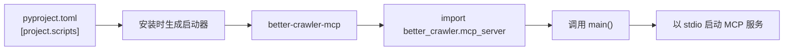
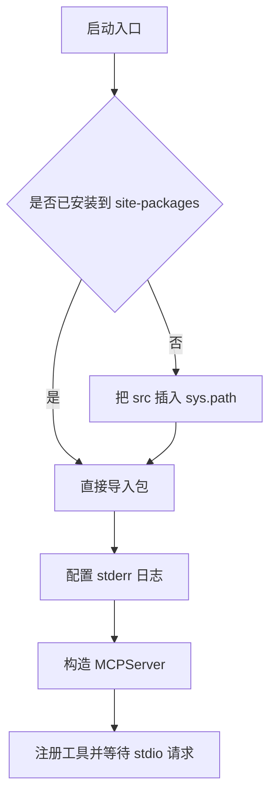

# pyproject 与包结构

装上 better-crawler 之后，可以在终端里敲一条 `better-crawler-mcp` 启动服务。这条命令由安装时的打包工具生成，仓库里并没有同名脚本文件；它指向包内的一个函数，函数再启动 MCP 服务。想让这条命令出现，需要的只有一份 `pyproject.toml` 里的三行配置：构建后端、项目元数据、以及入口点声明。

三行配置决定命令能否生成，目录布局决定 wheel 里有什么，版本号决定两处是否一致；下面把 `pyproject.toml` 与 `src/better_crawler/` 逐段对上。

## 构建后端与项目元数据

`pyproject.toml` 的开头三行声明构建系统：后端是 hatchling（`pyproject.toml:1-3`）。这一段决定用什么工具把源码打成发行包，与运行时依赖无关。

`[project]` 段给出元数据：包名 `better-crawler-4-agent`、版本 `0.2.0`、说明、README 文件、Python 版本下限 3.10、许可证 MIT（`pyproject.toml:5-11`）。这些字段里有两个会直接影响使用者：包名决定 `pip install` 时敲什么，Python 下限决定在旧解释器上安装会不会被直接拒绝。

| 字段 | 值 | 影响 |
| --- | --- | --- |
| name | `better-crawler-4-agent` | 安装与依赖声明里使用的名字 |
| version | `0.2.0` | 发行版本，与包内 `__version__` 并行维护 |
| requires-python | `>=3.10` | 旧解释器上安装被拒绝 |
| license | MIT | 分发条款 |
| readme | `README.md` | 上传到包索引时展示的说明 |

## 入口点如何变成一条命令

`[project.scripts]` 段写了一行映射：`better-crawler-mcp = "better_crawler.mcp_server:main"`（`pyproject.toml:23-24`）。等号左边是安装后生成的可执行文件名，右边是"模块路径:函数名"。安装时打包工具会生成一个小启动器，导入该模块并调用该函数。

这条映射解决了一个常见需求：使用者不需要知道包内的目录结构，也不需要写 `python -m` 的长命令，只要记住一个稳定的命令名。代价是命令名与函数名一旦发布就不宜再改，改名会破坏已经写进配置文件的调用方。

## src 布局与打包范围

源码放在 `src/better_crawler/` 而不是仓库根目录，这是所谓的 src 布局。它的好处是导入路径必须经过安装才会出现，能提前暴露"忘了把新模块写进打包范围"这类问题：在仓库根目录直接运行解释器时，`import better_crawler` 不会意外成功。

打包范围由 `[tool.hatch.build.targets.wheel]` 指定为 `src/better_crawler`（`pyproject.toml:26-27`）。这条声明的含义是：wheel 里只包含这个目录。仓库里的 `scripts/`、`tests/`、`skills/` 与 `dsh-plugin/` 都不会进入 wheel，它们属于开发与集成材料。

## 包内导出了什么

`src/better_crawler/__init__.py` 把包的能力集中导出：`BrowserEngine`、`PageFetch`、`Fetcher`、`FetchResult`、`Extracted`、`extract_static`、`looks_unrendered`、`validate_url`、`UnsafeURLError` 与 `describe_status`（`src/better_crawler/__init__.py:6-20`）。集中导出的收益是使用方只依赖一个入口模块，内部文件如何拆分可以调整。

同一个文件里还有版本号：`__version__ = "0.2.0"`（`src/better_crawler/__init__.py:12`）。它与 `pyproject.toml` 里的 `version` 是两处独立的值，发布时需要同时改。两处不同步的表现是 `pip show` 与运行时自报的版本不一致。

| 位置 | 内容 | 用途 |
| --- | --- | --- |
| `pyproject.toml:7` | `version = "0.2.0"` | 发行版本号 |
| `src/better_crawler/__init__.py:12` | `__version__ = "0.2.0"` | 运行时自报版本 |
| `src/better_crawler/mcp_server.py:38` | 传入 `__version__` | MCP 服务对外声明的版本 |

## 服务入口自己做了哪些准备

`mcp_server.py` 在导入包之前先做了一段引导：把 `src` 目录插入 `sys.path`，条件是该目录存在且尚未在搜索路径里（`src/better_crawler/mcp_server.py:17-20`）。这段代码服务的是"没有安装到 site-packages、直接以脚本方式运行"的场景，插件与本地调试都会遇到。

接下来是日志配置（`src/better_crawler/mcp_server.py:26-31`）：日志输出走 stderr，级别可由环境变量控制。这条约束来自 stdio 传输本身：stdout 只能承载 MCP 协议帧，任何日志混进 stdout 都会破坏协议解析，表现为客户端连上就报解析错误。

服务对象在 `src/better_crawler/mcp_server.py:36-40` 构造，名字与版本都写在这里，工具名由框架拼上命名空间前缀。

## 为什么版本号不写在单一位置

把版本只放在 `pyproject.toml` 里、运行时从安装元数据读取，是可以做到单源的，代价是需要额外的读取逻辑，并且在"未安装、直接跑 src"的场景下读不到元数据。本项目选择两处各写一份，换取的是任何运行方式下都能拿到版本号。

这个选择的检查方式很直接：改版本时搜索两次字符串，确认两处一致。更稳妥的做法是加一条自检或测试，比较两处的值。

## 命令名改动的影响面

命令名一旦被写进别人的配置文件，就成了一份对外接口。改动它会同时影响配置文件的 `command`、文档里的示例、以及任何脚本里写死的调用。发布后要改名，可行的做法是保留旧名一段时间：新名作为正式入口，旧名指向同一个函数并在文档里标注弃用，等配置迁移完成再删除。

若使用方并不需要命令名，也可以直接调用启动器脚本。仓库里的 `scripts/launch.py` 就是这条路径：它自带解释器与浏览器的解析逻辑，因此不依赖安装步骤，适合从仓库直接接入的场景。

两处版本号的同步可以交给测试：读取 `pyproject.toml` 的 `version` 与包内 `__version__` 并比较，不一致就让测试失败。这条检查成本很低，能挡住最容易漏的一次改动。

入口点还承担一个隐性职责：把"怎么启动"与"包怎么组织"解耦。内部文件重命名时，只要入口点指向的函数没变，使用方的命令就不用改。

## 常见判断偏差

| # | 判断偏差 | 表现 | 依据 |
| --- | --- | --- | --- |
| 1 | 认为命令名就是某个脚本 | 仓库里找不到同名文件 | 命令由入口点生成 |
| 2 | 改了函数名没改入口点 | 安装后命令报导入错误 | 入口点写的是模块与函数 |
| 3 | 新模块没进 wheel | 装完之后导入失败 | 打包范围只含 src 下的包 |
| 4 | 在仓库根目录直接导入成功 | 误以为打包范围正确 | src 布局在安装后才可导入 |
| 5 | 版本只改了一处 | 元数据与运行时版本不一致 | 两处独立维护 |
| 6 | 日志写进 stdout | 客户端解析协议失败 | stdout 只放协议帧 |

## 小结

### 核心概念

- `pyproject.toml` 声明构建后端、项目元数据与入口点三段。
- 入口点把命令名映射到"模块:函数"，安装时生成可执行启动器。
- src 布局让导入路径只在安装后成立，能暴露打包范围遗漏。
- wheel 打包范围由构建目标显式指定，开发与集成目录不入包。
- 包内 `__init__.py` 集中导出能力，并单独维护一份版本号。
- stdio 服务的日志必须走 stderr，stdout 留给协议帧。

### 设计权衡

| 权衡点 | 本工程的选择 | 收益与代价 |
| --- | --- | --- |
| 目录布局 | src 布局 | 导入语义干净；代价是需要安装或引导才能运行 |
| 版本管理 | 两处各写一份 | 任何运行方式都能读版本；代价是要记得同步 |
| 打包范围 | 只含包目录 | 发行包小；代价是集成材料要单独分发 |
| 入口方式 | 命令行入口加脚本引导 | 既有稳定命令，也能直接跑脚本；代价是两条路径都要维护 |

## 练习

### 基础题

1. 写出 `pyproject.toml` 里构建后端、元数据与入口点三段的键名。
2. 入口点的等号左右两边分别是什么含义？
3. 为什么 src 布局能暴露打包范围的遗漏？
4. stdio 服务的日志为什么不能写进 stdout。

### 挑战题

5. 设计一种把版本号收敛到单一来源的方案，说明它在本仓库两种运行方式下的表现。
6. 新增一个内部模块并让它进入发行包，列出需要检查的文件与验证命令。
7. 如果把入口点改名，列出所有需要同步修改的位置与兼容性影响。
8. 给打包范围写一条自动化检查，判断源码里出现的顶层模块是否都在包目录内。

## 附：本页引用的路径

| 路径 | 用途 |
| --- | --- |
| `/mnt/d/better-crawler-4-agent/pyproject.toml` | 构建后端、元数据、依赖与入口点 |
| `/mnt/d/better-crawler-4-agent/src/better_crawler/__init__.py` | 能力导出与运行时版本号 |
| `/mnt/d/better-crawler-4-agent/src/better_crawler/mcp_server.py` | 服务入口、路径引导与日志配置 |
| `/mnt/d/better-crawler-4-agent/scripts/launch.py` | 解释器与浏览器的解析顺序 |
