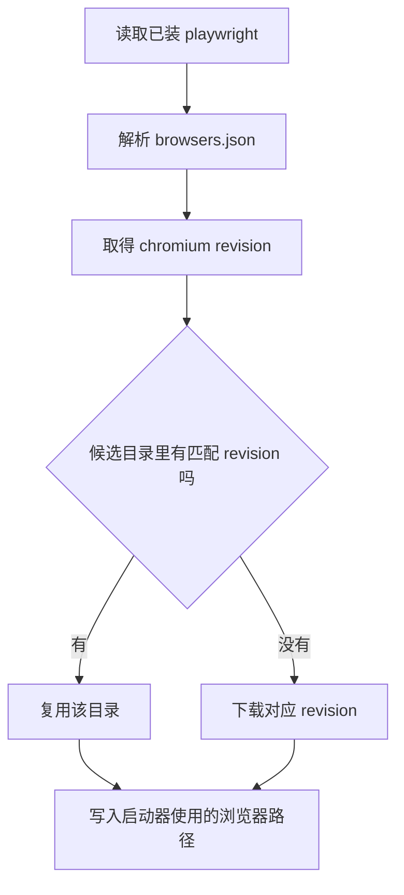
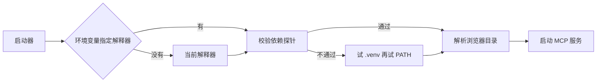

# 依赖钉死与浏览器版本

把 playwright 的版本约束从等号改成大于等于，本地大概率还能跑，换一台机器却可能在启动浏览器时失败。原因不在 Python 依赖装错，而在浏览器：playwright 的每一个发布版本对应一个固定的浏览器 revision，已下载的浏览器目录如果属于另一个版本，启动时会被判定为不匹配。这条约束把一个看似普通的依赖声明变成了与外部二进制绑定的接口。

这篇先看依赖清单里哪些用了等号、哪些用了下限，再讲浏览器 revision 的读取与复用逻辑，最后看解释器与浏览器目录的解析顺序，以及安装与自检脚本各自负责什么。

## 依赖清单里的两种约束

依赖列表写在 `pyproject.toml` 里，一共六个，约束写法分成两类。`playwright==1.61.0` 用等号钉死版本；`mcp>=2.0.0`、`trafilatura>=2.0.0`、`beautifulsoup4>=4.12.0`、`lxml>=5.3.0`、`httpx[http2]>=0.27.0` 用下限。

差异的理由写在文件注释里：1.61 对应浏览器 revision 1228，1.62 对应 1234；放宽版本会在复用已有浏览器时因 revision 不匹配而启动失败（`pyproject.toml`）。其余依赖是纯 Python 库，按语义版本向下兼容，因此用下限。

```toml
# pyproject.toml（节选）
dependencies = [
    # 与浏览器 revision 强绑定：1.61 用 rev 1228，1.62 用 rev 1234。
    # 放宽版本会导致复用已有浏览器时因 revision 不匹配而启动失败。
    "playwright==1.61.0",
    "mcp>=2.0.0",
    "trafilatura>=2.0.0",
    "beautifulsoup4>=4.12.0",
    "lxml>=5.3.0",
    "httpx[http2]>=0.27.0",
]
```

这些写法用的是语义化版本（semver）：版本号按「主版本.次版本.补丁」排列，主版本变化意味着可能有不兼容改动。`==1.61.0` 表示「只能是这个版本」，`>=2.0.0` 表示「2.0.0 及以上都行」；前者把行为钉死，后者把选择权交给安装当时的最新版本。

| 依赖 | 约束 | 理由 |
| --- | --- | --- |
| playwright | `==1.61.0` | 与浏览器 revision 强绑定 |
| mcp | `>=2.0.0` | 需要 2.x 的新模块路径 |
| trafilatura | `>=2.0.0` | 正文抽取库，向下兼容 |
| beautifulsoup4 | `>=4.12.0` | HTML 解析，向下兼容 |
| lxml | `>=5.3.0` | 解析后端 |
| httpx[http2] | `>=0.27.0` | HTTP 客户端，带 http2 附加项 |

## 浏览器 revision 是怎么读出来的

安装脚本不硬编码 revision，而是从当前解释器所装的 playwright 里读：找到 playwright 包的 `driver/package/browsers.json`，取出名字为 chromium 的那一项的 `revision` 字段（`scripts/install.py`）。这样写的好处是 playwright 升级之后不需要改脚本；代价是脚本必须真的导入 playwright，否则读不到。

```python
# scripts/install.py（节选）
def _required_revision(python: str) -> str | None:
    """读出该解释器所装 playwright 需要的 chromium revision。"""
    code = (
        "import json,os,playwright;"
        "d=os.path.join(os.path.dirname(playwright.__file__),'driver','package','browsers.json');"
        "print(next(b['revision'] for b in json.load(open(d))['browsers'"
        " if b['name']=='chromium'))"
    )
    ...
    return None
```

revision 是 Playwright 给浏览器构建编的号：每个 playwright 版本只认一个 revision，下载下来的浏览器目录名里也带着这个号。这段读取逻辑被交给一个子进程执行，因此读到的必然是目标解释器环境里那份 playwright 的需求，而不是脚本自己所在环境的；`...` 处省去的是子进程调用与失败处理。

拿到 revision 之后，脚本会在候选目录里找一个已经包含该 revision 的浏览器目录复用，避免重复下载（`scripts/install.py` 的说明）。找不到时才下载。



## 解释器与浏览器目录的解析顺序

MCP 客户端拉起启动器时，环境里未必有正确的解释器与浏览器路径。`scripts/launch.py` 把两者的优先级写成了注释形式：解释器依次尝试环境变量指定值、当前解释器（需具备依赖）、仓库内 `.venv`、PATH 上的 `python`；浏览器目录依次尝试两个环境变量、仓库内 `.playwright`、playwright 默认目录。

依赖检查不能只看 `import` 是否成功。`scripts/launch.py` 定义了一个探针，除了导入五个包，还要 `from mcp.server.mcpserver import MCPServer` 成功。原因是 mcp 1.x 没有这个模块路径，只查导入会选中旧版本，然后在启动时失败。这条检查把"装上了"和"能用"分开判断。

```python
# scripts/launch.py（节选）
_REQUIRED = ("playwright", "mcp", "trafilatura", "bs4", "httpx")

# 除了能导入，还得确认 API 可用：mcp 1.x 没有 mcp.server.mcpserver，
# 只查 import 会选中旧版本，然后在真正启动时炸掉。
_PROBE = (
    "import " + ", ".join(_REQUIRED) + "\n"
    "from mcp.server.mcpserver import MCPServer\n"
)
```

`_PROBE` 就是探针：一段在候选解释器里试跑的小脚本，退出码为 0 才算这个解释器可用。先试运行再选择，比启动到一半才发现模块不存在要便宜得多。

| 解析顺序 | 解释器 | 浏览器目录 |
| --- | --- | --- |
| 1 | `BETTER_CRAWLER_PYTHON` | `BETTER_CRAWLER_BROWSERS_PATH` 或 `PLAYWRIGHT_BROWSERS_PATH` |
| 2 | 当前解释器（依赖齐备） | 仓库内 `.playwright` |
| 3 | 仓库内 `.venv` | playwright 默认目录 |
| 4 | PATH 上的 `python` | 无 |



## 安装脚本做了哪几件事

`scripts/install.py` 写明它建虚拟环境、装依赖、下载浏览器，并打印各 agent 的接入配置；同时提供了四个开关：跳过浏览器下载、复用已有虚拟环境、指定已有浏览器目录、只打印配置不安装。

"只打印配置"这个开关的价值在于：机器上已经装好环境，只想拿到一段可以粘贴的配置。把安装与配置生成放在同一个脚本里，减少了"装完之后还要自己拼 JSON"的步骤。

## 自检脚本检查什么

`scripts/selfcheck.py` 提供带真实抓取与离线两种模式，默认连两个公开测试页跑一遍：一个静态文档页走快路径，一个中文博客走浏览器渲染路径（`scripts/selfcheck.py`）。注释里还留了一条经验：不要用正文过短的示例站做测试页，它会低于最小正文长度而被判失败（`scripts/selfcheck.py`）。

```python
# scripts/selfcheck.py（节选）
# 公开的测试页：一条静态站快路径，一条需要浏览器渲染的中文博客
# 注意别用 example.com —— 它正文只有 142 字符，低于 MIN_CONTENT_LENGTH
_TEST_URLS = [
    ("https://docs.python.org/3/tutorial/classes.html", "英文文档（静态）"),
    ("https://www.cnblogs.com/buptl/p/20866967", "中文博客（浏览器）"),
]
```

两页分别代表静态快路径与浏览器渲染路径，任一条失败就说明对应的那条抓取链路断了；正文长度阈值则保证检查的是抓取本身，而不是拿一个空页面骗过判定。

自检的价值在于把"依赖、浏览器、抓取、安全校验"四类检查放在一次运行里，发布或换机器之后跑一次就能知道链路是否完整。

## 浏览器目录的三种来源

浏览器目录在解析顺序里有三个来源，各自的失效表现不同。环境变量指定的目录最优先，路径写错时的表现是启动即失败，因为启动器不会再往下找。仓库内 `.playwright` 目录适合把浏览器与被调试代码放在一起，删掉仓库目录就等于删掉浏览器。playwright 默认目录是全局缓存，多份项目可能共用同一份浏览器，版本冲突时表现为某一份项目先失败。

判断当前用的是哪一份，可以看启动日志里解析到的路径。清理浏览器时应当只删当前项目使用的那一份，避免让其他项目重新下载。

其余依赖用下限并不等于没有风险。下限只保证装得上，不保证上游新版本行为不变；正文抽取库升级后改变段落合并策略，就会让同一页面的抽取结果发生变化。遇到这类回归时，临时把该依赖也钉到具体版本，是比改代码更快的定位手段。

依赖约束最终要服务于"可复现"这个目标：同一份配置在任何机器上解析出同一组版本，行为才可能一致。凡是会引入外部二进制的依赖，都应当按这条标准处理。

自检脚本里的测试页选择也体现同一原则：抓取链路要覆盖静态与渲染两条路径，页面的正文还要足够长，否则检查的是阈值而不是抓取本身。换测试页时应保持这两条特征不变。

## 常见判断偏差

| # | 判断偏差 | 表现 | 依据 |
| --- | --- | --- | --- |
| 1 | 放宽 playwright 版本 | 复用旧浏览器时启动失败 | revision 与版本绑定 |
| 2 | 以为浏览器可以跨版本复用 | 提示 revision 不匹配 | 目录名带 revision |
| 3 | 只检查包能否导入 | 启动时才报模块不存在 | mcp 1.x 缺少新路径 |
| 4 | 把依赖装到系统解释器 | 客户端拉起的解释器没有依赖 | 启动器有解析顺序 |
| 5 | 用正文过短的页面自检 | 被判定为抓取失败 | 存在最小正文长度阈值 |
| 6 | 忽略环境变量优先级 | 指定了路径却没生效 | 环境变量排在解析顺序最前 |

## 小结

### 核心概念

- playwright 用等号钉死，因为它与浏览器 revision 强绑定。
- revision 从已装 playwright 的 `browsers.json` 读取，脚本不硬编码。
- 候选目录里有匹配 revision 时复用，避免重复下载。
- 启动器按固定顺序解析解释器与浏览器目录，环境变量优先级最高。
- 依赖探针不只看导入，还要验证新版本才有的模块路径。
- 自检脚本一次覆盖依赖、浏览器、抓取与安全校验四类。

### 设计权衡

| 权衡点 | 常见选择 | 收益与代价 |
| --- | --- | --- |
| playwright 约束 | 钉死版本 | 行为可复现；代价是升级需要同步浏览器 |
| revision 来源 | 运行时从包内读取 | 不随版本失效；代价是依赖解释器可导入 |
| 依赖检查 | 导入加 API 探针 | 提前失败；代价是探针要随框架更新 |
| 浏览器目录 | 环境变量优先 | 部署时可指定；代价是配置项更多 |

## 练习

### 基础题

1. 说明为什么 playwright 使用等号约束而其他依赖使用下限约束。
2. revision 从哪里读取，为什么不写在脚本里？
3. 解释器解析顺序有哪四级？
4. 依赖探针为什么要额外验证一个模块路径？

### 挑战题

5. 设计一条升级 playwright 的操作流程，覆盖约束修改、浏览器下载与自检。
6. 如果要在离线机器上安装，浏览器目录复用与依赖安装分别需要什么准备？
7. 给启动器写一份失败时的诊断输出方案，说明每一级尝试应当打印什么。
8. 把依赖检查改成可配置的，设计配置项与默认值，并说明误判风险。

## 附：本页引用的路径

| 路径 | 用途 |
| --- | --- |
| `/mnt/d/better-crawler-4-agent/pyproject.toml` | 依赖约束与版本绑定说明 |
| `/mnt/d/better-crawler-4-agent/scripts/install.py` | 安装流程、revision 读取与配置打印 |
| `/mnt/d/better-crawler-4-agent/scripts/launch.py` | 解释器与浏览器解析顺序、依赖探针 |
| `/mnt/d/better-crawler-4-agent/scripts/selfcheck.py` | 四类自检与测试页选择 |
| `/mnt/d/KnowledgeDiver/server_start.sh` | 服务器侧浏览器路径校验的对照实现 |
