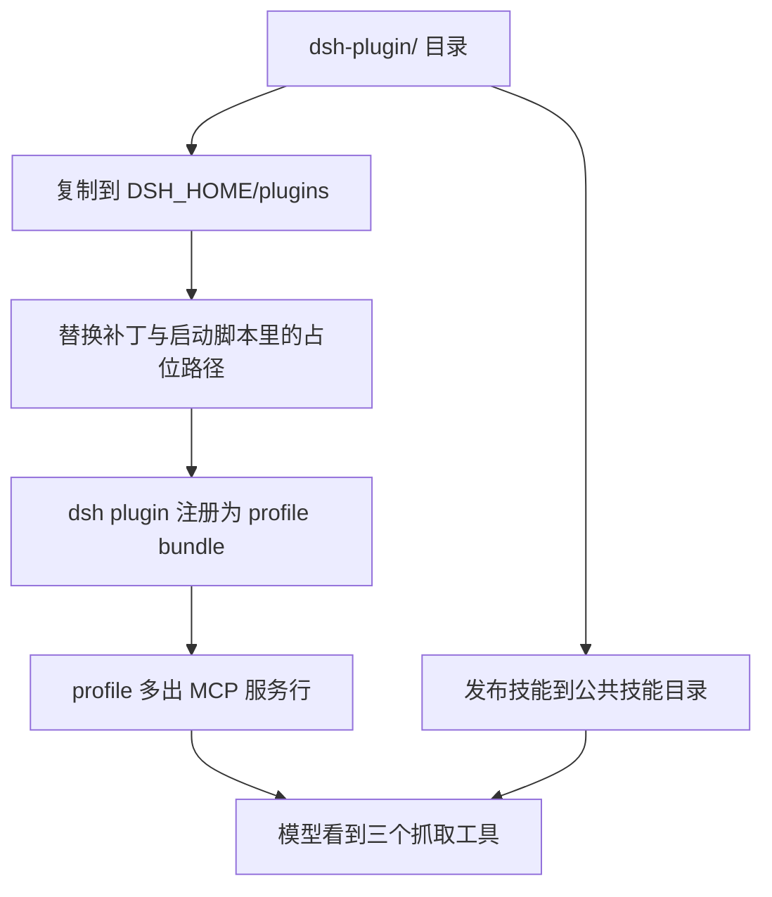

# 构建发布与多端分发

包写完只是开始。要让别人用起来，需要回答两个问题：怎么把代码变成一个可安装的东西，以及装完之后怎么接进自己的客户端。前者是打包与构建，后者是分发。这个仓库给出的答案有两层：通用一层是标准的 MCP 配置，客户端各自认自己的配置文件；专用一层是给 DeepSeek Harness 的插件包，它把 MCP 服务注册进一个 profile，并顺带发布一份技能说明。

这篇按构建、分发形态、插件包的内部结构、发布检查四段展开，重点放在每种分发方式的适用条件与各自的失败表现。

## 从源码到可安装包

构建由 `pyproject.toml` 声明的 hatchling 后端完成（`pyproject.toml`）。标准做法是在仓库根目录执行构建命令，产出 wheel 与源码包；wheel 的实际内容由打包范围决定，本仓库只包含 `src/better_crawler`（`pyproject.toml`），因此 `scripts/` 与 `dsh-plugin/` 不会进入发行包，它们要随仓库一起分发。

wheel 与 sdist 是发行包的两种形态：wheel（`.whl`）是安装时直接展开的压缩包，`pip install` 默认优先找它；sdist（`.tar.gz`）是源码包，装的时候才现场构建。两者都由同一份打包声明产出，区别只在前者带的是已经排好位的文件。

开发阶段的安装方式与发布不同。可编辑安装把仓库目录挂进环境的导入路径，改代码立即生效，适合本机调试；正式安装则使用构建产物，环境与源码目录解耦，适合部署。两种方式都会生成同一个命令行入口（`pyproject.toml`），验证方式相同：装完之后敲一次命令，看它能否启动。

| 场景 | 安装方式 | 生效范围 |
| --- | --- | --- |
| 本机开发 | 可编辑安装 | 改代码立即生效 |
| 部署 | 安装 wheel | 与源码目录无关 |
| 离线机器 | 先下载产物再安装 | 需要自行准备依赖与浏览器 |
| 只拿来跑 MCP | 直接调用启动器脚本 | 不需要安装入口命令 |


## 通用分发：一份配置加一个启动器

通用形态由仓库里的 `.mcp.json` 与 `scripts/launch.py` 组成。配置文件声明服务名、启动命令与三个环境变量：启动器路径、超时与单次返回上限。客户端读取这段配置后，会用配置里的解释器拉起启动器，启动器再按上一节讲过的顺序解析解释器与浏览器。

仓库根目录的 `.mcp.json` 就是这份声明本身：

```json
{
  "mcpServers": {
    "better-crawler": {
      "command": "python",
      "args": ["scripts/launch.py"],
      "env": {
        "BETTER_CRAWLER_TIMEOUT": "25",
        "BETTER_CRAWLER_MAX_CHARS": "50000"
      }
    }
  }
}
```

`mcpServers` 下每个键是一项服务，`command` 加 `args` 是拉起它的命令，`env` 是传给它的环境变量。这里用的是 stdio 通信，也就是靠标准输入输出管道传协议帧，所以客户端必须真的能按 `args` 找到脚本。

各客户端的配置文件位置不同，README 里列了一张对照表（`README.md`）：项目级或用户级 JSON、`.cursor` 下的 JSON、某个 CLI 的 `mcp.servers` 字段、以及 TOML 形式的 `[mcp_servers]` 段。配置内容基本一致，差别只在放置位置与键名。

| 客户端 | 配置位置 | 键名形态 |
| --- | --- | --- |
| Claude Code | 项目级 `.mcp.json` 或用户级配置 | `mcpServers` |
| Cursor | 用户目录下的 `mcp.json` | `mcpServers` |
| ZCode | CLI 配置的 `mcp.servers` 字段 | 嵌套字段 |
| Codex | 用户目录下的 `config.toml` | `[mcp_servers.名字]` |
| DeepSeek Harness | 用仓库自带插件包 | 插件 bundle |

配置里最容易出错的是启动命令的相对路径。`.mcp.json` 用的是相对仓库根目录的路径（`.mcp.json` 的 `args` 字段），因此客户端的工作目录必须落在仓库根；换到别处就找不到启动器，表现为服务启动即退出。

## 专用分发：插件包与声明式补丁

dsh 的接入方式与通用 MCP 配置不同：它要求一个声明了 `dsh.bundle.patch` 的 npm 包，补丁文件描述"往 profile 配置里插什么"。`dsh-plugin/package.json` 给出包名、版本、`private` 标记与 `type: module`，并把补丁指向 `./cordis.patch.yml`。

```json
{
  "name": "better-crawler-4-agent-dsh",
  "version": "1.0.0",
  "private": true,
  "type": "module",
  "dsh": {
    "bundle": {
      "patch": "./cordis.patch.yml"
    }
  }
}
```

`private: true` 表示不发布到 npm，只按本地目录安装；`type: module` 说明包里的 `.js` 按 ES 模块解析；真正让 dsh 认它的是 `dsh.bundle.patch` 这一段——它把包和补丁文件绑在一起。

补丁内容是一行插入：一个标识为 `mcp-better-crawler` 的 MCP 客户端行，名字为 `'@deepseek-ai/dsh-mcp-client'`，配置里声明服务名（在仓库的注释里对应三个工具名）；补丁头部的注释还说明这个行是普通的可寻址补丁行，profile 或叠加补丁可以把它禁用、改命令、改超时，而不必修改这个包（`dsh-plugin/cordis.patch.yml`）。

```yaml
# dsh-plugin/cordis.patch.yml（节选）
- insert:
    - id: mcp-better-crawler
      name: '@deepseek-ai/dsh-mcp-client'
      config:
        serverName: better-crawler
        transport: stdio
        command: /bin/sh
        args:
          - __PLUGIN_DIR__/scripts/launch.sh
        toolCallTimeoutMs: 180000
```

`insert` 表示往配置树里加一行，`id` 是这一行的地址，后面的层可以按它来覆盖；`__PLUGIN_DIR__` 是占位符，安装脚本会替换成真实绝对路径，因为 stdio 行里的启动脚本路径必须写绝对路径。

安装脚本要解决的是路径问题：stdio 的 MCP 行必须写绝对启动器路径，而包被安装到随机位置。做法是把插件目录复制到 `$DSH_HOME/plugins/` 下，用替换字符把占位符换成真实绝对路径，再用命令行把这份副本注册为 profile 的 bundle，最后把技能发布到公共技能目录（`dsh-plugin/install.sh`）。

```sh
# dsh-plugin/install.sh（节选）
STAGE=$DSH_HOME/plugins/better-crawler-4-agent-dsh
cp -R "$HERE" "$STAGE"
sed -i "s|__PLUGIN_DIR__|$STAGE|g; s|__REPO_DIR__|$REPO|g" \
    "$STAGE/cordis.patch.yml" "$STAGE/scripts/launch.sh"
dsh plugin --profile "$PROFILE" add "file:$STAGE"
```

`cp -R` 把整个插件目录复制到 `$DSH_HOME/plugins/` 下的固定位置；`sed -i` 就地改写文件内容，把占位符换成真实路径（`-i` 即原地修改）；最后一行把这份副本登记进 profile 的依赖清单，profile 启动时才会把它当作一个组合包来读。



## 三种分发形态怎么选

三种形态对应三类使用场景：本机开发用可编辑安装或直接调用启动器；给任意 MCP 客户端接入用通用配置；给自己的 dsh profile 用插件包。它们的共同点是最终都落到同一个 stdio MCP 服务上，因此服务行为只有一处需要维护。

差异在于依赖关系：通用配置依赖客户端的工作目录与解释器环境，插件包额外依赖 dsh 的命令行工具与 profile 机制。选择时先确认目标客户端的形态，再决定要不要引入插件这一层。

交接给别人时最容易漏的是依赖之外的两样东西：浏览器目录与解释器路径。前者在对方的机器上可能不存在，需要按安装脚本的方式重新下载或复用；后者在客户端拉起服务时未必是安装依赖的那一个，需要靠环境变量固定。把这两项写进接入说明，比让对方自己排查更省时间。

## 发布前的检查清单

发布前要确认三件事：版本号两处一致（`pyproject.toml` 与 `src/better_crawler/__init__.py`）、自检脚本全绿、配置打印结果与 README 里的对照表一致。若仓库要打标签，标签名与版本号保持一致，方便后来者对应（标签实践按通用做法，本仓库未见标签）。

| 检查项 | 方式 | 通过标准 |
| --- | --- | --- |
| 版本一致 | 搜两处字符串 | 值相同 |
| 依赖与浏览器 | 运行自检脚本 | 全部通过 |
| 接入配置 | 只打印配置模式 | 输出可直接使用 |
| 打包范围 | 检查构建配置 | 只含包目录 |
| 文档同步 | 对照 README 表 | 位置与键名无过时项 |

标签与版本号的关系在第一次发布时就应当定下来：标签名用版本号，正文写这一版的主要变化。后面再补标签的仓库，往往要回头从提交历史里猜测每个版本的边界，成本远高于当时写一行说明。

发布说明不必很长，但至少要写清这一版改了什么、需要不需要重新下载浏览器或重装依赖。使用者据此判断能不能直接升级，比让他们先升级再排查更省时间。

## 常见判断偏差

| # | 判断偏差 | 表现 | 依据 |
| --- | --- | --- | --- |
| 1 | 以为 wheel 里有全部脚本 | 装完之后找不到安装脚本 | 打包范围只含包目录 |
| 2 | 通用配置里写相对路径就位 | 客户端启动即退出 | 工作目录不在仓库根 |
| 3 | 手工把插件目录加进 profile | 路径占位符未被替换 | 需要安装脚本做替换 |
| 4 | 插件行改动直接改包 | 升级时改动丢失 | 补丁行可被 profile 覆盖 |
| 5 | 版本只改一处就发布 | 运行时版本与元数据不一致 | 两处独立维护 |
| 6 | 发布后不跑自检 | 换机器才发现浏览器缺失 | 自检覆盖四类检查 |

## 小结

### 核心概念

- 构建由 hatchling 完成，wheel 只包含包目录。
- 通用分发由一份 MCP 配置与一个启动器组成，配置位置随客户端而异。
- 相对路径配置要求客户端在仓库根目录启动，否则找不到启动器。
- dsh 插件是一个声明补丁文件的包，补丁插入一行 MCP 客户端配置。
- 安装脚本把插件复制到 profile 目录并替换绝对路径占位符，再注册为 bundle。
- 发布前检查版本一致、自检通过、配置可用与文档同步。

### 设计权衡

| 权衡点 | 常见选择 | 收益与代价 |
| --- | --- | --- |
| 分发形态 | 通用配置加插件包 | 覆盖不同客户端；代价是两套说明要同步 |
| 插件安装 | 复制到目录再注册 | 路径固定、可覆盖；代价是多一次复制 |
| 打包范围 | 只含包目录 | 发行包干净；代价是脚本与插件随仓库分发 |
| 版本管理 | 两处同步 | 简单直观；代价是容易漏改 |

## 练习

### 基础题

1. 发行包里包含哪些目录，哪些不包含？
2. 通用配置里的启动命令为什么要求客户端在仓库根目录运行？
3. dsh 插件包通过哪个字段声明补丁文件？
4. 安装脚本为什么要替换占位符路径？

### 挑战题

5. 设计一份发布检查清单的自动化版本，说明每项的检查命令与失败处理。
6. 如果要把同一份服务同时接入两个 dsh profile，安装脚本需要怎样调整？
7. 给补丁行写一份覆盖方案：在 profile 侧改变超时与命令，不修改插件包。
8. 说明插件形态相比通用配置多出的依赖，以及各自失效时的表现。

## 附：本页引用的路径

| 路径 | 用途 |
| --- | --- |
| `/mnt/d/better-crawler-4-agent/pyproject.toml` | 构建后端、打包范围与入口点 |
| `/mnt/d/better-crawler-4-agent/README.md` | 安装选项、客户端配置位置对照表 |
| `/mnt/d/better-crawler-4-agent/.mcp.json` | 通用 MCP 配置样例 |
| `/mnt/d/better-crawler-4-agent/dsh-plugin/package.json` | 插件包声明与补丁入口 |
| `/mnt/d/better-crawler-4-agent/dsh-plugin/cordis.patch.yml` | 插入的 MCP 客户端行 |
| `/mnt/d/better-crawler-4-agent/dsh-plugin/install.sh` | 复制、替换占位符与注册 bundle |
