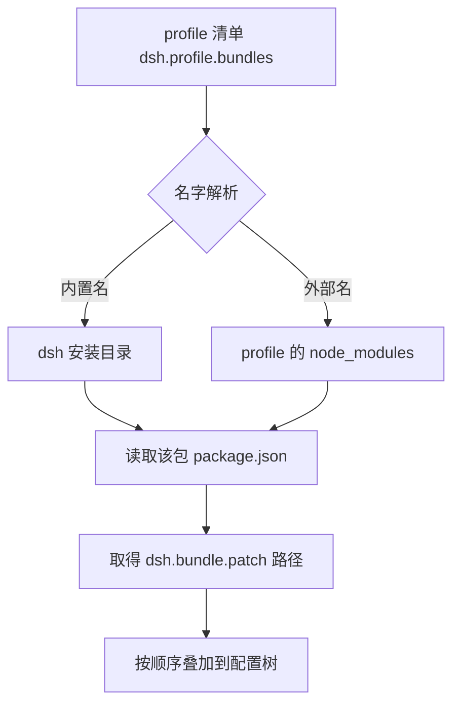
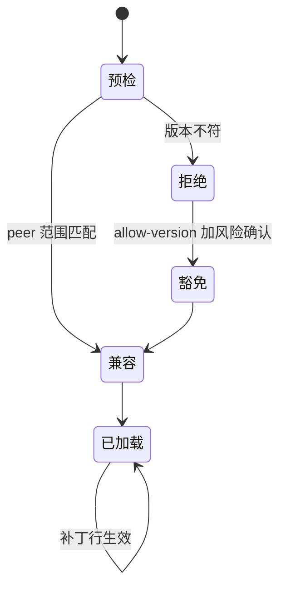

# 插件的形态与清单

给 DSH 写插件，第一步要决定的是包的形状，而不是先写代码。DSH 把功能组织成一棵配置树，树上的每一行都是一个插件的配置项；一个插件包可以只贡献一行配置，也可以贡献一整组。这类包在 DSH 的术语里叫组合包，它的作用是往配置树里插入或者修改若干行。

一个组合包对外只需要一个声明：它的 `package.json` 里写着补丁文件在哪。profile 按自己的清单依次应用这些补丁，叠成最终的配置树。理解这条链路的关键在于分清三样东西：包清单、profile 清单、补丁文件。

## 包清单里只有一个关键字段

组合包的 package.json 至少要声明一个 `dsh` 字段，里面是 `bundle.patch`：一个相对包目录的补丁文件路径，或者一组按顺序应用的路径（`node_modules/@deepseek-ai/dsh-app-boot/lib/types/profile.d.ts:38-52`）。校验逻辑写得很直接：既不是字符串也不是字符串数组就报错，错误信息是 `dsh.bundle.patch must be a file path or a list of file paths`（`node_modules/@deepseek-ai/dsh-app-boot/lib/index.js:495-497`）。

除这个字段之外，包就是一个普通的 npm 包：有名字、版本、许可证，可以被安装到 profile 的 `node_modules` 下。是否发布到 npm 由使用者决定，本地目录用 `file:` 形式也能安装。

| 字段 | 作用 | 必填 |
| --- | --- | --- |
| `name` / `version` | 包标识与版本 | 是 |
| `dsh.bundle.patch` | 补丁文件路径或路径列表 | 组合包必填 |
| `private` | 标记不发布 | 按需 |
| `type` | 模块类型 | 按需 |
| 依赖项 | 插件运行时需要的包 | 按需 |

## profile 清单决定用哪些包

profile 目录里也有一份 `package.json`，它除了记录树外插件依赖，还保存 profile 清单：`dsh.profile` 以及其中有顺序的 `bundles` 列表（`README.zh.md:37`）。同一段的说明里还提到，配置树由这些组合包的补丁层按顺序叠加，再应用用户自己的覆盖层。

清单里的名字解析有两处锚点：先从 dsh 安装目录解析内置组合包，再从 profile 自身的 `node_modules` 解析外部插件；包管理器会把树外插件装进后者（`README.zh.md:46`）。两处锚点的顺序解释了一个现象：同名的内置包不会被本地安装的同名包顶掉。

| 内置组合包 | 对应 profile 模板 |
| --- | --- |
| `@deepseek-ai/dsh-base` 加应用包 | web、headless、acp 等 |
| `@deepseek-ai/dsh-sdk-minimal` | sdk-minimal 单包模板 |

模板与组合包列表写在安装包源码里（`node_modules/@deepseek-ai/dsh-app-boot/lib/index.js:530-534`）：web 是 base 加 web 应用包，headless 是 base 加 headless 应用包，sdk 是 base 加 sdk 应用包，sdk-minimal 只有自己。

## 补丁文件才是功能入口

包本身可以是空的，功能全部由补丁文件描述。补丁文件的读取与定位由两个函数完成：一个校验声明形态并返回按应用顺序排列的相对路径，另一个把它们解析成绝对路径（`node_modules/@deepseek-ai/dsh-app-boot/lib/index.js:495-508`）。因此运行期不关心补丁文件名，只关心 package.json 里的声明。

这个设计带来的直接好处是同一份补丁可以被不同的包复用，包与补丁分离；代价是多了一层间接，排查时需要先确认声明指向的文件是否存在。

## 一个真实的小插件包

better-crawler 的 DSH 接入包就是一个最小例子。它的 `package.json` 里声明 `dsh.bundle.patch` 指向 `./cordis.patch.yml`，补丁内容是一行插入：一个标识为 `mcp-better-crawler` 的 MCP 客户端行，插件名是 `'@deepseek-ai/dsh-mcp-client'`，配置里写明服务名（`dsh-plugin/cordis.patch.yml:17-25`）。

补丁头部还留了设计说明：这是一个普通的可寻址补丁行，profile 自己的补丁或者命令行叠加层可以把它禁用、换命令、改超时，而不需要改这个包。这条注释解释了组合包与用户配置的职责边界。

## 插件与普通依赖的区别

普通依赖是"装进来给某些代码用"，组合包是"装进来改变配置树"。判断一个包是不是组合包，看它有没有 `dsh.bundle` 声明：插件管理器在预检时也会给出 `bundle` 为真或假的判断（`node_modules/@deepseek-ai/dsh-plugin-manager/lib/types/types.d.ts:151`）。

组合包还可以携带补丁之外的内容。better-crawler 的接入包顺带把一份技能说明发布到公共技能目录，这部分由安装脚本完成，不属于包清单的声明范围（`dsh-plugin/install.sh:7-13`）。

## 版本与运行时兼容

安装与启动会按插件声明的 peer 范围校验 DSH 运行时版本，不兼容时需要明确确认精确版本的豁免；管理豁免的命令是 `allow-version`、`revoke-version` 与 `version-exemptions`（`README.zh.md:39`，`lib/plugin-BGnVfe_D.js:14-56`）。豁免记录按包与运行时版本精确匹配，命令行会提示风险。

| 情形 | 表现 | 处理 |
| --- | --- | --- |
| peer 范围匹配 | 正常安装与启动 | 无需操作 |
| peer 范围不匹配 | 安装或启动被拒绝 | 确认风险后加豁免 |
| 豁免后仍失败 | 运行时报错 | 检查 API 是否真的兼容 |

补丁文件也可以只做一件事：把某个内置行关掉。组合包并不总是"增加功能"，关闭一个默认开启的能力同样是它的一种用法。

包清单的校验发生在加载之前，因此一个指向不存在文件的补丁声明会在启动时报错，而不是静默跳过。这条行为让错误更早暴露，代价是清单里的路径必须始终可用。

## 常见判断偏差

| # | 判断偏差 | 表现 | 依据 |
| --- | --- | --- | --- |
| 1 | 把组合包当成普通库直接导入 | 装上了但没有效果 | 效果来自补丁层 |
| 2 | 补丁路径写绝对路径 | 换机器后解析失败 | 声明是包目录相对路径 |
| 3 | 认为本地包会顶掉内置包 | 内置行仍在 | 解析有两处锚点，内置优先 |
| 4 | 改了补丁文件却没改声明 | 新文件不生效 | 只读取声明中的路径 |
| 5 | 忽略 peer 范围 | 启动被拒或运行报错 | 有版本兼容检查 |
| 6 | 把技能当成包清单的一部分 | 技能目录不存在 | 技能由安装脚本单独发布 |

## 小结

### 核心概念

- 组合包在 package.json 的 `dsh.bundle.patch` 里声明一个或一组补丁文件。
- profile 清单 `dsh.profile.bundles` 决定应用哪些组合包以及顺序。
- 组合包名字先从 dsh 安装目录解析，再从 profile 的 node_modules 解析。
- 补丁文件才是功能入口，包本身可以只有清单。
- 安装与启动会校验 peer 版本，不匹配需要精确版本豁免。
- 技能等附带内容由安装脚本发布，不属于包清单。

### 设计权衡

| 权衡点 | 本工程的选择 | 收益与代价 |
| --- | --- | --- |
| 包与补丁 | 分离，声明指向文件 | 补丁可复用；代价是多一层间接 |
| 解析锚点 | 内置优先于 profile | 内置行为稳定；代价是本地同名包不会覆盖 |
| 补丁粒度 | 一行插入即可 | 小改动成本低；代价是包多时行分散 |
| 版本校验 | peer 范围加精确豁免 | 不兼容时不静默；代价是需要人工确认 |

## 练习

### 基础题

1. 组合包的 package.json 里哪个字段是必须的，它的取值有哪两种形态？
2. profile 清单里的组合包按什么顺序应用？
3. 组合包名字的两处解析锚点分别是什么？
4. 说明补丁文件与包的职责分工。

### 挑战题

5. 写一个只插入一行配置的最小组合包，列出目录结构与清单内容。
6. 如果两个组合包插入同一行 id，说明可能的冲突表现与排查方式。
7. 设计一条检查，判断某个已安装包是不是组合包以及它的补丁文件是否存在。
8. 版本豁免的粒度是包加运行时版本，说明这种粒度带来的管理负担与替代方案。

## 附：本页引用的路径

| 路径 | 用途 |
| --- | --- |
| `README.zh.md` | profile 组成、层叠顺序与兼容性说明（相对 DSH 安装目录） |
| `node_modules/@deepseek-ai/dsh-app-boot/lib/types/profile.d.ts` | profile 清单与补丁文件的类型声明 |
| `node_modules/@deepseek-ai/dsh-app-boot/lib/index.js` | 补丁路径解析与内置模板列表 |
| `node_modules/@deepseek-ai/dsh-plugin-manager/lib/types/types.d.ts` | 组合包预检与补丁行检查 |
| `lib/plugin-BGnVfe_D.js` | 版本豁免命令的实现 |
| `dsh-plugin/package.json` 与 `dsh-plugin/cordis.patch.yml` | better-crawler 的最小组合包实例 |
