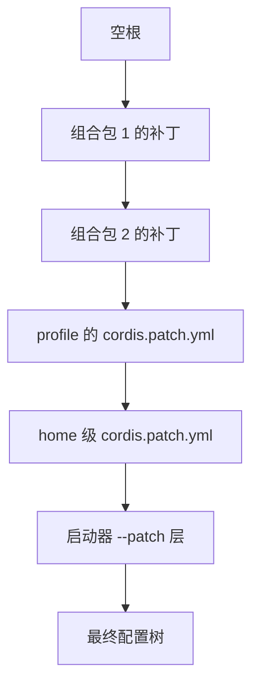
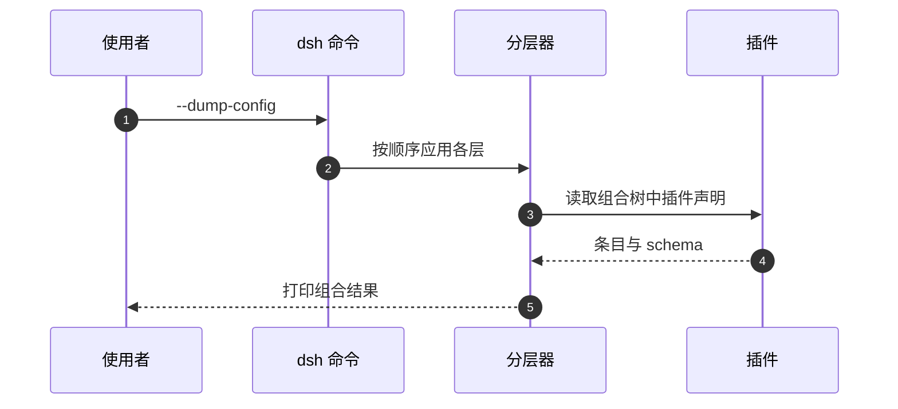

# 配置分层与补丁语义

同一个 profile 在不同机器上表现不同，原因通常不在插件代码，而在配置叠了哪几层。DSH 的配置树从一个空根开始，先把清单里各个组合包的补丁按顺序叠上去，再叠 profile 自己的覆盖文件与 home 级覆盖文件，最后叠启动器命令行指定的覆盖层（`README.zh.md:41-44`）。每一层只能看到前一层的产物，最终结果是这些层的串行组合。

理解分层的价值在于定位问题：某一行被禁用、某段超时被改掉，先问它是哪一层写进去的，比先看插件源码有效得多。

## 从空根开始的第一层

第一层来自 profile 清单 `dsh.profile.bundles` 里列出的组合包。它们按清单顺序依次应用，每个包贡献自己的补丁文件，补丁文件里可以是插入行，也可以是修改或禁用已有行（`node_modules/@deepseek-ai/dsh-app-boot/lib/types/profile.d.ts:5-14`）。顺序有意义：后面的包可以覆盖前面包插入的同一行。

| 层 | 来源 | 顺序位置 |
| --- | --- | --- |
| 组合包层 | `dsh.profile.bundles` 各包的补丁 | 最先 |
| profile 用户层 | profile 目录的 `cordis.patch.yml` | 其次 |
| home 用户层 | `$DSH_HOME/cordis.patch.yml` | 再次 |
| 启动器覆盖层 | `--patch` 指定文件与命令衍生的补丁 | 最后 |

profile 用户层的文件名是固定的：`PROFILE_PATCH_FILENAME` 定义为 `cordis.patch.yml`（`node_modules/@deepseek-ai/dsh-app-boot/lib/types/profile.d.ts:28-29`）。home 层的同名文件作用于所有 profile，适合放跨 profile 的公共覆盖。

## 补丁行的语义

补丁文件描述对配置树的操作，最小单位是行。行的标识由补丁自己声明，插件管理器把每个组合包贡献的行整理出来，包括它插入的行与它修改却不插入的行（`node_modules/@deepseek-ai/dsh-plugin-manager/lib/types/types.d.ts:32-65`）。"修改却不插入"指的是改内置行的配置或者把内置行关掉。

行标识的意义在于可寻址：写补丁的人可以用 id 定位到某一行，替换它的配置字段，或者禁用它。better-crawler 的补丁头注释把这一点写明：profile 自己的补丁或叠加补丁可以禁用这一行、换掉命令、改超时，不需要动组合包（`dsh-plugin/cordis.patch.yml:17-19`）。

| 操作 | 作用对象 | 典型用途 |
| --- | --- | --- |
| 插入 | 新行 | 增加一个插件配置项 |
| 修改字段 | 已有行 | 换命令、改超时、加环境变量 |
| 禁用 | 已有行 | 临时关闭某个能力 |

## 层的优先级如何体现

优先级高的层后应用，因此可以覆盖前面的结果。一个常见例子是超时：组合包声明默认值，profile 层改成自己的值，启动器再用 `--patch` 临时改一次，最终生效的是最后一次修改。判断当前值来自哪一层，要按层顺序从后往前比对。

这条规则也解释了为什么修改组合包源码往往不是正确的解法：同一个效果可以在更靠后的层里写一行覆盖，成本更低，也不会在升级时被覆盖。

## 组合结果的检查手段

不启动应用也能检查配置树。`--dump-default-config` 与 `--dump-config` 打印组合后的配置，`--dump-config-schema` 则导入组合树中插件声明的 schema，打印描述条目与补丁的 JSON Schema，而不是配置值（`README.zh.md:48`）。检查不受信任的插件之前，文档建议先看 schema dump 的安全性与范围说明。

| 手段 | 输出 | 用途 |
| --- | --- | --- |
| `--dump-default-config` | 默认层组合结果 | 确认内置行的初始形态 |
| `--dump-config` | 当前组合结果 | 确认覆盖是否生效 |
| `--dump-config-schema` | 条目的 schema | 在加载前查看插件声明 |

## 热重载什么时候生效

在配置里启用 HMR 插件之后，profile 清单、profile 补丁与 home 级补丁都会进入监视范围，改动通过统一串行重载重新组合所有层；没有启用时，改动在重启后生效（`README.zh.md:37`）。串行的含义是重载不会并发执行，因此连续保存多次只会触发一串重载。

排查"改了配置没反应"时，先确认 HMR 是否启用，再看改动落在哪一层。落在启动器覆盖层上的改动不受文件监视影响，需要重新启动命令。

## 版本兼容与豁免

配置层叠加之前还有一道版本检查：安装与启动按插件声明的 peer 范围校验运行时版本，不匹配时需要确认精确版本的豁免（`README.zh.md:39`）。豁免记录按包名与运行时版本精确匹配，因此升级 DSH 之后旧豁免不会自动生效，需要重新确认。

分层的另一面是可读性：层数变多之后，同一行的最终形态需要跨几个文件才能拼出来。给每层写清用途注释，比事后从结果倒推省力得多。

补丁的应用顺序不依赖文件在磁盘上的位置，只依赖清单里的列表顺序。同一个包在不同 profile 中被放在不同位置，产生的组合结果就可能不同，这一点在跨 profile 对比行为时需要注意。

层的覆盖是后写覆盖前写，而不是合并同名字段。要改一个嵌套字段，补丁需要写出该字段所在的完整行结构，否则可能只改到部分字段。

## 常见判断偏差

| # | 判断偏差 | 表现 | 依据 |
| --- | --- | --- | --- |
| 1 | 认为补丁只有插入一种操作 | 找不到关闭某能力的写法 | 补丁可修改与禁用已有行 |
| 2 | 改组合包源码来调参数 | 升级后改动丢失 | 更靠后的层可以覆盖 |
| 3 | 把 home 层当成 profile 专属 | 其他 profile 被连带修改 | home 层作用于所有 profile |
| 4 | 改了文件立刻期望生效 | 需要重启才生效 | HMR 未启用时改动延后 |
| 5 | 不检查组合结果就启动 | 靠运行时报错定位 | 有 dump 手段可先看 |
| 6 | 升级后沿用旧豁免 | 仍然被判定不兼容 | 豁免按版本精确匹配 |

## 小结

### 核心概念

- 配置树从空根开始，按组合包、profile、home、启动器覆盖的顺序叠加。
- profile 用户层文件名固定为 `cordis.patch.yml`，home 层同名且作用于所有 profile。
- 补丁以行为单位，支持插入、修改字段与禁用三种操作。
- 行标识使配置可被更靠后的层寻址覆盖。
- dump 系列命令可以在不启动的情况下检查组合结果与 schema。
- 启用 HMR 时补丁文件改动会触发串行重载，否则重启生效。

### 设计权衡

| 权衡点 | 本工程的选择 | 收益与代价 |
| --- | --- | --- |
| 分层模型 | 空根加逐层补丁 | 组合逻辑清晰；代价是排查要按层定位 |
| 覆盖入口 | profile 与 home 两级用户层 | 灵活；代价是容易忘记某一层 |
| 热重载 | 可选启用 | 改动即时生效；代价是需要一个常驻监视 |
| 版本校验 | peer 范围加精确豁免 | 不兼容不静默；代价是升级后需重新确认 |

## 练习

### 基础题

1. 按顺序写出配置树的四层来源。
2. profile 用户层的文件名是什么，home 层与它的区别在哪？
3. 补丁支持哪三种操作？
4. dump 系列三个命令分别输出什么？

### 挑战题

5. 设计一次覆盖实验：用启动器覆盖层改动某个组合包插入行的配置，写出验证步骤。
6. 说明两个组合包插入同一行标识时，层顺序会如何影响最终结果。
7. HMR 启用与未启用时排查路径有什么不同？写出各自的检查项。
8. 给版本豁免设计一份管理方案，说明升级 DSH 后怎样发现需要重新确认的条目。

## 附：本页引用的路径

| 路径 | 用途 |
| --- | --- |
| `README.zh.md` | 分层顺序、HMR、dump 手段与版本兼容说明 |
| `node_modules/@deepseek-ai/dsh-app-boot/lib/types/profile.d.ts` | profile 清单、补丁文件名与组合顺序 |
| `node_modules/@deepseek-ai/dsh-plugin-manager/lib/types/types.d.ts` | 补丁行的插入与修改记录 |
| `dsh-plugin/cordis.patch.yml` | 可寻址补丁行的实例与说明注释 |
| `lib/plugin-BGnVfe_D.js` | 版本豁免命令实现 |
