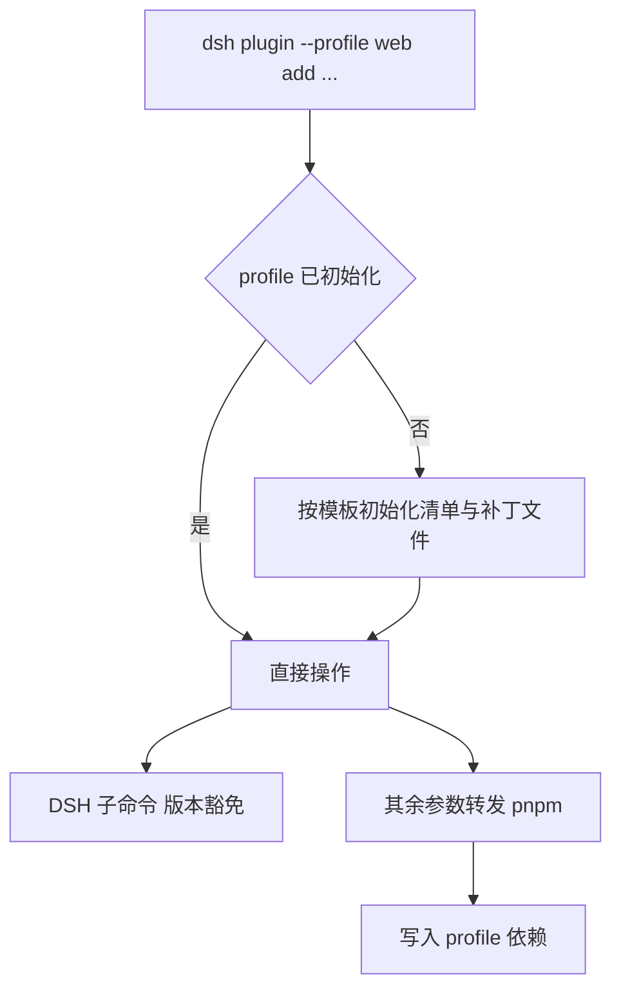
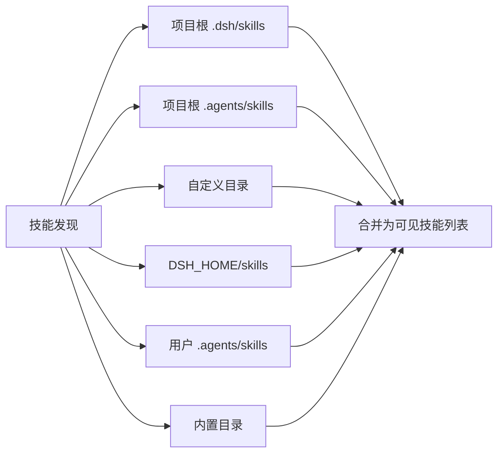

# 安装、技能与调试

profile 是 DSH 的一套独立配置，插件与补丁都挂在它下面；插件只有装进某个 profile 才会生效，装错位置或者装完没有重载，表现都是“没有反应”。把组合包装进 profile 有两种方式：直接往 profile 的 `node_modules` 里装，或者用 `dsh plugin` 命令。后者更省事，因为它同时处理 profile 初始化、写锁与兼容性提示；但它并不自己实现包管理，而是把参数转发给 pnpm 在 profile 目录里执行（`README.zh.md`，`lib/plugin-BGnVfe_D.js`）。理解这一点能解释很多现象：报错信息是包管理器的、构建脚本的批准提示也是包管理器的。

pnpm 是 Node 生态里的一种包管理器，与 npm 共用包源但安装方式不同；dsh 自己不做这些事，只把参数转交给它，所以报错文案与批准提示都是 pnpm 的风格。

这篇讲安装命令实际做了什么、profile 什么时候被初始化、技能从哪些目录被发现，最后给出一份故障对照表。

## 安装命令把活交给包管理器

`dsh plugin --profile <名字>` 后面的参数原样交给 pnpm，在该 profile 目录里执行。命令内部先处理两类 DSH 自己的子命令：版本豁免相关的 `allow-version`、`revoke-version`、`version-exemptions`；其余参数才进入包管理流程（`lib/plugin-BGnVfe_D.js`）。

写操作加锁，锁的对象是 profile 的 `package.json`，等待上限写在调用处（`lib/plugin-BGnVfe_D.js`）。同一 profile 上并发执行两次安装会被串行化，这与配置层的串行重载是同一思路。

写锁是「同一时刻只允许一个进程改这份清单」的约定，第二个进程要等第一个结束再开始，等待有上限，超时即报错。

| 参数形态 | 结果 |
| --- | --- |
| `add file:/绝对路径` | 以本地目录形式加入 |
| `add 包名` | 从注册源安装 |
| `add git+...` | 从 git 安装，构建脚本需要批准 |
| `remove 包名` | 移除依赖 |

## profile 什么时候被初始化

内置名称的 profile 在首次使用时按模板初始化：web、headless、sdk、sdk-minimal、acp 都有各自的组合包列表（`README.zh.md`）。用一个未使用的自定义名字时，可以用 `--from-default-profile` 基于模板创建，或者直接用插件命令初始化一个以 base 为基础的 profile（`lib/plugin-BGnVfe_D.js`）。desktop 是保留名字，由桌面应用持有，命令行会拒绝针对它的启动与配置请求。

初始化只发生一次。之后 profile 目录里固定有 `package.json` 与 `cordis.patch.yml` 两个文件，清单里记录组合包列表，用户层记录覆盖。



## 为什么本地插件要暂存一份

stdio 形态的插件行必须写可执行的绝对路径，而包被安装到随机位置。better-crawler 的安装脚本用了一个两步方案：先把插件目录复制到 `$DSH_HOME/plugins/` 下，再把拷贝里的占位符替换成真实绝对路径，最后把这份副本注册为 profile 的 bundle（`dsh-plugin/install.sh`）。

技能也由同一个脚本发布，用的是符号链接：

```sh
# dsh-plugin/install.sh（节选）
mkdir -p "$DSH_HOME/skills"
ln -sfn "$REPO/skills/web-to-text" "$DSH_HOME/skills/web-to-text"
```

`ln -s` 建符号链接，相当于在技能目录里给仓库那份技能挂一个入口；`-f` 允许覆盖同名项，`-n` 防止把链接建进已有目录内部。用链接而不是复制，改仓库里的技能文件立即生效；代价是仓库目录被移动或删除后，链接会指向空处。

这样做还有一层好处：注册的是副本，源码仓库可以继续改动，需要重新安装时才同步。代价是副本与源码可能不一致，升级时要记得重跑安装脚本。

## 技能从哪些目录被发现

技能由文件系统提供者发现，它支持目录式与单文件 Markdown 两种形态，来源覆盖项目、自定义与用户三个层级（`node_modules/@deepseek-ai/dsh-skill-filesystem/lib/index.js`）。具体根目录按顺序包括项目下的 `.dsh/skills`、项目下的 `.agents/skills`、自定义目录、`$DSH_HOME/skills`、用户目录下的 `.agents/skills`，最后是内置目录（`node_modules/@deepseek-ai/dsh-skill-filesystem/lib/index.js`）。

这些根目录在源码里是一个个 push 进列表的：

```js
// node_modules/@deepseek-ai/dsh-skill-filesystem/lib/index.js（节选）
roots.push({
    path: join(projectRoot, ".dsh/skills"),
    source: "project-dsh",
    ...
}, {
    path: join(projectRoot, ".agents/skills"),
    source: "project-agents",
    ...
});
...
roots.push({
    path: join(this.dshHome, "skills"),
    source: "user-dsh",
    ...
}, {
    path: join(this.agentsHome, "skills"),
    source: "user-agents",
    ...
});
```

每个根目录都带一个 `source` 标记（project-dsh、project-agents、custom、user-dsh、user-agents 等），合并后的技能列表因此能说明一项技能是从哪一层发现的；`...` 处省略的是排序与归属用的其余字段。

better-crawler 的安装脚本把技能发布到 `$DSH_HOME/skills` 下的一个子目录，这样所有 profile 都能发现它（`dsh-plugin/install.sh`）。技能不随组合包声明走，因此卸载插件不会自动删掉技能，需要单独清理。

| 来源 | 路径 | 生效范围 |
| --- | --- | --- |
| 项目 dsh | 项目下 `.dsh/skills` | 该项目 |
| 项目 agents | 项目下 `.agents/skills` | 该项目 |
| 自定义 | 配置指定的目录 | 按配置 |
| 用户 dsh | `$DSH_HOME/skills` | 所有 profile |
| 用户 agents | 用户目录下 `.agents/skills` | 所有 profile |
| 内置 | 安装包附带目录 | 所有 profile |



## 验证与诊断

装完之后先确认包被解析到组合包：预检接口会返回某个依赖是否声明了补丁，取值可能是真、假或者无法判断（`node_modules/@deepseek-ai/dsh-plugin-manager/lib/types/types.d.ts`）。再确认补丁文件存在，最后用 dump 命令看它插入的行是否出现在组合结果里。

| 检查项 | 手段 | 通过标准 |
| --- | --- | --- |
| 依赖是否装上 | 看 profile 依赖列表 | 包名与版本出现 |
| 是否组合包 | 预检返回值 | `bundle` 为真 |
| 补丁是否存在 | 检查声明的文件 | 文件可读 |
| 行是否生效 | dump 组合结果 | 目标行出现 |
| 技能是否可见 | 看技能列表 | 名称出现 |

## 故障对照表

| 现象 | 可能原因 | 先看什么 |
| --- | --- | --- |
| 命令提示 dsh 不在 PATH | 安装脚本前置检查未通过 | `install.sh` 里对 `dsh` 是否在 PATH 的检查 |
| 插件行里的路径是占位符 | 手工注册而非跑安装脚本 | 补丁文件里的占位符是否被替换 |
| 安装被拒，提示版本不兼容 | peer 范围不匹配 | 按提示加精确版本豁免 |
| git 安装提示构建被阻止 | 包管理器的构建批准策略 | profile 的 pnpm 工作区配置 |
| 装上了但行为没变 | 组合包未加入清单或被跳过 | 清单中的组合包列表与跳过提示 |
| 技能不出现 | 发布到了错误的根目录 | 用户级技能目录下是否存在 |

其中构建批准一项需要单独说明：从 git 安装的插件会在安装时运行准备脚本，包管理器默认阻止，命令会提示把对应的键加到 profile 的 pnpm 工作区配置里再重跑（`lib/plugin-BGnVfe_D.js`）。

pnpm 默认不执行依赖包自带的安装脚本，这是防供应链投毒的一道闸；批准就是把该包名写进 profile 的 pnpm 配置，明确表示「我知道这个包会在安装时跑脚本」。

## 常见判断偏差

| # | 判断偏差 | 表现 | 依据 |
| --- | --- | --- | --- |
| 1 | 认为插件命令自己实现包管理 | 报错信息风格不像 DSH | 参数被转发给 pnpm |
| 2 | 手工注册插件目录 | 占位路径未替换 | 安装脚本负责替换 |
| 3 | 卸载组合包后期望技能消失 | 技能仍在列表里 | 技能单独发布 |
| 4 | 把内置技能目录当成可写 | 改动在升级后丢失 | 内置目录属于安装包 |
| 5 | 忽略 profile 保留名 | 针对 desktop 的命令被拒 | desktop 由应用持有 |
| 6 | 认为装完立即生效 | 需要重载或重启 | 与 HMR 是否启用有关 |

## 小结

### 核心概念

- `dsh plugin` 把非 DSH 参数转发给包管理器，在 profile 目录里执行。
- 安装写操作对 profile 的 package.json 加锁，并发操作被串行化。
- 内置 profile 名称首次使用时按模板初始化，desktop 是保留名。
- 本地插件需要暂存副本并把占位符替换成绝对路径。
- 技能从项目、自定义、用户与内置多个根目录被发现，安装脚本负责发布。
- 诊断顺序是：装上了、是组合包、补丁存在、行生效、技能可见。

### 设计权衡

| 权衡点 | 常见选择 | 收益与代价 |
| --- | --- | --- |
| 安装入口 | 命令转发给包管理器 | 复用成熟工具；代价是错误信息需要翻译 |
| 本地安装 | 复制到插件目录 | 路径固定可覆盖；代价是副本与源码需同步 |
| 技能发布 | 复制到用户技能目录 | 所有 profile 可见；代价是需单独卸载 |
| 诊断手段 | 预检加 dump | 不启动即可定位；代价是层次较多 |

## 练习

### 基础题

1. `dsh plugin` 后面的参数最终由谁执行？
2. 内置 profile 名称有哪几个，保留名是哪一个？
3. 本地组合包为什么需要暂存一份副本？
4. 技能的用户级根目录是哪两个？

### 挑战题

5. 写一份安装失败的分步排查清单，按"命令、依赖、组合包、补丁、行"排序。
6. 设计一个升级脚本，同步插件副本与源码并重新发布技能。
7. 说明卸载一个组合包时需要清理哪些位置，避免留下无效技能。
8. 如果同一技能名出现在两个根目录，设计一种判断实际生效来源的方法。

## 附：本页引用的路径

| 路径 | 用途 |
| --- | --- |
| `README.zh.md` | 插件命令、profile 初始化与保留名说明 |
| `lib/plugin-BGnVfe_D.js` | 插件命令实现、写锁与构建批准提示 |
| `node_modules/@deepseek-ai/dsh-skill-filesystem/lib/index.js` | 技能发现的根目录与顺序 |
| `node_modules/@deepseek-ai/dsh-plugin-manager/lib/types/types.d.ts` | 组合包预检与错误分类 |
| `dsh-plugin/install.sh` | 暂存、占位符替换与技能发布实例 |
