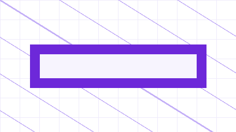

# 环境与命令

第二个文件。它在同一页里紧跟在「概述」后面，左栏会把它列为独立的一节。

## 构建

```bash
npm install --cache ./
npm run build
```

## 插图

图片直接引用同级文件即可，构建时会自动压缩并改写路径：



## 任务列表

- [x] 已经做好的事
- [ ] 还没做的事

## 脚注

这里引用一条脚注[^1]。

[^1]: 脚注内容会渲染在页面底部。
