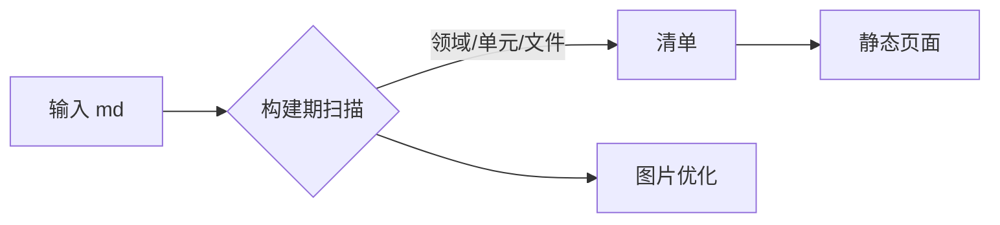
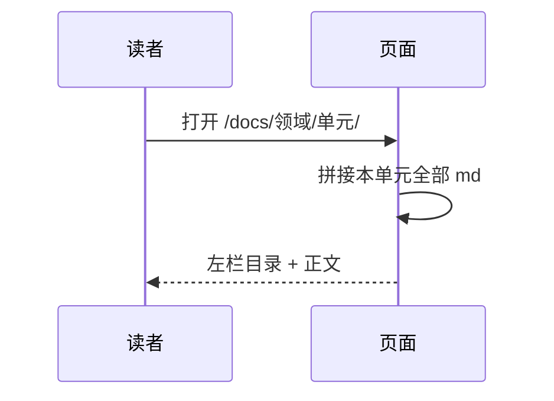

# 图表与流程

Mermaid 在浏览器里懒加载渲染，只在含图的页面拉取脚本；关掉 JS 时显示源码。

```mermaid
flowchart LR
  A[输入 md] --> B{构建期扫描}
  B -->|领域/单元/文件| C[清单]
  C --> D[静态页面]
  B --> E[图片优化]
```

时序图：

```mermaid
sequenceDiagram
  读者->>页面: 打开 /docs/领域/单元/
  页面->>页面: 拼接本单元全部 md
  页面-->>读者: 左栏目录 + 正文
```
